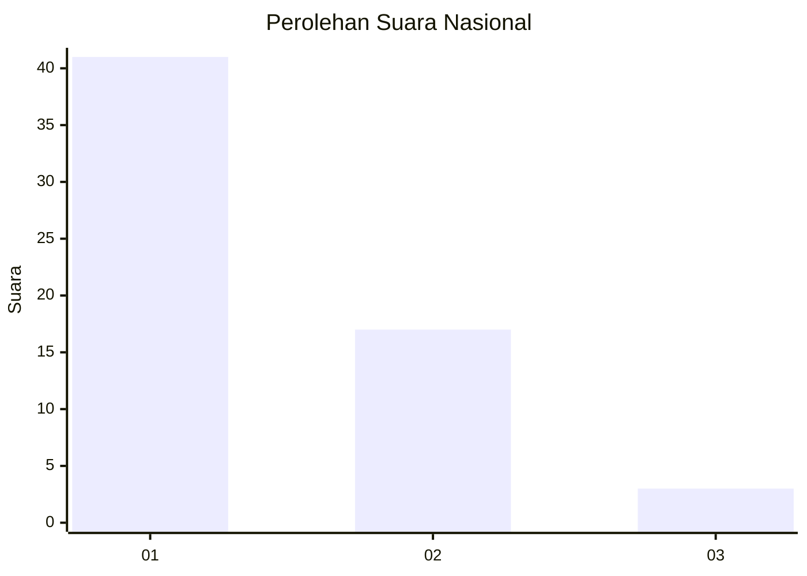
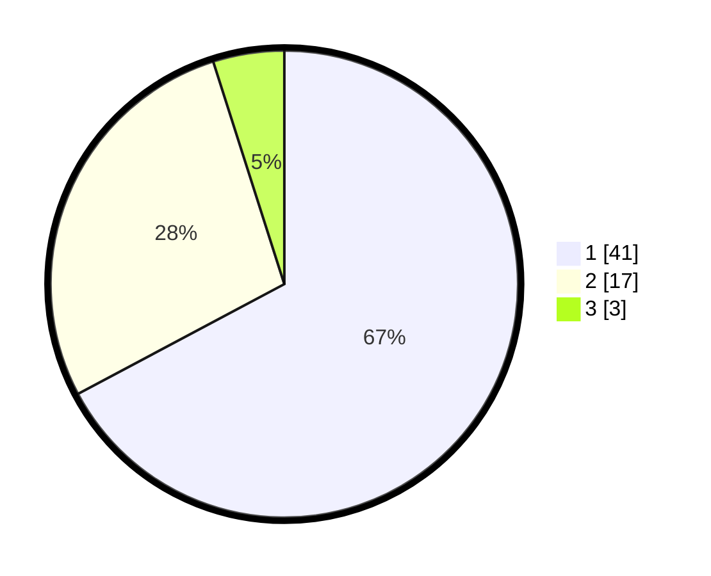

# Hasil

## Grafik

## Tabel

| No. | Nama Paslon    | Suara | Suara (raw) | Persentase |
|:--- |:-------------- | -----:| -----------:| ----------:|
| 1   | ANIES MUHAIMIN | 41    | [41][p-1]   | 67,21      |
| 2   | PRABOWO GIBRAN | 17    | [17][p-2]   | 27,87      |
| 3   | GANJAR MAHFUD  | 3     | [3][p-3]    | 4,92       |

[p-1]: https://github.com/gigit-pemilu/pemilu-2024/blob/main/pilpres/hitung-suara/sub/99-luar-negeri/sub/01-abu-dhabi-uni-emirat-arab/sub/01-abu-dhabi-uni-emirat-arab/sub/0001-abu-dhabi-uni-emirat-arab/sub/001-pos-001/sub/paslon-1.txt
[p-2]: https://github.com/gigit-pemilu/pemilu-2024/blob/main/pilpres/hitung-suara/sub/99-luar-negeri/sub/01-abu-dhabi-uni-emirat-arab/sub/01-abu-dhabi-uni-emirat-arab/sub/0001-abu-dhabi-uni-emirat-arab/sub/001-pos-001/sub/paslon-2.txt
[p-3]: https://github.com/gigit-pemilu/pemilu-2024/blob/main/pilpres/hitung-suara/sub/99-luar-negeri/sub/01-abu-dhabi-uni-emirat-arab/sub/01-abu-dhabi-uni-emirat-arab/sub/0001-abu-dhabi-uni-emirat-arab/sub/001-pos-001/sub/paslon-3.txt

## Foto C Plano

https://sirekap-obj-formc.kpu.go.id/d238/pemilu/ppwp/99/01/01/00/01/9901010001001-20240215-170436--d68f3388-1a68-43db-9a5b-05c64b8f815a.jpg

https://sirekap-obj-formc.kpu.go.id/d238/pemilu/ppwp/99/01/01/00/01/9901010001001-20240215-194936--d2ed8edb-f2e8-4854-8320-8e912cadae9b.jpg

https://sirekap-obj-formc.kpu.go.id/d238/pemilu/ppwp/99/01/01/00/01/9901010001001-20240215-170539--3e6eae96-b5aa-4776-9e91-c19401d10ba6.jpg

## Metadata

| Key        | Value               |
| ---------- | ------------------- |
| Time Stamp | 2024-02-17 16:00:02 |

## DATA PEMILIH TETAP

Jumlah pemilih dalam DPT: **459**.
 * L: **83**.
 * P: **376**.

## DATA PENGGUNA HAK PILIH

Jumlah pengguna hak pilih dalam DPT: **62**.
 * L: **17**.
 * P: **45**.

Jumlah pengguna hak pilih dalam DPTb: **0**.
 * L: **0**.
 * P: **0**.

Jumlah pengguna hak pilih dalam DPK: **0**.
 * L: **0**.
 * P: **0**.

Jumlah pengguna hak pilih: **62**.
 * L: **17**.
 * P: **45**.

## JUMLAH SUARA SAH DAN TIDAK SAH

JUMLAH SELURUH SUARA SAH: **61**.

JUMLAH SUARA TIDAK SAH: **1**.

JUMLAH SELURUH SUARA SAH DAN SUARA TIDAK SAH: **62**.

