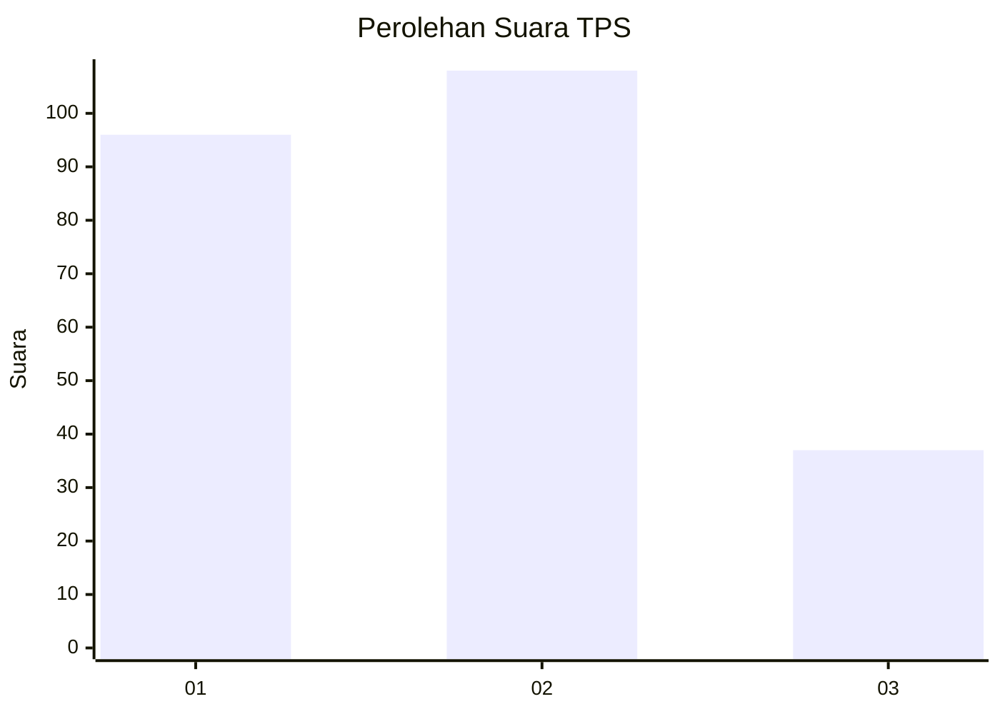
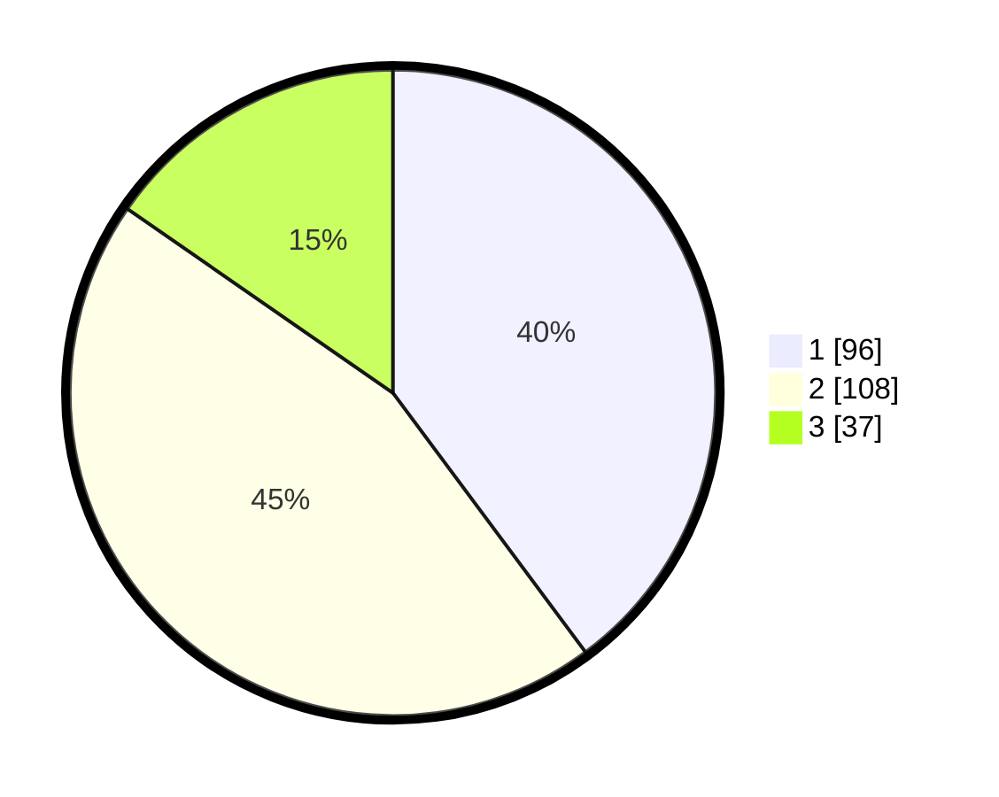

# Hasil

## Grafik

## Tabel

| No. | Nama Paslon    | Suara | Suara (raw) | Persentase |
|:--- |:-------------- | -----:| -----------:| ----------:|
| 1   | ANIES MUHAIMIN | 96    | [96][p-1]   | 39,83      |
| 2   | PRABOWO GIBRAN | 108   | [108][p-2]  | 44,81      |
| 3   | GANJAR MAHFUD  | 37    | [37][p-3]   | 15,35      |

[p-1]: https://github.com/gigit-pemilu/pemilu-2024-99-luar-negeri/blob/main/pilpres/hitung-suara/sub/99-luar-negeri/sub/01-abu-dhabi-uni-emirat-arab/sub/01-abu-dhabi-uni-emirat-arab/sub/0001-abu-dhabi-uni-emirat-arab/sub/002-tps-001/sub/paslon-1.txt
[p-2]: https://github.com/gigit-pemilu/pemilu-2024-99-luar-negeri/blob/main/pilpres/hitung-suara/sub/99-luar-negeri/sub/01-abu-dhabi-uni-emirat-arab/sub/01-abu-dhabi-uni-emirat-arab/sub/0001-abu-dhabi-uni-emirat-arab/sub/002-tps-001/sub/paslon-2.txt
[p-3]: https://github.com/gigit-pemilu/pemilu-2024-99-luar-negeri/blob/main/pilpres/hitung-suara/sub/99-luar-negeri/sub/01-abu-dhabi-uni-emirat-arab/sub/01-abu-dhabi-uni-emirat-arab/sub/0001-abu-dhabi-uni-emirat-arab/sub/002-tps-001/sub/paslon-3.txt

## Foto C Plano

https://sirekap-obj-formc.kpu.go.id/d13d/pemilu/ppwp/99/01/01/00/01/9901010001002-20240214-204134--9e6af290-2150-4e67-9362-c0df30524843.jpg

https://sirekap-obj-formc.kpu.go.id/d13d/pemilu/ppwp/99/01/01/00/01/9901010001002-20240214-194713--4d468c8e-2687-4dee-ab62-afa2fcb90edd.jpg

https://sirekap-obj-formc.kpu.go.id/d13d/pemilu/ppwp/99/01/01/00/01/9901010001002-20240214-194725--b8e4928c-77f4-48b4-a90b-d916b3f10b1b.jpg

## Metadata

| Key        | Value               |
| ---------- | ------------------- |
| Time Stamp | 2024-02-15 00:41:44 |

## DATA PEMILIH TETAP

Jumlah pemilih dalam DPT: **484**.
 * L: **182**.
 * P: **302**.

## DATA PENGGUNA HAK PILIH

Jumlah pengguna hak pilih dalam DPT: **125**.
 * L: **59**.
 * P: **66**.

Jumlah pengguna hak pilih dalam DPTb: **103**.
 * L: **49**.
 * P: **54**.

Jumlah pengguna hak pilih dalam DPK: **20**.
 * L: **11**.
 * P: **9**.

Jumlah pengguna hak pilih: **248**.
 * L: **119**.
 * P: **129**.

## JUMLAH SUARA SAH DAN TIDAK SAH

JUMLAH SELURUH SUARA SAH: **241**.

JUMLAH SUARA TIDAK SAH: **7**.

JUMLAH SELURUH SUARA SAH DAN SUARA TIDAK SAH: **248**.

