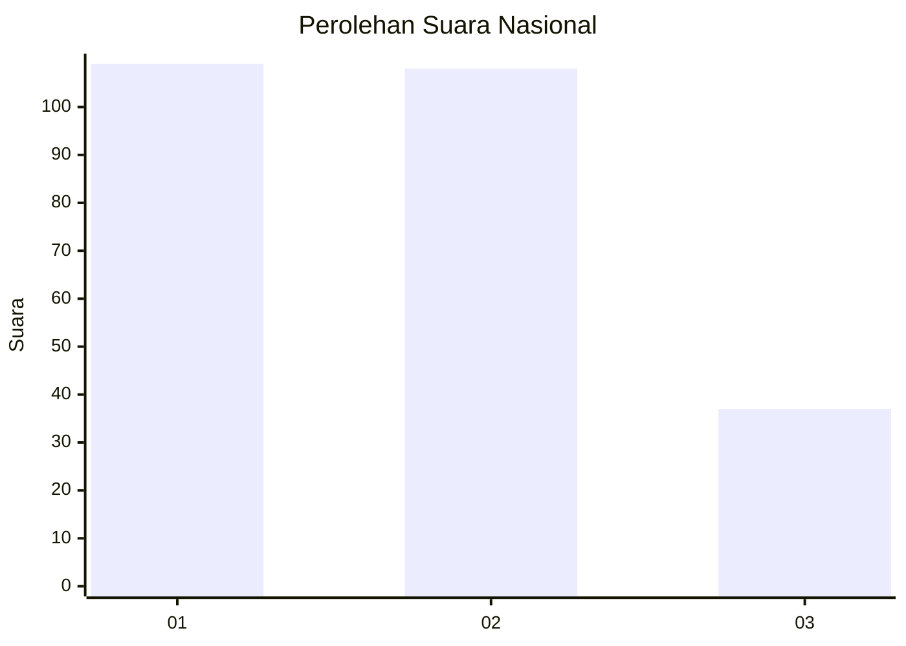
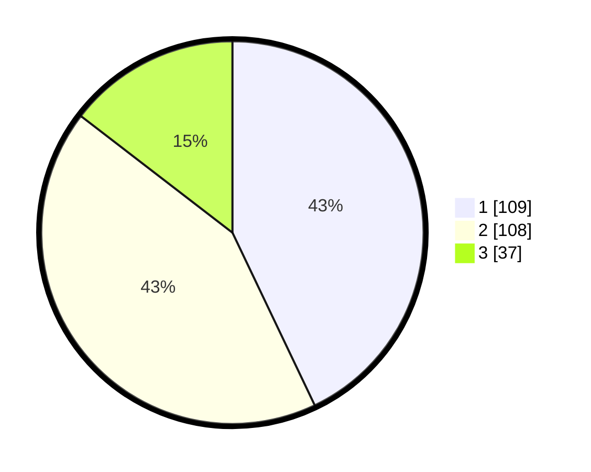

# Hasil

## Grafik

## Tabel

| No. | Nama Paslon    | Suara | Suara (raw) | Persentase |
|:--- |:-------------- | -----:| -----------:| ----------:|
| 1   | ANIES MUHAIMIN | 109   | [109][p-1]  | 42,91      |
| 2   | PRABOWO GIBRAN | 108   | [108][p-2]  | 42,52      |
| 3   | GANJAR MAHFUD  | 37    | [37][p-3]   | 14,57      |

[p-1]: https://github.com/gigit-pemilu/pemilu-2024/blob/main/pilpres/hitung-suara/sub/99-luar-negeri/sub/01-abu-dhabi-uni-emirat-arab/sub/01-abu-dhabi-uni-emirat-arab/sub/0001-abu-dhabi-uni-emirat-arab/sub/003-tps-002/sub/paslon-1.txt
[p-2]: https://github.com/gigit-pemilu/pemilu-2024/blob/main/pilpres/hitung-suara/sub/99-luar-negeri/sub/01-abu-dhabi-uni-emirat-arab/sub/01-abu-dhabi-uni-emirat-arab/sub/0001-abu-dhabi-uni-emirat-arab/sub/003-tps-002/sub/paslon-2.txt
[p-3]: https://github.com/gigit-pemilu/pemilu-2024/blob/main/pilpres/hitung-suara/sub/99-luar-negeri/sub/01-abu-dhabi-uni-emirat-arab/sub/01-abu-dhabi-uni-emirat-arab/sub/0001-abu-dhabi-uni-emirat-arab/sub/003-tps-002/sub/paslon-3.txt

## Foto C Plano

https://sirekap-obj-formc.kpu.go.id/f24b/pemilu/ppwp/99/01/01/00/01/9901010001003-20240220-010010--ff7cf067-cac1-4678-9e2d-4d5e92eb7ca7.jpg

https://sirekap-obj-formc.kpu.go.id/f24b/pemilu/ppwp/99/01/01/00/01/9901010001003-20240220-010011--9848686c-30ea-4d7e-b614-703b8da12f98.jpg

https://sirekap-obj-formc.kpu.go.id/f24b/pemilu/ppwp/99/01/01/00/01/9901010001003-20240214-205259--3a94e166-1a12-487a-914f-2c222cc572d1.jpg

## Metadata

| Key        | Value               |
| ---------- | ------------------- |
| Time Stamp | 2024-02-20 15:00:00 |

## DATA PEMILIH TETAP

Jumlah pemilih dalam DPT: **484**.
 * L: **183**.
 * P: **301**.

## DATA PENGGUNA HAK PILIH

Jumlah pengguna hak pilih dalam DPT: **139**.
 * L: **50**.
 * P: **89**.

Jumlah pengguna hak pilih dalam DPTb: **105**.
 * L: **53**.
 * P: **52**.

Jumlah pengguna hak pilih dalam DPK: **20**.
 * L: **3**.
 * P: **17**.

Jumlah pengguna hak pilih: **264**.
 * L: **106**.
 * P: **158**.

## JUMLAH SUARA SAH DAN TIDAK SAH

JUMLAH SELURUH SUARA SAH: **254**.

JUMLAH SUARA TIDAK SAH: **10**.

JUMLAH SELURUH SUARA SAH DAN SUARA TIDAK SAH: **264**.

