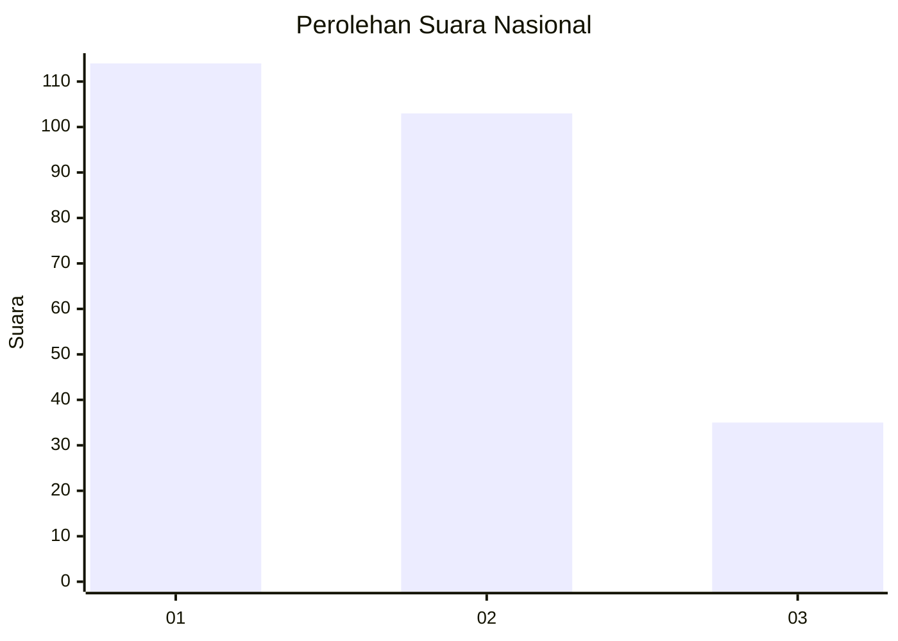
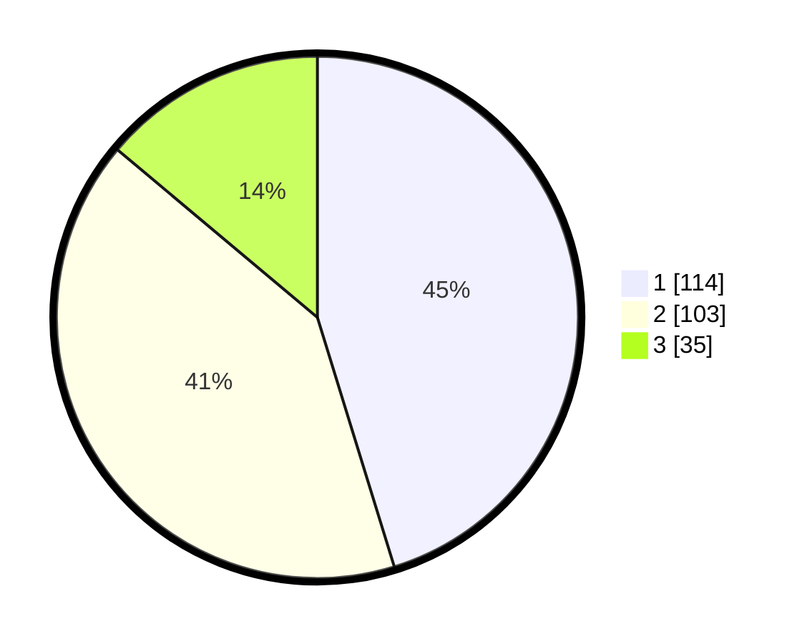

# Hasil

## Grafik

## Tabel

| No. | Nama Paslon    | Suara | Suara (raw) | Persentase |
|:--- |:-------------- | -----:| -----------:| ----------:|
| 1   | ANIES MUHAIMIN | 114   | [114][p-1]  | 45,24      |
| 2   | PRABOWO GIBRAN | 103   | [103][p-2]  | 40,87      |
| 3   | GANJAR MAHFUD  | 35    | [35][p-3]   | 13,89      |

[p-1]: https://github.com/gigit-pemilu/pemilu-2024/blob/main/pilpres/hitung-suara/sub/99-luar-negeri/sub/01-abu-dhabi-uni-emirat-arab/sub/01-abu-dhabi-uni-emirat-arab/sub/0001-abu-dhabi-uni-emirat-arab/sub/004-tps-003/sub/paslon-1.txt
[p-2]: https://github.com/gigit-pemilu/pemilu-2024/blob/main/pilpres/hitung-suara/sub/99-luar-negeri/sub/01-abu-dhabi-uni-emirat-arab/sub/01-abu-dhabi-uni-emirat-arab/sub/0001-abu-dhabi-uni-emirat-arab/sub/004-tps-003/sub/paslon-2.txt
[p-3]: https://github.com/gigit-pemilu/pemilu-2024/blob/main/pilpres/hitung-suara/sub/99-luar-negeri/sub/01-abu-dhabi-uni-emirat-arab/sub/01-abu-dhabi-uni-emirat-arab/sub/0001-abu-dhabi-uni-emirat-arab/sub/004-tps-003/sub/paslon-3.txt

## Foto C Plano

https://sirekap-obj-formc.kpu.go.id/3cbd/pemilu/ppwp/99/01/01/00/01/9901010001004-20240214-202710--3b90651f-49a6-46b7-a347-07193f8572fd.jpg

https://sirekap-obj-formc.kpu.go.id/3cbd/pemilu/ppwp/99/01/01/00/01/9901010001004-20240215-145059--55b0ce26-fd5b-4a78-abcc-c9aa233d86d5.jpg

https://sirekap-obj-formc.kpu.go.id/3cbd/pemilu/ppwp/99/01/01/00/01/9901010001004-20240214-211405--8ebeec24-07db-447c-bda4-13ced870b7f9.jpg

## Metadata

| Key        | Value               |
| ---------- | ------------------- |
| Time Stamp | 2024-02-16 01:30:27 |

## DATA PEMILIH TETAP

Jumlah pemilih dalam DPT: **485**.
 * L: **185**.
 * P: **300**.

## DATA PENGGUNA HAK PILIH

Jumlah pengguna hak pilih dalam DPT: **111**.
 * L: **52**.
 * P: **59**.

Jumlah pengguna hak pilih dalam DPTb: **114**.
 * L: **49**.
 * P: **65**.

Jumlah pengguna hak pilih dalam DPK: **29**.
 * L: **9**.
 * P: **20**.

Jumlah pengguna hak pilih: **254**.
 * L: **110**.
 * P: **144**.

## JUMLAH SUARA SAH DAN TIDAK SAH

JUMLAH SELURUH SUARA SAH: **252**.

JUMLAH SUARA TIDAK SAH: **2**.

JUMLAH SELURUH SUARA SAH DAN SUARA TIDAK SAH: **254**.

