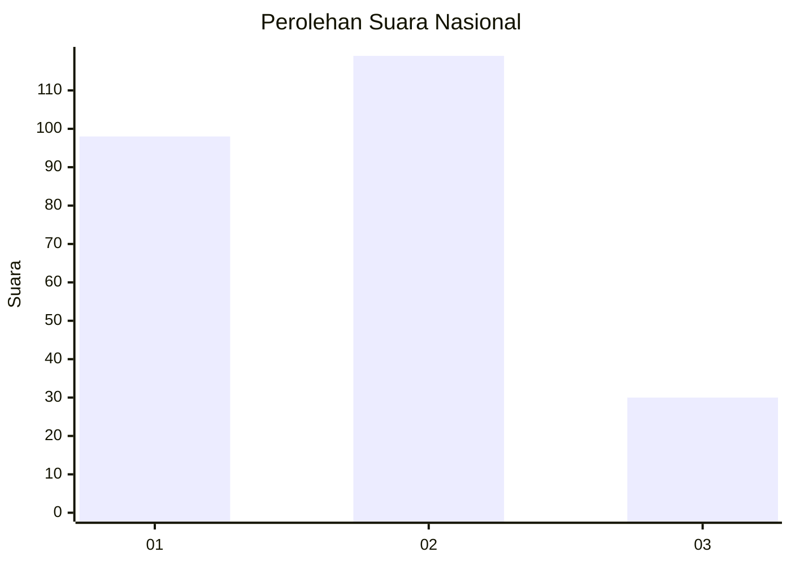
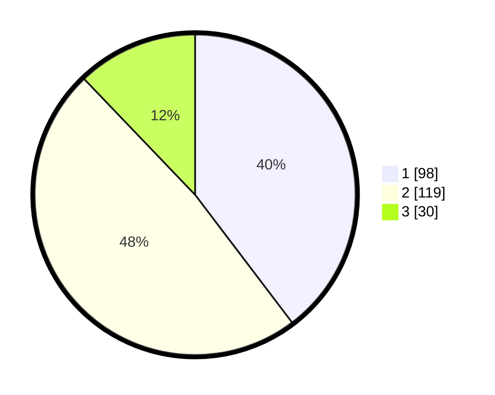

# Hasil

## Grafik

## Tabel

| No. | Nama Paslon    | Suara | Suara (raw) | Persentase |
|:--- |:-------------- | -----:| -----------:| ----------:|
| 1   | ANIES MUHAIMIN | 98    | [98][p-1]   | 39,68      |
| 2   | PRABOWO GIBRAN | 119   | [119][p-2]  | 48,18      |
| 3   | GANJAR MAHFUD  | 30    | [30][p-3]   | 12,15      |

[p-1]: https://github.com/gigit-pemilu/pemilu-2024/blob/main/pilpres/hitung-suara/sub/99-luar-negeri/sub/01-abu-dhabi-uni-emirat-arab/sub/01-abu-dhabi-uni-emirat-arab/sub/0001-abu-dhabi-uni-emirat-arab/sub/005-tps-004/sub/paslon-1.txt
[p-2]: https://github.com/gigit-pemilu/pemilu-2024/blob/main/pilpres/hitung-suara/sub/99-luar-negeri/sub/01-abu-dhabi-uni-emirat-arab/sub/01-abu-dhabi-uni-emirat-arab/sub/0001-abu-dhabi-uni-emirat-arab/sub/005-tps-004/sub/paslon-2.txt
[p-3]: https://github.com/gigit-pemilu/pemilu-2024/blob/main/pilpres/hitung-suara/sub/99-luar-negeri/sub/01-abu-dhabi-uni-emirat-arab/sub/01-abu-dhabi-uni-emirat-arab/sub/0001-abu-dhabi-uni-emirat-arab/sub/005-tps-004/sub/paslon-3.txt

## Foto C Plano

https://sirekap-obj-formc.kpu.go.id/c253/pemilu/ppwp/99/01/01/00/01/9901010001005-20240221-021136--1c653f8a-fce7-4fc1-b8e5-bccf79abd09e.jpg

https://sirekap-obj-formc.kpu.go.id/c253/pemilu/ppwp/99/01/01/00/01/9901010001005-20240214-222115--c25dbc91-cc70-479d-ab33-3c8375dd8fde.jpg

https://sirekap-obj-formc.kpu.go.id/c253/pemilu/ppwp/99/01/01/00/01/9901010001005-20240215-142157--352cffc7-4a07-4ee7-a345-39eaff9b5e37.jpg

## Metadata

| Key        | Value               |
| ---------- | ------------------- |
| Time Stamp | 2024-02-21 03:00:00 |

## DATA PEMILIH TETAP

Jumlah pemilih dalam DPT: **0**.
 * L: **0**.
 * P: **0**.

## DATA PENGGUNA HAK PILIH

Jumlah pengguna hak pilih dalam DPT: **0**.
 * L: **0**.
 * P: **0**.

Jumlah pengguna hak pilih dalam DPTb: **0**.
 * L: **0**.
 * P: **0**.

Jumlah pengguna hak pilih dalam DPK: **0**.
 * L: **0**.
 * P: **0**.

Jumlah pengguna hak pilih: **0**.
 * L: **0**.
 * P: **0**.

## JUMLAH SUARA SAH DAN TIDAK SAH

JUMLAH SELURUH SUARA SAH: **247**.

JUMLAH SUARA TIDAK SAH: **5**.

JUMLAH SELURUH SUARA SAH DAN SUARA TIDAK SAH: **252**.

