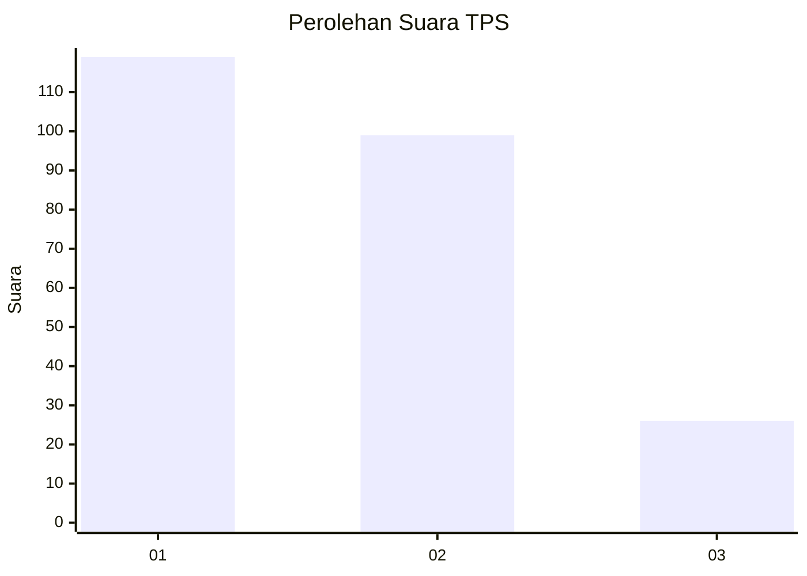
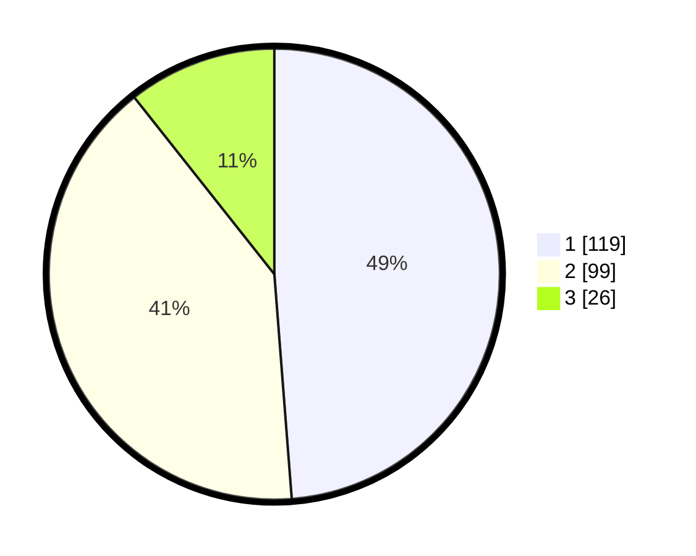

# Hasil

## Grafik

## Tabel

| No. | Nama Paslon    | Suara | Suara (raw) | Persentase |
|:--- |:-------------- | -----:| -----------:| ----------:|
| 1   | ANIES MUHAIMIN | 119   | [119][p-1]  | 48,77      |
| 2   | PRABOWO GIBRAN | 99    | [99][p-2]   | 40,57      |
| 3   | GANJAR MAHFUD  | 26    | [26][p-3]   | 10,66      |

[p-1]: https://github.com/gigit-pemilu/pemilu-2024-99-luar-negeri/blob/main/pilpres/hitung-suara/sub/99-luar-negeri/sub/01-abu-dhabi-uni-emirat-arab/sub/01-abu-dhabi-uni-emirat-arab/sub/0001-abu-dhabi-uni-emirat-arab/sub/007-tps-006/sub/paslon-1.txt
[p-2]: https://github.com/gigit-pemilu/pemilu-2024-99-luar-negeri/blob/main/pilpres/hitung-suara/sub/99-luar-negeri/sub/01-abu-dhabi-uni-emirat-arab/sub/01-abu-dhabi-uni-emirat-arab/sub/0001-abu-dhabi-uni-emirat-arab/sub/007-tps-006/sub/paslon-2.txt
[p-3]: https://github.com/gigit-pemilu/pemilu-2024-99-luar-negeri/blob/main/pilpres/hitung-suara/sub/99-luar-negeri/sub/01-abu-dhabi-uni-emirat-arab/sub/01-abu-dhabi-uni-emirat-arab/sub/0001-abu-dhabi-uni-emirat-arab/sub/007-tps-006/sub/paslon-3.txt

## Foto C Plano

https://sirekap-obj-formc.kpu.go.id/bfcf/pemilu/ppwp/99/01/01/00/01/9901010001007-20240214-184536--5f50be4f-991d-4a33-92e8-519b73e655b0.jpg

https://sirekap-obj-formc.kpu.go.id/bfcf/pemilu/ppwp/99/01/01/00/01/9901010001007-20240214-184652--42c45000-bae4-4293-ade6-ee87859caee3.jpg

https://sirekap-obj-formc.kpu.go.id/bfcf/pemilu/ppwp/99/01/01/00/01/9901010001007-20240214-184547--1b33332d-b502-40d6-b212-c27b2869d3b0.jpg

## Metadata

| Key        | Value               |
| ---------- | ------------------- |
| Time Stamp | 2024-02-14 21:46:01 |

## DATA PEMILIH TETAP

Jumlah pemilih dalam DPT: **485**.
 * L: **180**.
 * P: **305**.

## DATA PENGGUNA HAK PILIH

Jumlah pengguna hak pilih dalam DPT: **75**.
 * L: **38**.
 * P: **37**.

Jumlah pengguna hak pilih dalam DPTb: **113**.
 * L: **47**.
 * P: **66**.

Jumlah pengguna hak pilih dalam DPK: **62**.
 * L: **17**.
 * P: **45**.

Jumlah pengguna hak pilih: **250**.
 * L: **102**.
 * P: **148**.

## JUMLAH SUARA SAH DAN TIDAK SAH

JUMLAH SELURUH SUARA SAH: **244**.

JUMLAH SUARA TIDAK SAH: **6**.

JUMLAH SELURUH SUARA SAH DAN SUARA TIDAK SAH: **250**.

