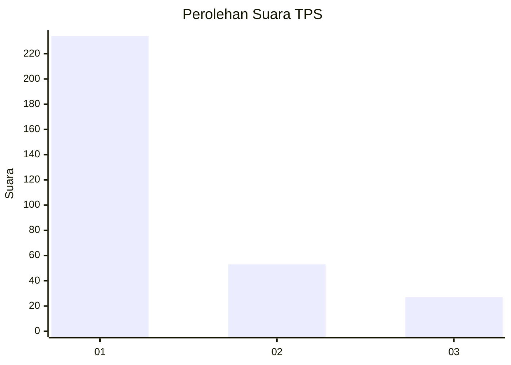
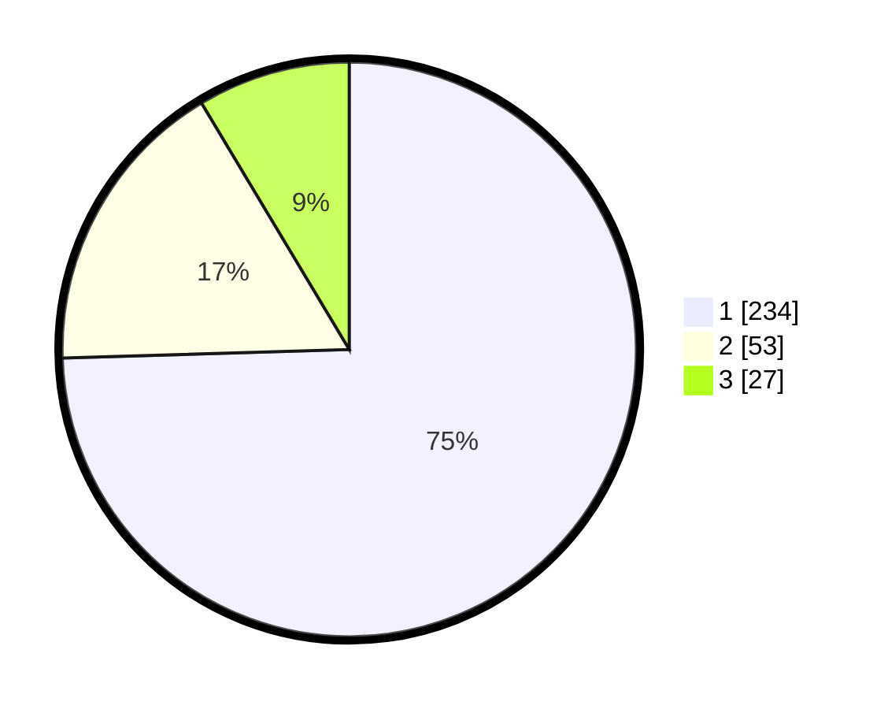

# Hasil

## Grafik

## Tabel

| No. | Nama Paslon    | Suara | Suara (raw) | Persentase |
|:--- |:-------------- | -----:| -----------:| ----------:|
| 1   | ANIES MUHAIMIN | 234   | [234][p-1]  | 74,52      |
| 2   | PRABOWO GIBRAN | 53    | [53][p-2]   | 16,88      |
| 3   | GANJAR MAHFUD  | 27    | [27][p-3]   | 8,60       |

[p-1]: https://github.com/gigit-pemilu/pemilu-2024-99-luar-negeri/blob/main/pilpres/hitung-suara/sub/99-luar-negeri/sub/01-abu-dhabi-uni-emirat-arab/sub/01-abu-dhabi-uni-emirat-arab/sub/0001-abu-dhabi-uni-emirat-arab/sub/011-ksk-002/sub/paslon-1.txt
[p-2]: https://github.com/gigit-pemilu/pemilu-2024-99-luar-negeri/blob/main/pilpres/hitung-suara/sub/99-luar-negeri/sub/01-abu-dhabi-uni-emirat-arab/sub/01-abu-dhabi-uni-emirat-arab/sub/0001-abu-dhabi-uni-emirat-arab/sub/011-ksk-002/sub/paslon-2.txt
[p-3]: https://github.com/gigit-pemilu/pemilu-2024-99-luar-negeri/blob/main/pilpres/hitung-suara/sub/99-luar-negeri/sub/01-abu-dhabi-uni-emirat-arab/sub/01-abu-dhabi-uni-emirat-arab/sub/0001-abu-dhabi-uni-emirat-arab/sub/011-ksk-002/sub/paslon-3.txt

## Foto C Plano

https://sirekap-obj-formc.kpu.go.id/0c14/pemilu/ppwp/99/01/01/00/01/9901010001011-20240214-223802--a1724b00-0501-45fe-a775-5b989c26736d.jpg

https://sirekap-obj-formc.kpu.go.id/0c14/pemilu/ppwp/99/01/01/00/01/9901010001011-20240214-223847--20df6042-1137-4d52-936b-79f6c2d2f967.jpg

https://sirekap-obj-formc.kpu.go.id/0c14/pemilu/ppwp/99/01/01/00/01/9901010001011-20240214-223934--fba7a6f7-4a7f-49aa-9843-9538d7e0b241.jpg

## Metadata

| Key        | Value               |
| ---------- | ------------------- |
| Time Stamp | 2024-02-15 15:00:29 |

## DATA PEMILIH TETAP

Jumlah pemilih dalam DPT: **468**.
 * L: **261**.
 * P: **207**.

## DATA PENGGUNA HAK PILIH

Jumlah pengguna hak pilih dalam DPT: **282**.
 * L: **172**.
 * P: **110**.

Jumlah pengguna hak pilih dalam DPTb: **37**.
 * L: **17**.
 * P: **20**.

Jumlah pengguna hak pilih dalam DPK: **0**.
 * L: **0**.
 * P: **0**.

Jumlah pengguna hak pilih: **319**.
 * L: **189**.
 * P: **130**.

## JUMLAH SUARA SAH DAN TIDAK SAH

JUMLAH SELURUH SUARA SAH: **314**.

JUMLAH SUARA TIDAK SAH: **5**.

JUMLAH SELURUH SUARA SAH DAN SUARA TIDAK SAH: **319**.

