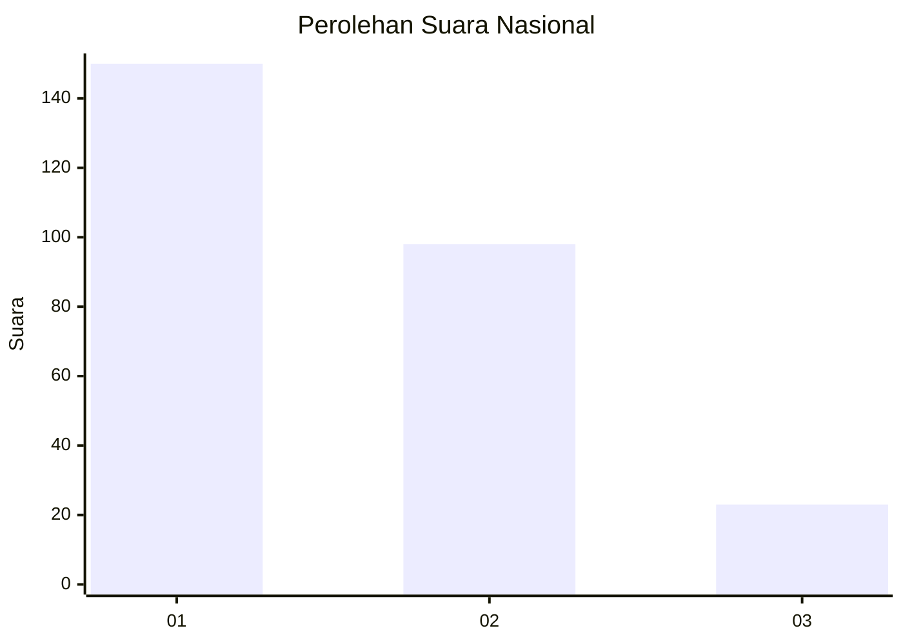
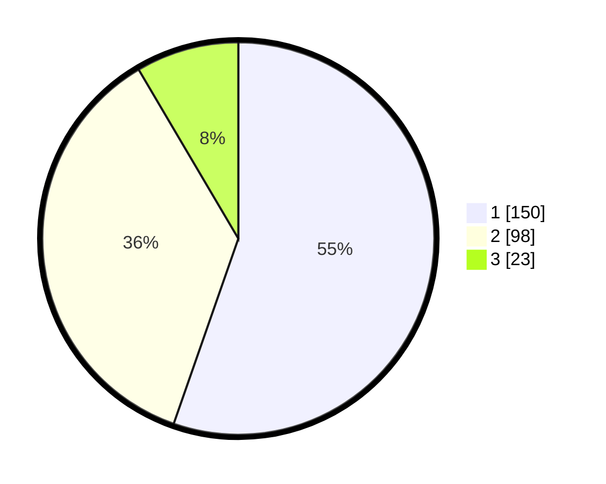

# Hasil

## Grafik

## Tabel

| No. | Nama Paslon    | Suara | Suara (raw) | Persentase |
|:--- |:-------------- | -----:| -----------:| ----------:|
| 1   | ANIES MUHAIMIN | 150   | [150][p-1]  | 55,35      |
| 2   | PRABOWO GIBRAN | 98    | [98][p-2]   | 36,16      |
| 3   | GANJAR MAHFUD  | 23    | [23][p-3]   | 8,49       |

[p-1]: https://github.com/gigit-pemilu/pemilu-2024/blob/main/pilpres/hitung-suara/sub/99-luar-negeri/sub/01-abu-dhabi-uni-emirat-arab/sub/01-abu-dhabi-uni-emirat-arab/sub/0001-abu-dhabi-uni-emirat-arab/sub/013-ksk-004/sub/paslon-1.txt
[p-2]: https://github.com/gigit-pemilu/pemilu-2024/blob/main/pilpres/hitung-suara/sub/99-luar-negeri/sub/01-abu-dhabi-uni-emirat-arab/sub/01-abu-dhabi-uni-emirat-arab/sub/0001-abu-dhabi-uni-emirat-arab/sub/013-ksk-004/sub/paslon-2.txt
[p-3]: https://github.com/gigit-pemilu/pemilu-2024/blob/main/pilpres/hitung-suara/sub/99-luar-negeri/sub/01-abu-dhabi-uni-emirat-arab/sub/01-abu-dhabi-uni-emirat-arab/sub/0001-abu-dhabi-uni-emirat-arab/sub/013-ksk-004/sub/paslon-3.txt

## Foto C Plano

https://sirekap-obj-formc.kpu.go.id/d1bf/pemilu/ppwp/99/01/01/00/01/9901010001013-20240219-202850--20a6b559-4cdc-4728-91ab-0236920e8941.jpg

https://sirekap-obj-formc.kpu.go.id/d1bf/pemilu/ppwp/99/01/01/00/01/9901010001013-20240218-195320--f9a32dca-df30-4546-997b-ce9a24bf97fe.jpg

https://sirekap-obj-formc.kpu.go.id/d1bf/pemilu/ppwp/99/01/01/00/01/9901010001013-20240219-203123--1e671bf9-0b78-41bb-9376-644a2301aa89.jpg

## Metadata

| Key        | Value               |
| ---------- | ------------------- |
| Time Stamp | 2024-02-19 23:00:00 |

## DATA PEMILIH TETAP

Jumlah pemilih dalam DPT: **328**.
 * L: **125**.
 * P: **203**.

## DATA PENGGUNA HAK PILIH

Jumlah pengguna hak pilih dalam DPT: **7**.
 * L: **3**.
 * P: **4**.

Jumlah pengguna hak pilih dalam DPTb: **56**.
 * L: **43**.
 * P: **13**.

Jumlah pengguna hak pilih dalam DPK: **209**.
 * L: **121**.
 * P: **88**.

Jumlah pengguna hak pilih: **272**.
 * L: **167**.
 * P: **105**.

## JUMLAH SUARA SAH DAN TIDAK SAH

JUMLAH SELURUH SUARA SAH: **271**.

JUMLAH SUARA TIDAK SAH: **1**.

JUMLAH SELURUH SUARA SAH DAN SUARA TIDAK SAH: **272**.

