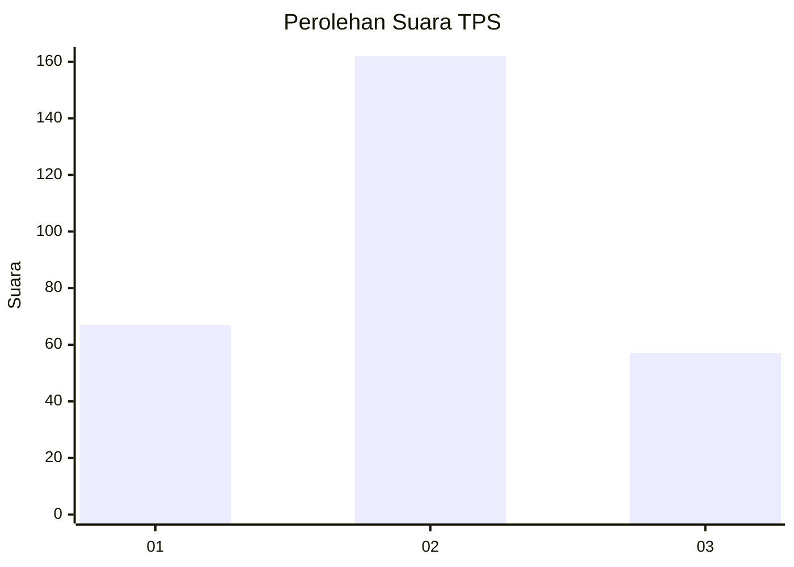
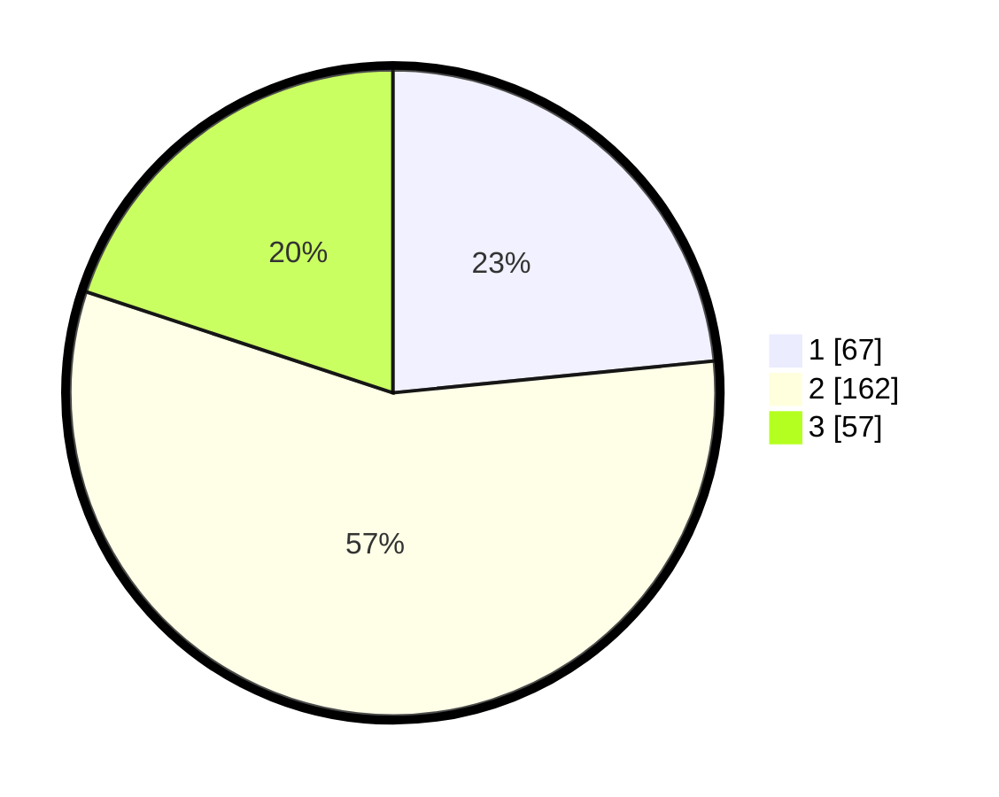

# Hasil

## Grafik

## Tabel

| No. | Nama Paslon    | Suara | Suara (raw) | Persentase |
|:--- |:-------------- | -----:| -----------:| ----------:|
| 1   | ANIES MUHAIMIN | 67    | [67][p-1]   | 23,43      |
| 2   | PRABOWO GIBRAN | 162   | [162][p-2]  | 56,64      |
| 3   | GANJAR MAHFUD  | 57    | [57][p-3]   | 19,93      |

[p-1]: https://github.com/gigit-pemilu/pemilu-2024-99-luar-negeri/blob/main/pilpres/hitung-suara/sub/99-luar-negeri/sub/02-abuja-nigeria/sub/01-abuja-nigeria/sub/0001-abuja-nigeria/sub/001-pos-001/sub/paslon-1.txt
[p-2]: https://github.com/gigit-pemilu/pemilu-2024-99-luar-negeri/blob/main/pilpres/hitung-suara/sub/99-luar-negeri/sub/02-abuja-nigeria/sub/01-abuja-nigeria/sub/0001-abuja-nigeria/sub/001-pos-001/sub/paslon-2.txt
[p-3]: https://github.com/gigit-pemilu/pemilu-2024-99-luar-negeri/blob/main/pilpres/hitung-suara/sub/99-luar-negeri/sub/02-abuja-nigeria/sub/01-abuja-nigeria/sub/0001-abuja-nigeria/sub/001-pos-001/sub/paslon-3.txt

## Foto C Plano

https://sirekap-obj-formc.kpu.go.id/e2f5/pemilu/ppwp/99/02/01/00/01/9902010001001-20240216-210556--23a782ed-4444-4197-a9f2-aef88c9773f0.jpg

https://sirekap-obj-formc.kpu.go.id/e2f5/pemilu/ppwp/99/02/01/00/01/9902010001001-20240216-205121--d40e9cac-36e9-43d0-94b0-5589398cc9d1.jpg

https://sirekap-obj-formc.kpu.go.id/e2f5/pemilu/ppwp/99/02/01/00/01/9902010001001-20240216-211043--6f37265d-7542-44af-911b-444a2d053add.jpg

## Metadata

| Key        | Value               |
| ---------- | ------------------- |
| Time Stamp | 2024-02-16 22:01:00 |

## DATA PEMILIH TETAP

Jumlah pemilih dalam DPT: **686**.
 * L: **654**.
 * P: **32**.

## DATA PENGGUNA HAK PILIH

Jumlah pengguna hak pilih dalam DPT: **286**.
 * L: **270**.
 * P: **16**.

Jumlah pengguna hak pilih dalam DPTb: **0**.
 * L: **0**.
 * P: **0**.

Jumlah pengguna hak pilih dalam DPK: **0**.
 * L: **0**.
 * P: **0**.

Jumlah pengguna hak pilih: **286**.
 * L: **270**.
 * P: **16**.

## JUMLAH SUARA SAH DAN TIDAK SAH

JUMLAH SELURUH SUARA SAH: **286**.

JUMLAH SUARA TIDAK SAH: **44**.

JUMLAH SELURUH SUARA SAH DAN SUARA TIDAK SAH: **330**.

