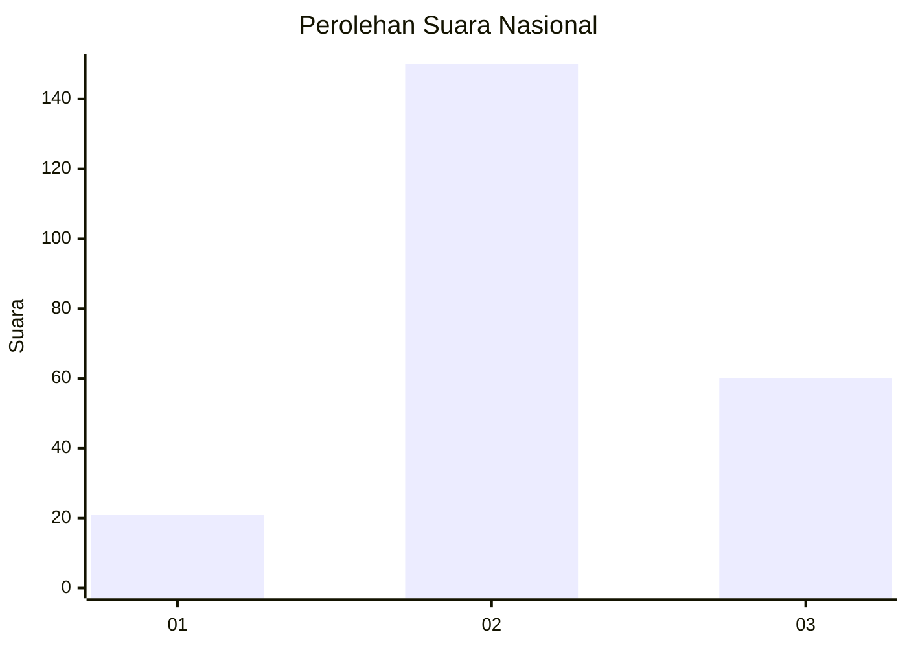
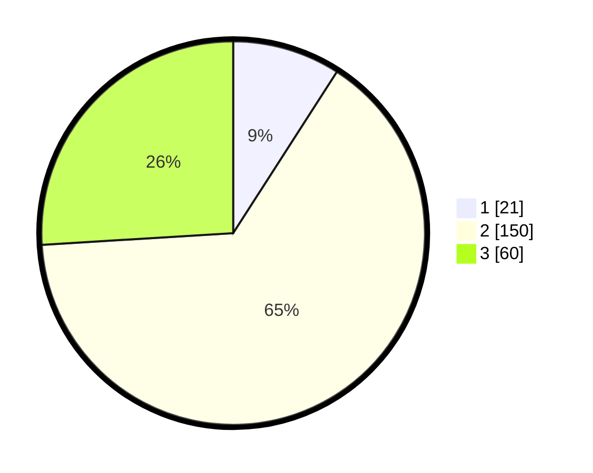

# Hasil

## Grafik

## Tabel

| No. | Nama Paslon    | Suara | Suara (raw) | Persentase |
|:--- |:-------------- | -----:| -----------:| ----------:|
| 1   | ANIES MUHAIMIN | 21    | [21][p-1]   | 9,09       |
| 2   | PRABOWO GIBRAN | 150   | [150][p-2]  | 64,94      |
| 3   | GANJAR MAHFUD  | 60    | [60][p-3]   | 25,97      |

[p-1]: https://github.com/gigit-pemilu/pemilu-2024/blob/main/pilpres/hitung-suara/sub/99-luar-negeri/sub/02-abuja-nigeria/sub/01-abuja-nigeria/sub/0001-abuja-nigeria/sub/002-pos-002/sub/paslon-1.txt
[p-2]: https://github.com/gigit-pemilu/pemilu-2024/blob/main/pilpres/hitung-suara/sub/99-luar-negeri/sub/02-abuja-nigeria/sub/01-abuja-nigeria/sub/0001-abuja-nigeria/sub/002-pos-002/sub/paslon-2.txt
[p-3]: https://github.com/gigit-pemilu/pemilu-2024/blob/main/pilpres/hitung-suara/sub/99-luar-negeri/sub/02-abuja-nigeria/sub/01-abuja-nigeria/sub/0001-abuja-nigeria/sub/002-pos-002/sub/paslon-3.txt

## Foto C Plano

https://sirekap-obj-formc.kpu.go.id/c982/pemilu/ppwp/99/02/01/00/01/9902010001002-20240218-002914--2f0ce906-82da-48a8-89d9-93f59a43b6c0.jpg

https://sirekap-obj-formc.kpu.go.id/c982/pemilu/ppwp/99/02/01/00/01/9902010001002-20240218-005536--4e1d2399-383b-4749-959f-f61ff20b5cf9.jpg

https://sirekap-obj-formc.kpu.go.id/c982/pemilu/ppwp/99/02/01/00/01/9902010001002-20240218-005813--7a045647-bd51-4d37-9e4c-b36cd68e5785.jpg

## Metadata

| Key        | Value               |
| ---------- | ------------------- |
| Time Stamp | 2024-02-19 06:16:00 |

## DATA PEMILIH TETAP

Jumlah pemilih dalam DPT: **281**.
 * L: **266**.
 * P: **15**.

## DATA PENGGUNA HAK PILIH

Jumlah pengguna hak pilih dalam DPT: **214**.
 * L: **203**.
 * P: **11**.

Jumlah pengguna hak pilih dalam DPTb: **17**.
 * L: **16**.
 * P: **1**.

Jumlah pengguna hak pilih dalam DPK: **0**.
 * L: **0**.
 * P: **0**.

Jumlah pengguna hak pilih: **231**.
 * L: **219**.
 * P: **12**.

## JUMLAH SUARA SAH DAN TIDAK SAH

JUMLAH SELURUH SUARA SAH: **231**.

JUMLAH SUARA TIDAK SAH: **3**.

JUMLAH SELURUH SUARA SAH DAN SUARA TIDAK SAH: **234**.

