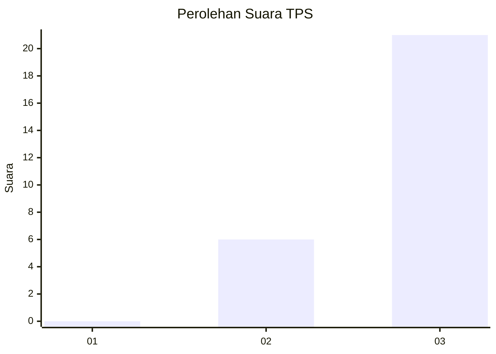
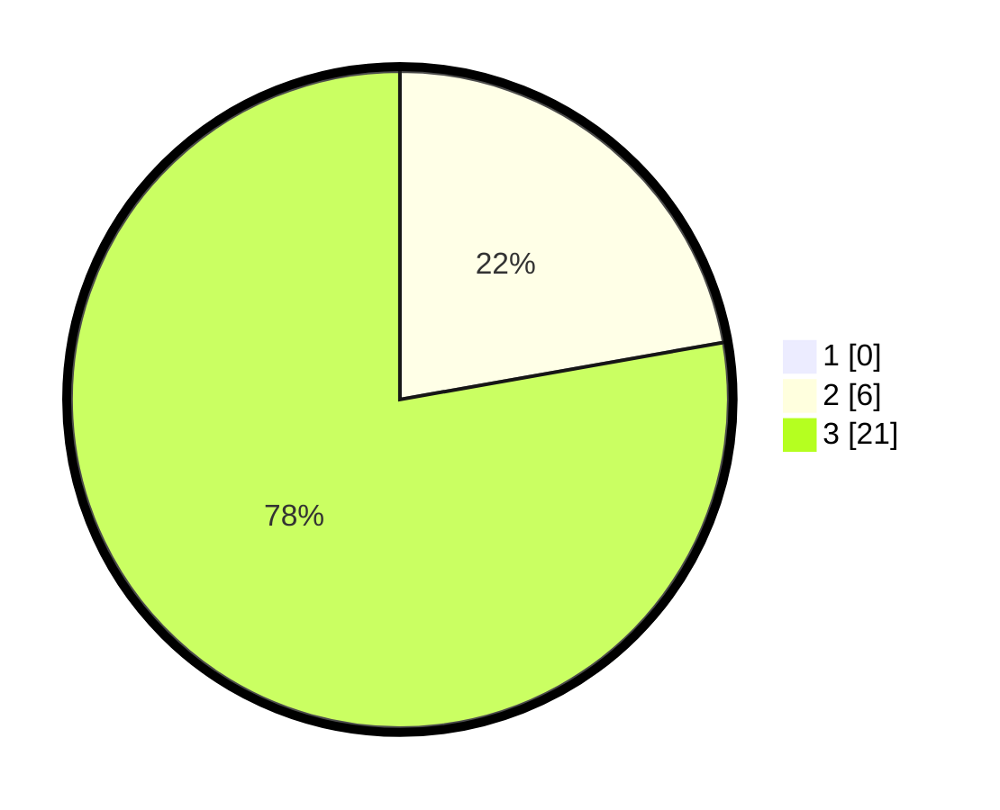

# Hasil

## Grafik

## Tabel

| No. | Nama Paslon    | Suara | Suara (raw) | Persentase |
|:--- |:-------------- | -----:| -----------:| ----------:|
| 1   | ANIES MUHAIMIN | 0     | [0][p-1]    | 0,00       |
| 2   | PRABOWO GIBRAN | 6     | [6][p-2]    | 22,22      |
| 3   | GANJAR MAHFUD  | 21    | [21][p-3]   | 77,78      |

[p-1]: https://github.com/gigit-pemilu/pemilu-2024-99-luar-negeri/blob/main/pilpres/hitung-suara/sub/99-luar-negeri/sub/02-abuja-nigeria/sub/01-abuja-nigeria/sub/0001-abuja-nigeria/sub/003-pos-003/sub/paslon-1.txt
[p-2]: https://github.com/gigit-pemilu/pemilu-2024-99-luar-negeri/blob/main/pilpres/hitung-suara/sub/99-luar-negeri/sub/02-abuja-nigeria/sub/01-abuja-nigeria/sub/0001-abuja-nigeria/sub/003-pos-003/sub/paslon-2.txt
[p-3]: https://github.com/gigit-pemilu/pemilu-2024-99-luar-negeri/blob/main/pilpres/hitung-suara/sub/99-luar-negeri/sub/02-abuja-nigeria/sub/01-abuja-nigeria/sub/0001-abuja-nigeria/sub/003-pos-003/sub/paslon-3.txt

## Foto C Plano

https://sirekap-obj-formc.kpu.go.id/1faa/pemilu/ppwp/99/02/01/00/01/9902010001003-20240216-173418--79e3adba-d255-46bf-899f-921f8ba265ac.jpg

https://sirekap-obj-formc.kpu.go.id/1faa/pemilu/ppwp/99/02/01/00/01/9902010001003-20240217-232534--844fd5b5-9cf3-47e8-adec-086eca09830d.jpg

https://sirekap-obj-formc.kpu.go.id/1faa/pemilu/ppwp/99/02/01/00/01/9902010001003-20240217-232847--e83190f1-6532-432d-8910-73d1ad679cb9.jpg

## Metadata

| Key        | Value               |
| ---------- | ------------------- |
| Time Stamp | 2024-02-19 06:16:00 |

## DATA PEMILIH TETAP

Jumlah pemilih dalam DPT: **47**.
 * L: **27**.
 * P: **20**.

## DATA PENGGUNA HAK PILIH

Jumlah pengguna hak pilih dalam DPT: **26**.
 * L: **11**.
 * P: **15**.

Jumlah pengguna hak pilih dalam DPTb: **2**.
 * L: **0**.
 * P: **2**.

Jumlah pengguna hak pilih dalam DPK: **0**.
 * L: **0**.
 * P: **0**.

Jumlah pengguna hak pilih: **28**.
 * L: **11**.
 * P: **17**.

## JUMLAH SUARA SAH DAN TIDAK SAH

JUMLAH SELURUH SUARA SAH: **27**.

JUMLAH SUARA TIDAK SAH: **1**.

JUMLAH SELURUH SUARA SAH DAN SUARA TIDAK SAH: **28**.

