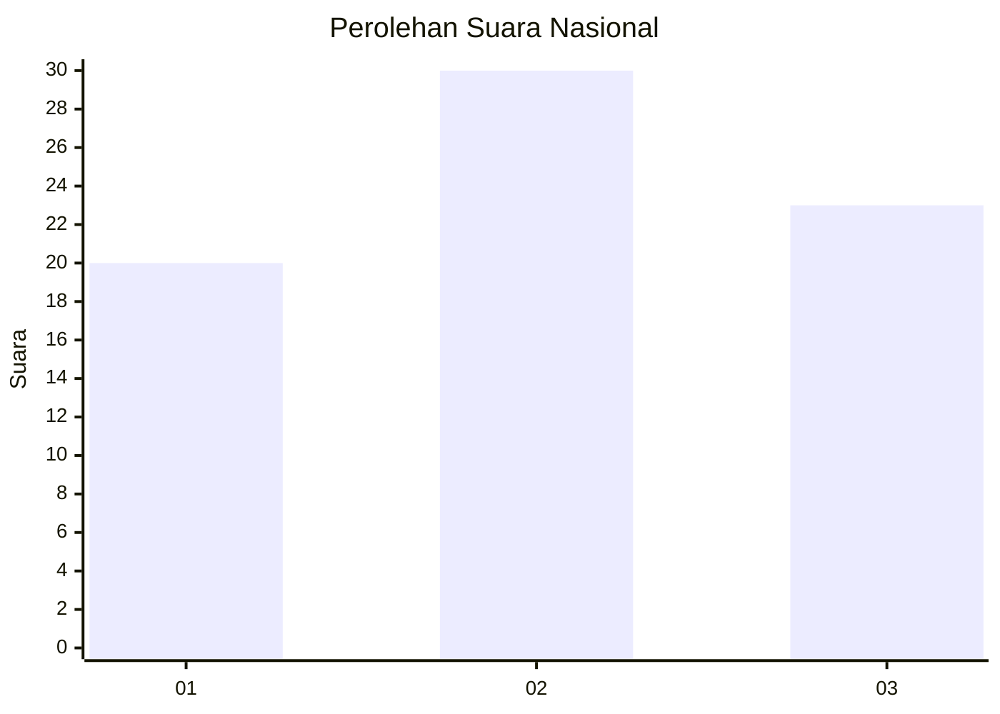
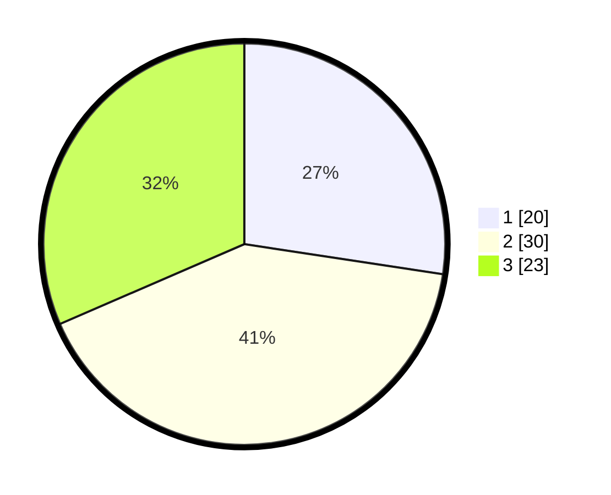

# Hasil

## Grafik

## Tabel

| No. | Nama Paslon    | Suara | Suara (raw) | Persentase |
|:--- |:-------------- | -----:| -----------:| ----------:|
| 1   | ANIES MUHAIMIN | 20    | [20][p-1]   | 27,40      |
| 2   | PRABOWO GIBRAN | 30    | [30][p-2]   | 41,10      |
| 3   | GANJAR MAHFUD  | 23    | [23][p-3]   | 31,51      |

[p-1]: https://github.com/gigit-pemilu/pemilu-2024/blob/main/pilpres/hitung-suara/sub/99-luar-negeri/sub/02-abuja-nigeria/sub/01-abuja-nigeria/sub/0001-abuja-nigeria/sub/004-pos-004/sub/paslon-1.txt
[p-2]: https://github.com/gigit-pemilu/pemilu-2024/blob/main/pilpres/hitung-suara/sub/99-luar-negeri/sub/02-abuja-nigeria/sub/01-abuja-nigeria/sub/0001-abuja-nigeria/sub/004-pos-004/sub/paslon-2.txt
[p-3]: https://github.com/gigit-pemilu/pemilu-2024/blob/main/pilpres/hitung-suara/sub/99-luar-negeri/sub/02-abuja-nigeria/sub/01-abuja-nigeria/sub/0001-abuja-nigeria/sub/004-pos-004/sub/paslon-3.txt

## Foto C Plano

https://sirekap-obj-formc.kpu.go.id/864b/pemilu/ppwp/99/02/01/00/01/9902010001004-20240216-020927--c891b1c5-9c1f-40cd-95ee-bc0e5456bc1b.jpg

https://sirekap-obj-formc.kpu.go.id/864b/pemilu/ppwp/99/02/01/00/01/9902010001004-20240216-020450--e007caf9-0f49-4e93-8bf3-e7a7e3b9b4de.jpg

https://sirekap-obj-formc.kpu.go.id/864b/pemilu/ppwp/99/02/01/00/01/9902010001004-20240216-020515--94d7856c-b615-4d89-b74e-9a9889021f7d.jpg

## Metadata

| Key        | Value               |
| ---------- | ------------------- |
| Time Stamp | 2024-02-16 02:30:27 |

## DATA PEMILIH TETAP

Jumlah pemilih dalam DPT: **80**.
 * L: **77**.
 * P: **3**.

## DATA PENGGUNA HAK PILIH

Jumlah pengguna hak pilih dalam DPT: **64**.
 * L: **63**.
 * P: **1**.

Jumlah pengguna hak pilih dalam DPTb: **10**.
 * L: **10**.
 * P: **0**.

Jumlah pengguna hak pilih dalam DPK: **0**.
 * L: **0**.
 * P: **0**.

Jumlah pengguna hak pilih: **74**.
 * L: **73**.
 * P: **1**.

## JUMLAH SUARA SAH DAN TIDAK SAH

JUMLAH SELURUH SUARA SAH: **73**.

JUMLAH SUARA TIDAK SAH: **1**.

JUMLAH SELURUH SUARA SAH DAN SUARA TIDAK SAH: **74**.

