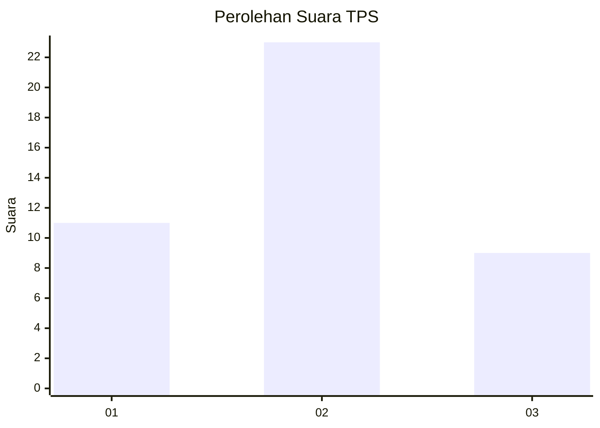
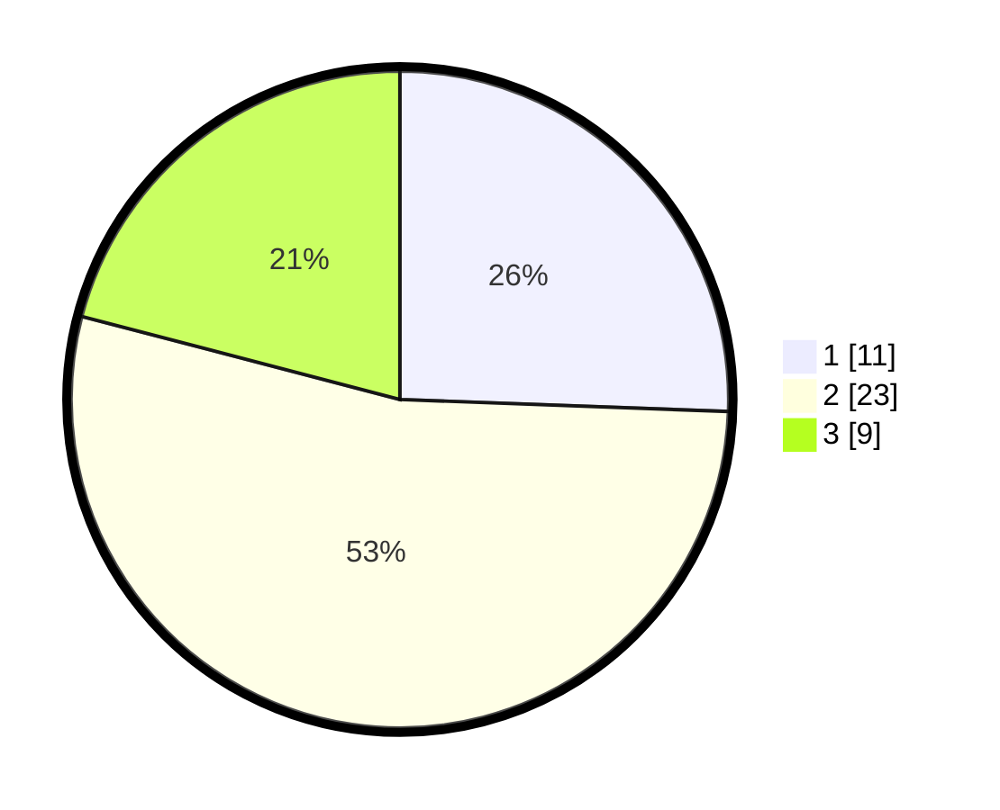

# Hasil

## Grafik

## Tabel

| No. | Nama Paslon    | Suara | Suara (raw) | Persentase |
|:--- |:-------------- | -----:| -----------:| ----------:|
| 1   | ANIES MUHAIMIN | 11    | [11][p-1]   | 25,58      |
| 2   | PRABOWO GIBRAN | 23    | [23][p-2]   | 53,49      |
| 3   | GANJAR MAHFUD  | 9     | [9][p-3]    | 20,93      |

[p-1]: https://github.com/gigit-pemilu/pemilu-2024-99-luar-negeri/blob/main/pilpres/hitung-suara/sub/99-luar-negeri/sub/02-abuja-nigeria/sub/01-abuja-nigeria/sub/0001-abuja-nigeria/sub/005-tps-001/sub/paslon-1.txt
[p-2]: https://github.com/gigit-pemilu/pemilu-2024-99-luar-negeri/blob/main/pilpres/hitung-suara/sub/99-luar-negeri/sub/02-abuja-nigeria/sub/01-abuja-nigeria/sub/0001-abuja-nigeria/sub/005-tps-001/sub/paslon-2.txt
[p-3]: https://github.com/gigit-pemilu/pemilu-2024-99-luar-negeri/blob/main/pilpres/hitung-suara/sub/99-luar-negeri/sub/02-abuja-nigeria/sub/01-abuja-nigeria/sub/0001-abuja-nigeria/sub/005-tps-001/sub/paslon-3.txt

## Foto C Plano

https://sirekap-obj-formc.kpu.go.id/b264/pemilu/ppwp/99/02/01/00/01/9902010001005-20240214-191038--2f22538e-e64a-4d23-bf5f-0ef9b183e295.jpg

https://sirekap-obj-formc.kpu.go.id/b264/pemilu/ppwp/99/02/01/00/01/9902010001005-20240214-191041--674145fc-c9f8-4949-9a5d-4f6ef81a98a1.jpg

https://sirekap-obj-formc.kpu.go.id/b264/pemilu/ppwp/99/02/01/00/01/9902010001005-20240214-191044--ae5568af-d129-4ca1-b76c-cfb723c06ac1.jpg

## Metadata

| Key        | Value               |
| ---------- | ------------------- |
| Time Stamp | 2024-02-15 00:41:44 |

## DATA PEMILIH TETAP

Jumlah pemilih dalam DPT: **58**.
 * L: **22**.
 * P: **36**.

## DATA PENGGUNA HAK PILIH

Jumlah pengguna hak pilih dalam DPT: **32**.
 * L: **12**.
 * P: **20**.

Jumlah pengguna hak pilih dalam DPTb: **2**.
 * L: **1**.
 * P: **1**.

Jumlah pengguna hak pilih dalam DPK: **9**.
 * L: **6**.
 * P: **3**.

Jumlah pengguna hak pilih: **43**.
 * L: **19**.
 * P: **24**.

## JUMLAH SUARA SAH DAN TIDAK SAH

JUMLAH SELURUH SUARA SAH: **43**.

JUMLAH SUARA TIDAK SAH: **0**.

JUMLAH SELURUH SUARA SAH DAN SUARA TIDAK SAH: **43**.

