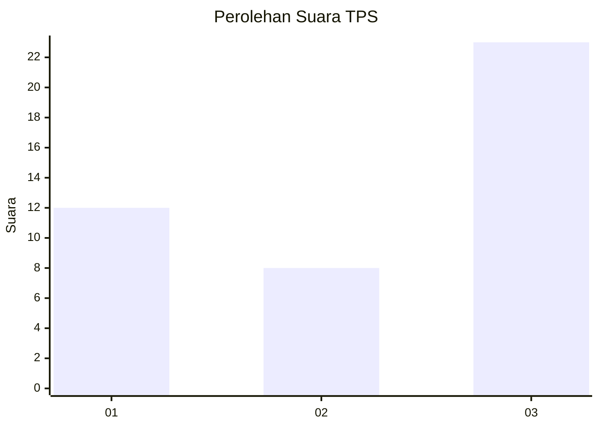
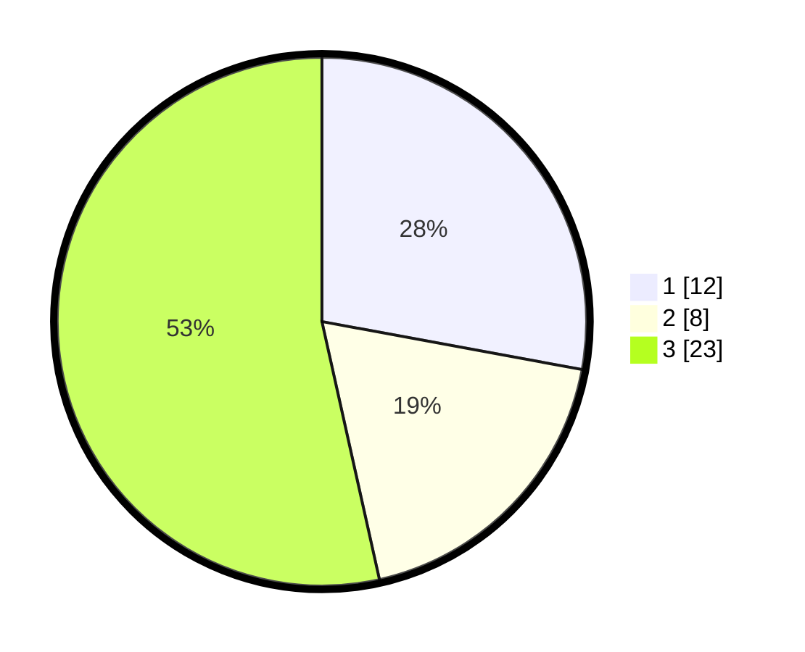

# Hasil

## Grafik

## Tabel

| No. | Nama Paslon    | Suara | Suara (raw) | Persentase |
|:--- |:-------------- | -----:| -----------:| ----------:|
| 1   | ANIES MUHAIMIN | 12    | [12][p-1]   | 27,91      |
| 2   | PRABOWO GIBRAN | 8     | [8][p-2]    | 18,60      |
| 3   | GANJAR MAHFUD  | 23    | [23][p-3]   | 53,49      |

[p-1]: https://github.com/gigit-pemilu/pemilu-2024-99-luar-negeri/blob/main/pilpres/hitung-suara/sub/99-luar-negeri/sub/03-addis-ababa-ethiopia/sub/01-addis-ababa-ethiopia/sub/0001-addis-ababa-ethiopia/sub/001-tps/sub/paslon-1.txt
[p-2]: https://github.com/gigit-pemilu/pemilu-2024-99-luar-negeri/blob/main/pilpres/hitung-suara/sub/99-luar-negeri/sub/03-addis-ababa-ethiopia/sub/01-addis-ababa-ethiopia/sub/0001-addis-ababa-ethiopia/sub/001-tps/sub/paslon-2.txt
[p-3]: https://github.com/gigit-pemilu/pemilu-2024-99-luar-negeri/blob/main/pilpres/hitung-suara/sub/99-luar-negeri/sub/03-addis-ababa-ethiopia/sub/01-addis-ababa-ethiopia/sub/0001-addis-ababa-ethiopia/sub/001-tps/sub/paslon-3.txt

## Foto C Plano

https://sirekap-obj-formc.kpu.go.id/f7b4/pemilu/ppwp/99/03/01/00/01/9903010001001-20240215-054558--085e2967-ef88-49d0-9b57-a5bb8022ff31.jpg

https://sirekap-obj-formc.kpu.go.id/f7b4/pemilu/ppwp/99/03/01/00/01/9903010001001-20240215-054619--d0a26012-883d-46b1-b518-39b3e8af81ce.jpg

https://sirekap-obj-formc.kpu.go.id/f7b4/pemilu/ppwp/99/03/01/00/01/9903010001001-20240215-054608--967a1010-5508-42ed-b3f7-d7b13a004f8a.jpg

## Metadata

| Key        | Value               |
| ---------- | ------------------- |
| Time Stamp | 2024-02-15 16:30:25 |

## DATA PEMILIH TETAP

Jumlah pemilih dalam DPT: **54**.
 * L: **26**.
 * P: **28**.

## DATA PENGGUNA HAK PILIH

Jumlah pengguna hak pilih dalam DPT: **38**.
 * L: **21**.
 * P: **17**.

Jumlah pengguna hak pilih dalam DPTb: **5**.
 * L: **1**.
 * P: **4**.

Jumlah pengguna hak pilih dalam DPK: **1**.
 * L: **1**.
 * P: **0**.

Jumlah pengguna hak pilih: **44**.
 * L: **23**.
 * P: **21**.

## JUMLAH SUARA SAH DAN TIDAK SAH

JUMLAH SELURUH SUARA SAH: **43**.

JUMLAH SUARA TIDAK SAH: **1**.

JUMLAH SELURUH SUARA SAH DAN SUARA TIDAK SAH: **44**.

