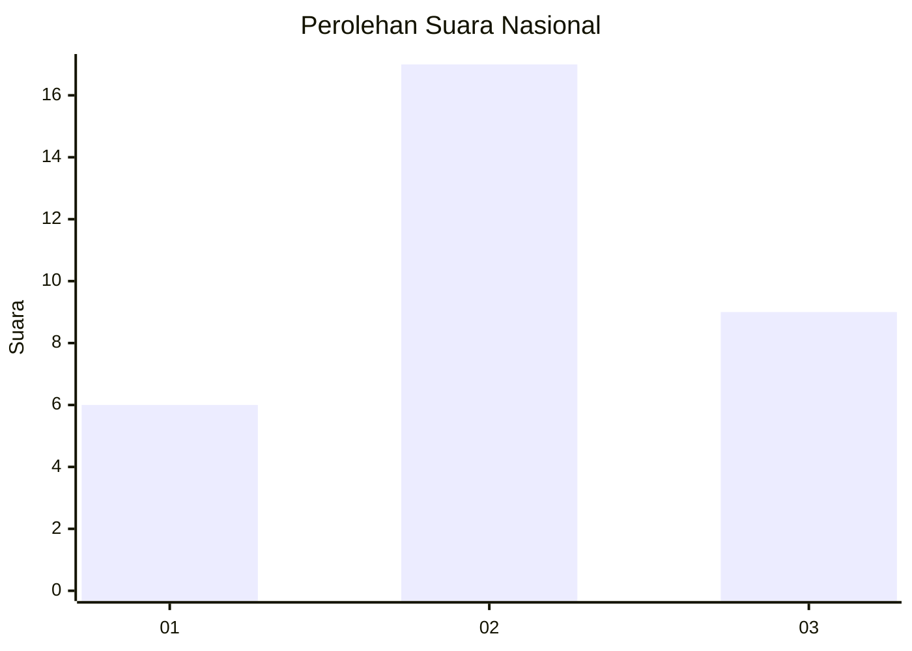
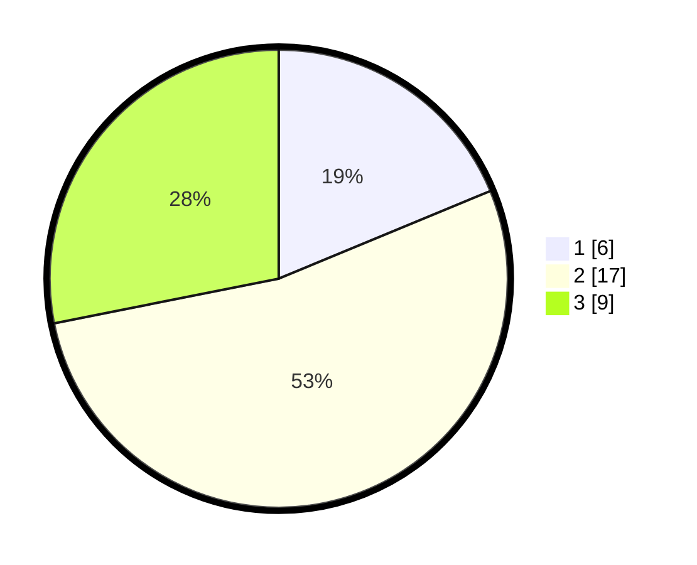

# Hasil

## Grafik

## Tabel

| No. | Nama Paslon    | Suara | Suara (raw) | Persentase |
|:--- |:-------------- | -----:| -----------:| ----------:|
| 1   | ANIES MUHAIMIN | 6     | [6][p-1]    | 18,75      |
| 2   | PRABOWO GIBRAN | 17    | [17][p-2]   | 53,13      |
| 3   | GANJAR MAHFUD  | 9     | [9][p-3]    | 28,13      |

[p-1]: https://github.com/gigit-pemilu/pemilu-2024/blob/main/pilpres/hitung-suara/sub/99-luar-negeri/sub/03-addis-ababa-ethiopia/sub/01-addis-ababa-ethiopia/sub/0001-addis-ababa-ethiopia/sub/002-ksk-001/sub/paslon-1.txt
[p-2]: https://github.com/gigit-pemilu/pemilu-2024/blob/main/pilpres/hitung-suara/sub/99-luar-negeri/sub/03-addis-ababa-ethiopia/sub/01-addis-ababa-ethiopia/sub/0001-addis-ababa-ethiopia/sub/002-ksk-001/sub/paslon-2.txt
[p-3]: https://github.com/gigit-pemilu/pemilu-2024/blob/main/pilpres/hitung-suara/sub/99-luar-negeri/sub/03-addis-ababa-ethiopia/sub/01-addis-ababa-ethiopia/sub/0001-addis-ababa-ethiopia/sub/002-ksk-001/sub/paslon-3.txt

## Foto C Plano

https://sirekap-obj-formc.kpu.go.id/6950/pemilu/ppwp/99/03/01/00/01/9903010001002-20240216-003232--da322bb3-e7db-4dda-8ce3-3dd41dce5c2f.jpg

https://sirekap-obj-formc.kpu.go.id/6950/pemilu/ppwp/99/03/01/00/01/9903010001002-20240216-003234--e65af590-48f2-4d13-b582-25b5eb28ed88.jpg

https://sirekap-obj-formc.kpu.go.id/6950/pemilu/ppwp/99/03/01/00/01/9903010001002-20240216-003233--7de92827-7d8f-4633-bf39-884f3cb1a308.jpg

## Metadata

| Key        | Value               |
| ---------- | ------------------- |
| Time Stamp | 2024-02-16 02:00:27 |

## DATA PEMILIH TETAP

Jumlah pemilih dalam DPT: **50**.
 * L: **22**.
 * P: **28**.

## DATA PENGGUNA HAK PILIH

Jumlah pengguna hak pilih dalam DPT: **28**.
 * L: **12**.
 * P: **16**.

Jumlah pengguna hak pilih dalam DPTb: **4**.
 * L: **3**.
 * P: **1**.

Jumlah pengguna hak pilih dalam DPK: **0**.
 * L: **0**.
 * P: **0**.

Jumlah pengguna hak pilih: **32**.
 * L: **15**.
 * P: **17**.

## JUMLAH SUARA SAH DAN TIDAK SAH

JUMLAH SELURUH SUARA SAH: **32**.

JUMLAH SUARA TIDAK SAH: **0**.

JUMLAH SELURUH SUARA SAH DAN SUARA TIDAK SAH: **32**.

