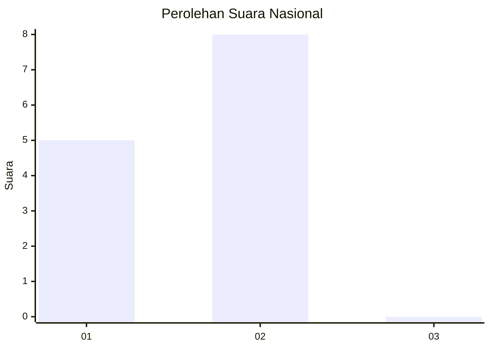
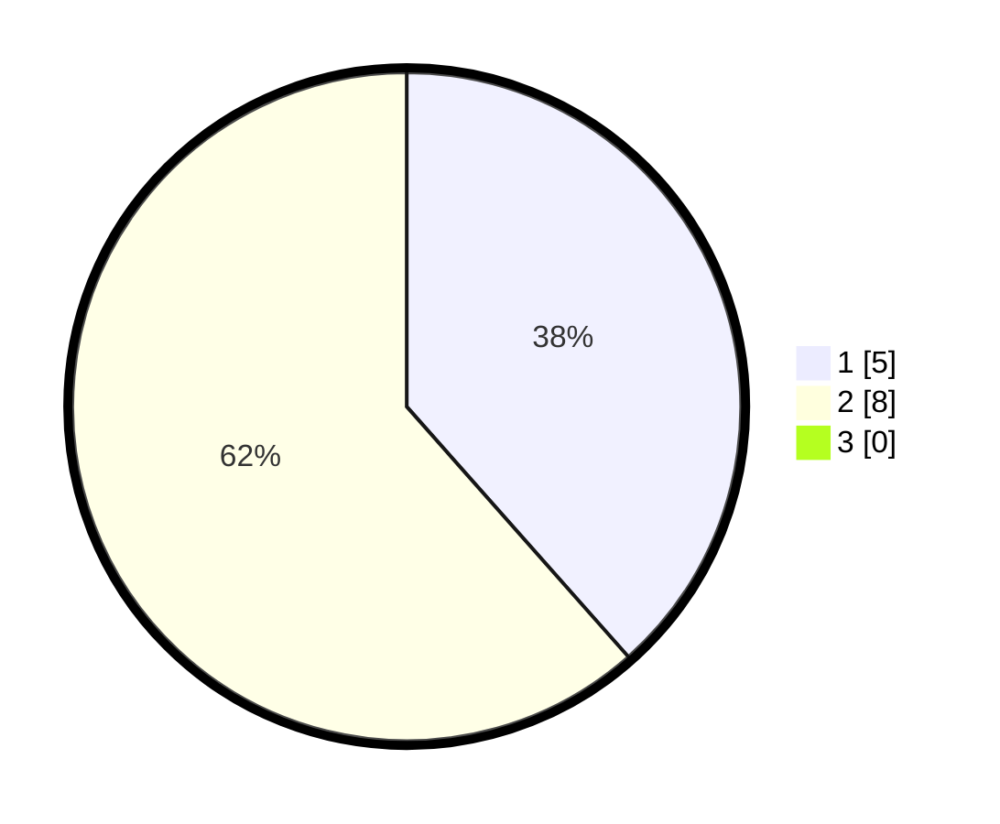

# Hasil

## Grafik

## Tabel

| No. | Nama Paslon    | Suara | Suara (raw) | Persentase |
|:--- |:-------------- | -----:| -----------:| ----------:|
| 1   | ANIES MUHAIMIN | 5     | [5][p-1]    | 38,46      |
| 2   | PRABOWO GIBRAN | 8     | [8][p-2]    | 61,54      |
| 3   | GANJAR MAHFUD  | 0     | [0][p-3]    | 0,00       |

[p-1]: https://github.com/gigit-pemilu/pemilu-2024/blob/main/pilpres/hitung-suara/sub/99-luar-negeri/sub/04-alger-aljazair/sub/01-alger-aljazair/sub/0001-alger-aljazair/sub/001-pos-001/sub/paslon-1.txt
[p-2]: https://github.com/gigit-pemilu/pemilu-2024/blob/main/pilpres/hitung-suara/sub/99-luar-negeri/sub/04-alger-aljazair/sub/01-alger-aljazair/sub/0001-alger-aljazair/sub/001-pos-001/sub/paslon-2.txt
[p-3]: https://github.com/gigit-pemilu/pemilu-2024/blob/main/pilpres/hitung-suara/sub/99-luar-negeri/sub/04-alger-aljazair/sub/01-alger-aljazair/sub/0001-alger-aljazair/sub/001-pos-001/sub/paslon-3.txt

## Foto C Plano

https://sirekap-obj-formc.kpu.go.id/6022/pemilu/ppwp/99/04/01/00/01/9904010001001-20240216-144724--4c8b8efd-ed4d-47d8-a057-69b2544c92fb.jpg

https://sirekap-obj-formc.kpu.go.id/6022/pemilu/ppwp/99/04/01/00/01/9904010001001-20240216-144726--ed7e4074-7d7d-4f17-bcb3-67157ff4ab7e.jpg

https://sirekap-obj-formc.kpu.go.id/6022/pemilu/ppwp/99/04/01/00/01/9904010001001-20240216-144725--4c6cdc1e-8775-46e9-906c-d1adc84fed7a.jpg

## Metadata

| Key        | Value               |
| ---------- | ------------------- |
| Time Stamp | 2024-02-17 14:45:18 |

## DATA PEMILIH TETAP

Jumlah pemilih dalam DPT: **24**.
 * L: **2**.
 * P: **22**.

## DATA PENGGUNA HAK PILIH

Jumlah pengguna hak pilih dalam DPT: **20**.
 * L: **1**.
 * P: **19**.

Jumlah pengguna hak pilih dalam DPTb: **0**.
 * L: **0**.
 * P: **0**.

Jumlah pengguna hak pilih dalam DPK: **0**.
 * L: **0**.
 * P: **0**.

Jumlah pengguna hak pilih: **20**.
 * L: **1**.
 * P: **19**.

## JUMLAH SUARA SAH DAN TIDAK SAH

JUMLAH SELURUH SUARA SAH: **13**.

JUMLAH SUARA TIDAK SAH: **7**.

JUMLAH SELURUH SUARA SAH DAN SUARA TIDAK SAH: **20**.

