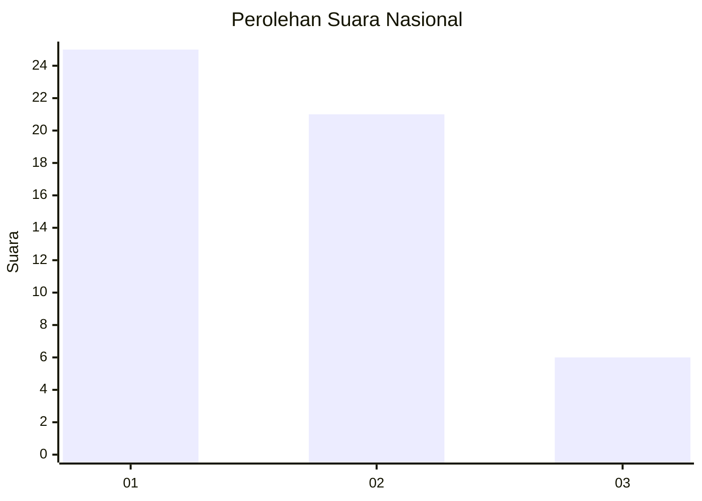
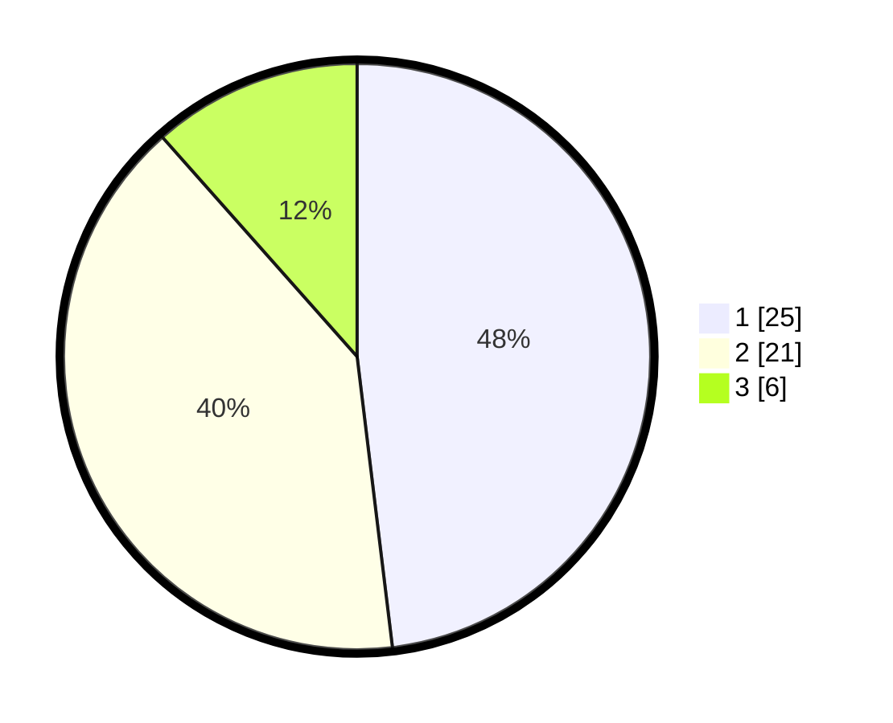

# Hasil

## Grafik

## Tabel

| No. | Nama Paslon    | Suara | Suara (raw) | Persentase |
|:--- |:-------------- | -----:| -----------:| ----------:|
| 1   | ANIES MUHAIMIN | 25    | [25][p-1]   | 48,08      |
| 2   | PRABOWO GIBRAN | 21    | [21][p-2]   | 40,38      |
| 3   | GANJAR MAHFUD  | 6     | [6][p-3]    | 11,54      |

[p-1]: https://github.com/gigit-pemilu/pemilu-2024/blob/main/pilpres/hitung-suara/sub/99-luar-negeri/sub/04-alger-aljazair/sub/01-alger-aljazair/sub/0001-alger-aljazair/sub/002-tps-001/sub/paslon-1.txt
[p-2]: https://github.com/gigit-pemilu/pemilu-2024/blob/main/pilpres/hitung-suara/sub/99-luar-negeri/sub/04-alger-aljazair/sub/01-alger-aljazair/sub/0001-alger-aljazair/sub/002-tps-001/sub/paslon-2.txt
[p-3]: https://github.com/gigit-pemilu/pemilu-2024/blob/main/pilpres/hitung-suara/sub/99-luar-negeri/sub/04-alger-aljazair/sub/01-alger-aljazair/sub/0001-alger-aljazair/sub/002-tps-001/sub/paslon-3.txt

## Foto C Plano

https://sirekap-obj-formc.kpu.go.id/9561/pemilu/ppwp/99/04/01/00/01/9904010001002-20240216-142350--4e029f85-35b7-4c7f-a2f4-f15f8031542c.jpg

https://sirekap-obj-formc.kpu.go.id/9561/pemilu/ppwp/99/04/01/00/01/9904010001002-20240216-142352--a7b72e30-5e00-4209-be90-80bd54e37f3f.jpg

https://sirekap-obj-formc.kpu.go.id/9561/pemilu/ppwp/99/04/01/00/01/9904010001002-20240216-142351--efb3d97b-3e18-4e05-b5a0-6d951577e683.jpg

## Metadata

| Key        | Value               |
| ---------- | ------------------- |
| Time Stamp | 2024-02-17 14:45:18 |

## DATA PEMILIH TETAP

Jumlah pemilih dalam DPT: **63**.
 * L: **24**.
 * P: **39**.

## DATA PENGGUNA HAK PILIH

Jumlah pengguna hak pilih dalam DPT: **51**.
 * L: **21**.
 * P: **30**.

Jumlah pengguna hak pilih dalam DPTb: **2**.
 * L: **1**.
 * P: **1**.

Jumlah pengguna hak pilih dalam DPK: **0**.
 * L: **0**.
 * P: **0**.

Jumlah pengguna hak pilih: **53**.
 * L: **22**.
 * P: **31**.

## JUMLAH SUARA SAH DAN TIDAK SAH

JUMLAH SELURUH SUARA SAH: **52**.

JUMLAH SUARA TIDAK SAH: **1**.

JUMLAH SELURUH SUARA SAH DAN SUARA TIDAK SAH: **53**.

