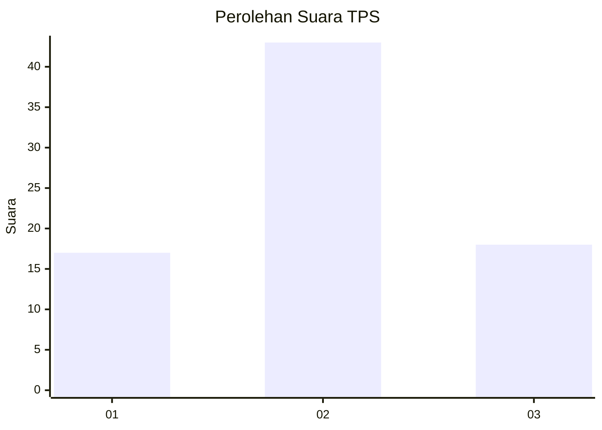
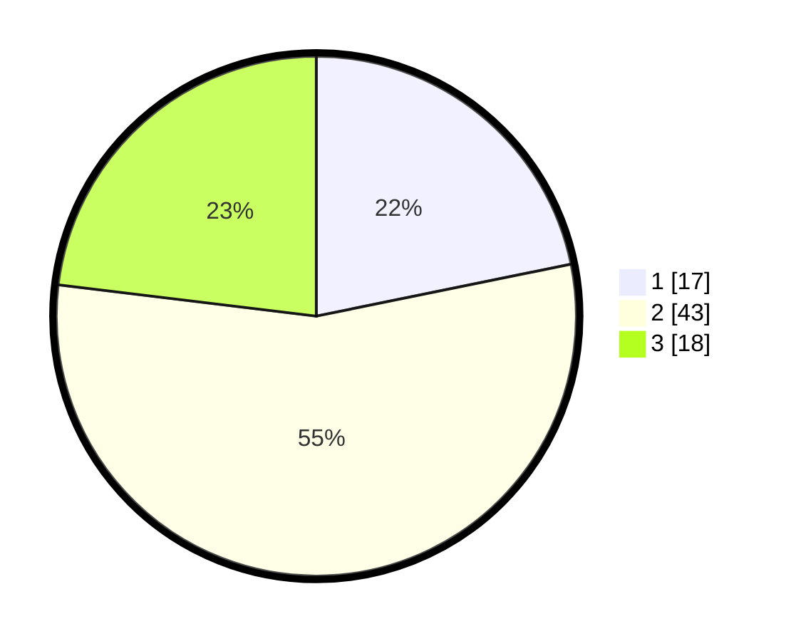

# Hasil

## Grafik

## Tabel

| No. | Nama Paslon    | Suara | Suara (raw) | Persentase |
|:--- |:-------------- | -----:| -----------:| ----------:|
| 1   | ANIES MUHAIMIN | 17    | [17][p-1]   | 21,79      |
| 2   | PRABOWO GIBRAN | 43    | [43][p-2]   | 55,13      |
| 3   | GANJAR MAHFUD  | 18    | [18][p-3]   | 23,08      |

[p-1]: https://github.com/gigit-pemilu/pemilu-2024-99-luar-negeri/blob/main/pilpres/hitung-suara/sub/99-luar-negeri/sub/04-alger-aljazair/sub/01-alger-aljazair/sub/0001-alger-aljazair/sub/003-ksk-001/sub/paslon-1.txt
[p-2]: https://github.com/gigit-pemilu/pemilu-2024-99-luar-negeri/blob/main/pilpres/hitung-suara/sub/99-luar-negeri/sub/04-alger-aljazair/sub/01-alger-aljazair/sub/0001-alger-aljazair/sub/003-ksk-001/sub/paslon-2.txt
[p-3]: https://github.com/gigit-pemilu/pemilu-2024-99-luar-negeri/blob/main/pilpres/hitung-suara/sub/99-luar-negeri/sub/04-alger-aljazair/sub/01-alger-aljazair/sub/0001-alger-aljazair/sub/003-ksk-001/sub/paslon-3.txt

## Foto C Plano

https://sirekap-obj-formc.kpu.go.id/0ab1/pemilu/ppwp/99/04/01/00/01/9904010001003-20240216-144527--424fd69e-54d4-42c3-b6c7-19b7a9b837d1.jpg

https://sirekap-obj-formc.kpu.go.id/0ab1/pemilu/ppwp/99/04/01/00/01/9904010001003-20240216-144529--34893750-6e5e-4746-acc7-9d7f1f232db7.jpg

https://sirekap-obj-formc.kpu.go.id/0ab1/pemilu/ppwp/99/04/01/00/01/9904010001003-20240216-144528--edb73401-e2ab-413d-ba71-d0b8eaf6be4c.jpg

## Metadata

| Key        | Value               |
| ---------- | ------------------- |
| Time Stamp | 2024-02-17 14:45:18 |

## DATA PEMILIH TETAP

Jumlah pemilih dalam DPT: **94**.
 * L: **94**.
 * P: **0**.

## DATA PENGGUNA HAK PILIH

Jumlah pengguna hak pilih dalam DPT: **75**.
 * L: **75**.
 * P: **0**.

Jumlah pengguna hak pilih dalam DPTb: **3**.
 * L: **3**.
 * P: **0**.

Jumlah pengguna hak pilih dalam DPK: **0**.
 * L: **0**.
 * P: **0**.

Jumlah pengguna hak pilih: **78**.
 * L: **78**.
 * P: **0**.

## JUMLAH SUARA SAH DAN TIDAK SAH

JUMLAH SELURUH SUARA SAH: **78**.

JUMLAH SUARA TIDAK SAH: **0**.

JUMLAH SELURUH SUARA SAH DAN SUARA TIDAK SAH: **78**.

