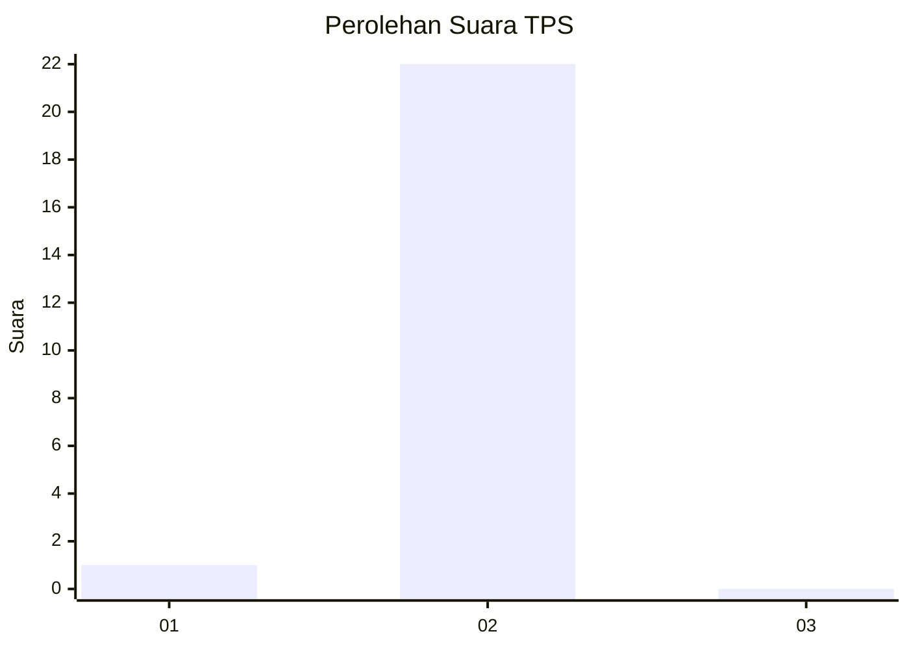
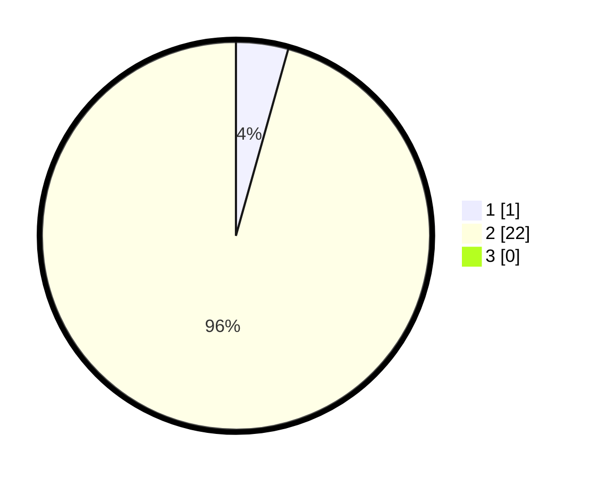

# Hasil

## Grafik

## Tabel

| No. | Nama Paslon    | Suara | Suara (raw) | Persentase |
|:--- |:-------------- | -----:| -----------:| ----------:|
| 1   | ANIES MUHAIMIN | 1     | [1][p-1]    | 4,35       |
| 2   | PRABOWO GIBRAN | 22    | [22][p-2]   | 95,65      |
| 3   | GANJAR MAHFUD  | 0     | [0][p-3]    | 0,00       |

[p-1]: https://github.com/gigit-pemilu/pemilu-2024-99-luar-negeri/blob/main/pilpres/hitung-suara/sub/99-luar-negeri/sub/05-amman-yordania/sub/01-amman-yordania/sub/0001-amman-yordania/sub/001-pos-001/sub/paslon-1.txt
[p-2]: https://github.com/gigit-pemilu/pemilu-2024-99-luar-negeri/blob/main/pilpres/hitung-suara/sub/99-luar-negeri/sub/05-amman-yordania/sub/01-amman-yordania/sub/0001-amman-yordania/sub/001-pos-001/sub/paslon-2.txt
[p-3]: https://github.com/gigit-pemilu/pemilu-2024-99-luar-negeri/blob/main/pilpres/hitung-suara/sub/99-luar-negeri/sub/05-amman-yordania/sub/01-amman-yordania/sub/0001-amman-yordania/sub/001-pos-001/sub/paslon-3.txt

## Foto C Plano

https://sirekap-obj-formc.kpu.go.id/251b/pemilu/ppwp/99/05/01/00/01/9905010001001-20240216-133134--32a7ceda-f827-4244-886a-f137d360440a.jpg

https://sirekap-obj-formc.kpu.go.id/251b/pemilu/ppwp/99/05/01/00/01/9905010001001-20240216-133136--245aac1c-f27d-43a3-929a-20c5b0275fa4.jpg

https://sirekap-obj-formc.kpu.go.id/251b/pemilu/ppwp/99/05/01/00/01/9905010001001-20240216-133135--008dd10d-6429-41a6-9bff-77bfe80b5788.jpg

## Metadata

| Key        | Value               |
| ---------- | ------------------- |
| Time Stamp | 2024-02-17 03:00:02 |

## DATA PEMILIH TETAP

Jumlah pemilih dalam DPT: **33**.
 * L: **13**.
 * P: **20**.

## DATA PENGGUNA HAK PILIH

Jumlah pengguna hak pilih dalam DPT: **24**.
 * L: **7**.
 * P: **17**.

Jumlah pengguna hak pilih dalam DPTb: **0**.
 * L: **0**.
 * P: **0**.

Jumlah pengguna hak pilih dalam DPK: **0**.
 * L: **0**.
 * P: **0**.

Jumlah pengguna hak pilih: **24**.
 * L: **7**.
 * P: **17**.

## JUMLAH SUARA SAH DAN TIDAK SAH

JUMLAH SELURUH SUARA SAH: **23**.

JUMLAH SUARA TIDAK SAH: **1**.

JUMLAH SELURUH SUARA SAH DAN SUARA TIDAK SAH: **24**.

