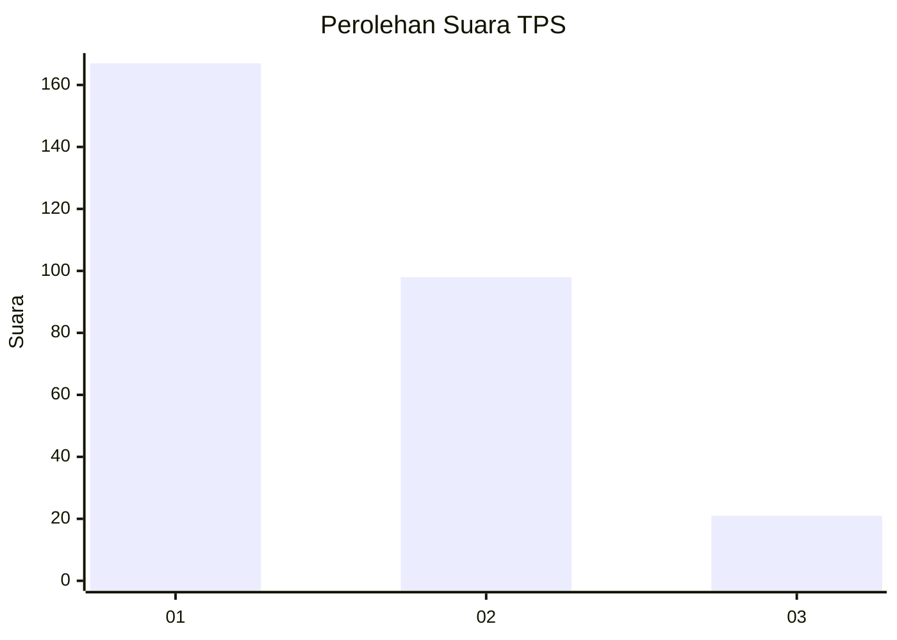
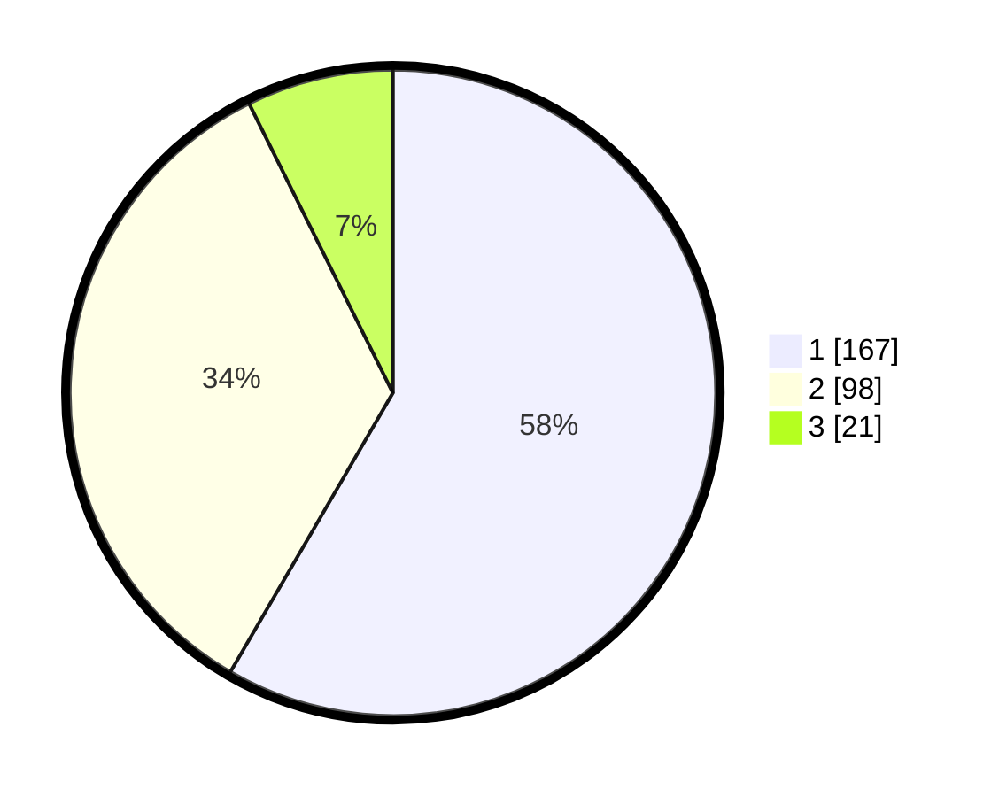

# Hasil

## Grafik

## Tabel

| No. | Nama Paslon    | Suara | Suara (raw) | Persentase |
|:--- |:-------------- | -----:| -----------:| ----------:|
| 1   | ANIES MUHAIMIN | 167   | [167][p-1]  | 58,39      |
| 2   | PRABOWO GIBRAN | 98    | [98][p-2]   | 34,27      |
| 3   | GANJAR MAHFUD  | 21    | [21][p-3]   | 7,34       |

[p-1]: https://github.com/gigit-pemilu/pemilu-2024-99-luar-negeri/blob/main/pilpres/hitung-suara/sub/99-luar-negeri/sub/05-amman-yordania/sub/01-amman-yordania/sub/0001-amman-yordania/sub/002-tps-001/sub/paslon-1.txt
[p-2]: https://github.com/gigit-pemilu/pemilu-2024-99-luar-negeri/blob/main/pilpres/hitung-suara/sub/99-luar-negeri/sub/05-amman-yordania/sub/01-amman-yordania/sub/0001-amman-yordania/sub/002-tps-001/sub/paslon-2.txt
[p-3]: https://github.com/gigit-pemilu/pemilu-2024-99-luar-negeri/blob/main/pilpres/hitung-suara/sub/99-luar-negeri/sub/05-amman-yordania/sub/01-amman-yordania/sub/0001-amman-yordania/sub/002-tps-001/sub/paslon-3.txt

## Foto C Plano

https://sirekap-obj-formc.kpu.go.id/8a00/pemilu/ppwp/99/05/01/00/01/9905010001002-20240214-200240--c14cd233-1761-46cc-85b7-3694c52be085.jpg

https://sirekap-obj-formc.kpu.go.id/8a00/pemilu/ppwp/99/05/01/00/01/9905010001002-20240214-200420--cb108099-2e07-4cb5-b517-79d778d562aa.jpg

https://sirekap-obj-formc.kpu.go.id/8a00/pemilu/ppwp/99/05/01/00/01/9905010001002-20240214-200502--2194c0e3-d87a-4553-9aa0-193203876b65.jpg

## Metadata

| Key        | Value               |
| ---------- | ------------------- |
| Time Stamp | 2024-02-15 16:30:25 |

## DATA PEMILIH TETAP

Jumlah pemilih dalam DPT: **541**.
 * L: **80**.
 * P: **461**.

## DATA PENGGUNA HAK PILIH

Jumlah pengguna hak pilih dalam DPT: **132**.
 * L: **44**.
 * P: **88**.

Jumlah pengguna hak pilih dalam DPTb: **120**.
 * L: **83**.
 * P: **37**.

Jumlah pengguna hak pilih dalam DPK: **36**.
 * L: **12**.
 * P: **24**.

Jumlah pengguna hak pilih: **288**.
 * L: **139**.
 * P: **149**.

## JUMLAH SUARA SAH DAN TIDAK SAH

JUMLAH SELURUH SUARA SAH: **286**.

JUMLAH SUARA TIDAK SAH: **2**.

JUMLAH SELURUH SUARA SAH DAN SUARA TIDAK SAH: **288**.

