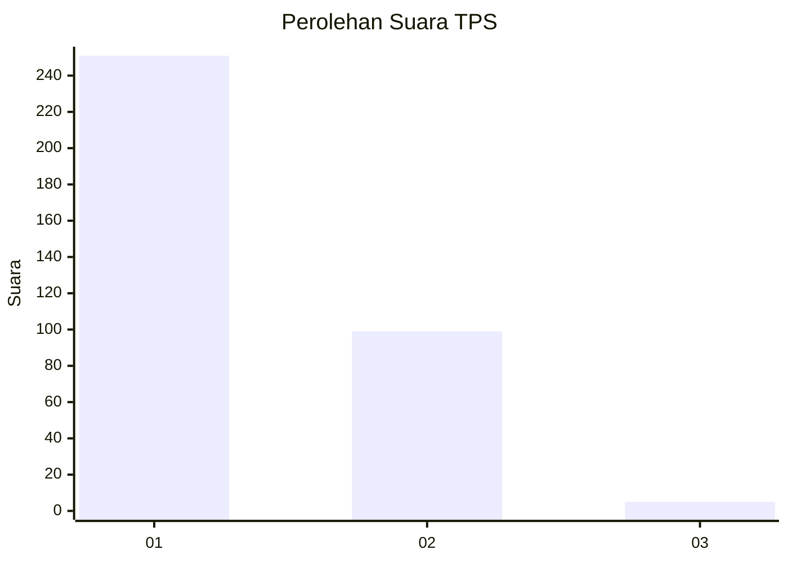
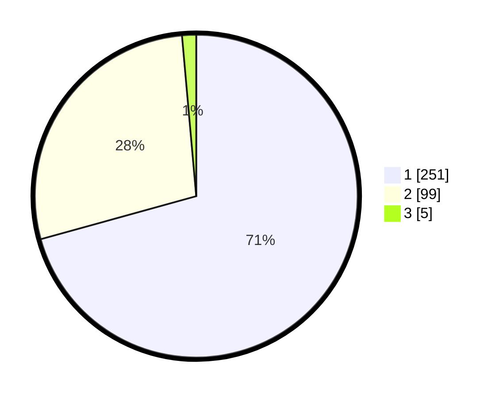

# Hasil

## Grafik

## Tabel

| No. | Nama Paslon    | Suara | Suara (raw) | Persentase |
|:--- |:-------------- | -----:| -----------:| ----------:|
| 1   | ANIES MUHAIMIN | 251   | [251][p-1]  | 70,70      |
| 2   | PRABOWO GIBRAN | 99    | [99][p-2]   | 27,89      |
| 3   | GANJAR MAHFUD  | 5     | [5][p-3]    | 1,41       |

[p-1]: https://github.com/gigit-pemilu/pemilu-2024-99-luar-negeri/blob/main/pilpres/hitung-suara/sub/99-luar-negeri/sub/05-amman-yordania/sub/01-amman-yordania/sub/0001-amman-yordania/sub/003-tps-002/sub/paslon-1.txt
[p-2]: https://github.com/gigit-pemilu/pemilu-2024-99-luar-negeri/blob/main/pilpres/hitung-suara/sub/99-luar-negeri/sub/05-amman-yordania/sub/01-amman-yordania/sub/0001-amman-yordania/sub/003-tps-002/sub/paslon-2.txt
[p-3]: https://github.com/gigit-pemilu/pemilu-2024-99-luar-negeri/blob/main/pilpres/hitung-suara/sub/99-luar-negeri/sub/05-amman-yordania/sub/01-amman-yordania/sub/0001-amman-yordania/sub/003-tps-002/sub/paslon-3.txt

## Foto C Plano

https://sirekap-obj-formc.kpu.go.id/601c/pemilu/ppwp/99/05/01/00/01/9905010001003-20240214-211314--a4726cb1-d1b7-40d5-a2e5-55d57b6a2c49.jpg

https://sirekap-obj-formc.kpu.go.id/601c/pemilu/ppwp/99/05/01/00/01/9905010001003-20240215-030024--9a471028-f907-4bb5-9789-31c4dd1065e6.jpg

https://sirekap-obj-formc.kpu.go.id/601c/pemilu/ppwp/99/05/01/00/01/9905010001003-20240215-011851--5618af44-9111-4fce-8d72-7f16f62ab6da.jpg

## Metadata

| Key        | Value               |
| ---------- | ------------------- |
| Time Stamp | 2024-02-16 01:30:27 |

## DATA PEMILIH TETAP

Jumlah pemilih dalam DPT: **516**.
 * L: **282**.
 * P: **234**.

## DATA PENGGUNA HAK PILIH

Jumlah pengguna hak pilih dalam DPT: **187**.
 * L: **128**.
 * P: **59**.

Jumlah pengguna hak pilih dalam DPTb: **148**.
 * L: **113**.
 * P: **35**.

Jumlah pengguna hak pilih dalam DPK: **21**.
 * L: **8**.
 * P: **13**.

Jumlah pengguna hak pilih: **356**.
 * L: **249**.
 * P: **107**.

## JUMLAH SUARA SAH DAN TIDAK SAH

JUMLAH SELURUH SUARA SAH: **355**.

JUMLAH SUARA TIDAK SAH: **1**.

JUMLAH SELURUH SUARA SAH DAN SUARA TIDAK SAH: **356**.

