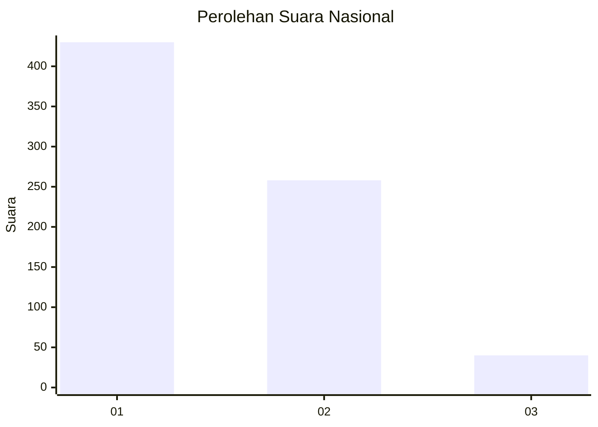
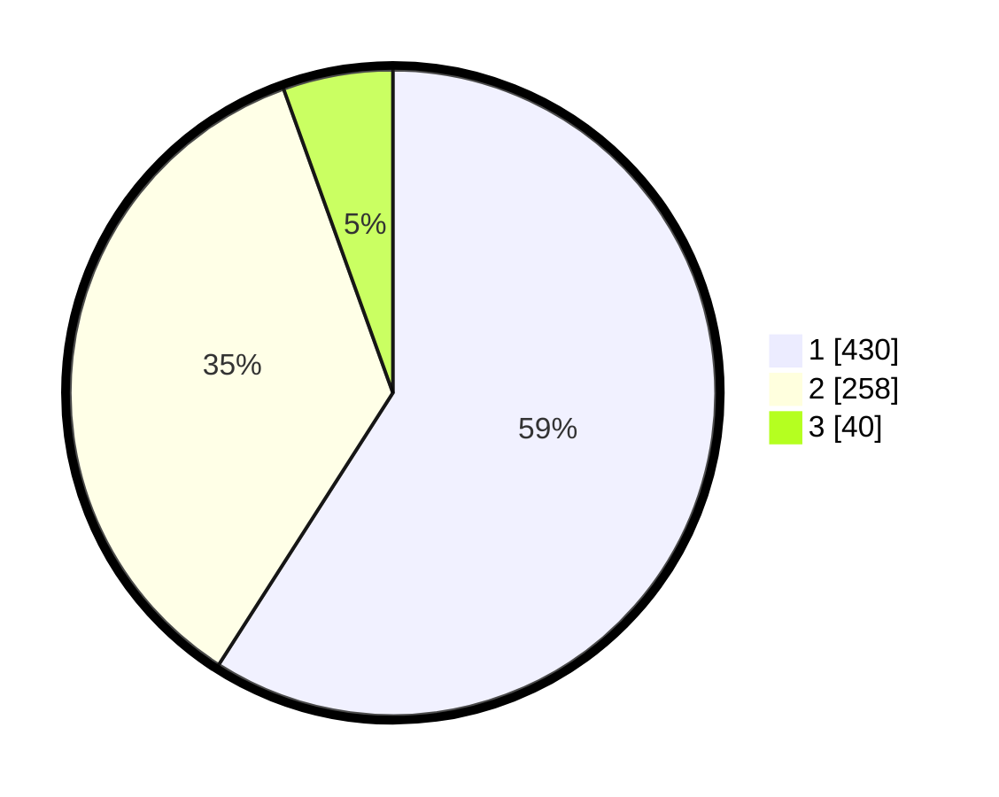

# Hasil

## Grafik

## Tabel

| No. | Nama Paslon    | Suara | Suara (raw) | Persentase |
|:--- |:-------------- | -----:| -----------:| ----------:|
| 1   | ANIES MUHAIMIN | 430   | [430][p-1]  | 59,07      |
| 2   | PRABOWO GIBRAN | 258   | [258][p-2]  | 35,44      |
| 3   | GANJAR MAHFUD  | 40    | [40][p-3]   | 5,49       |

[p-1]: https://github.com/gigit-pemilu/pemilu-2024/blob/main/pilpres/hitung-suara/sub/99-luar-negeri/sub/06-ankara-turki/sub/01-ankara-turki/sub/0001-ankara-turki/sub/001-pos-001/sub/paslon-1.txt
[p-2]: https://github.com/gigit-pemilu/pemilu-2024/blob/main/pilpres/hitung-suara/sub/99-luar-negeri/sub/06-ankara-turki/sub/01-ankara-turki/sub/0001-ankara-turki/sub/001-pos-001/sub/paslon-2.txt
[p-3]: https://github.com/gigit-pemilu/pemilu-2024/blob/main/pilpres/hitung-suara/sub/99-luar-negeri/sub/06-ankara-turki/sub/01-ankara-turki/sub/0001-ankara-turki/sub/001-pos-001/sub/paslon-3.txt

## Foto C Plano

https://sirekap-obj-formc.kpu.go.id/047d/pemilu/ppwp/99/06/01/00/01/9906010001001-20240216-063701--ba4aefee-c9d3-4616-ac73-d5c76ee8db8f.jpg

https://sirekap-obj-formc.kpu.go.id/047d/pemilu/ppwp/99/06/01/00/01/9906010001001-20240216-063749--d1a9ae15-43e2-4905-a646-28d94f2e830d.jpg

https://sirekap-obj-formc.kpu.go.id/047d/pemilu/ppwp/99/06/01/00/01/9906010001001-20240216-063818--b469159f-792d-464f-9013-37c06ec97d0d.jpg

## Metadata

| Key        | Value               |
| ---------- | ------------------- |
| Time Stamp | 2024-02-16 08:00:28 |

## DATA PEMILIH TETAP

Jumlah pemilih dalam DPT: **942**.
 * L: **321**.
 * P: **621**.

## DATA PENGGUNA HAK PILIH

Jumlah pengguna hak pilih dalam DPT: **741**.
 * L: **236**.
 * P: **505**.

Jumlah pengguna hak pilih dalam DPTb: **2**.
 * L: **0**.
 * P: **2**.

Jumlah pengguna hak pilih dalam DPK: **0**.
 * L: **0**.
 * P: **0**.

Jumlah pengguna hak pilih: **743**.
 * L: **236**.
 * P: **507**.

## JUMLAH SUARA SAH DAN TIDAK SAH

JUMLAH SELURUH SUARA SAH: **728**.

JUMLAH SUARA TIDAK SAH: **15**.

JUMLAH SELURUH SUARA SAH DAN SUARA TIDAK SAH: **743**.

