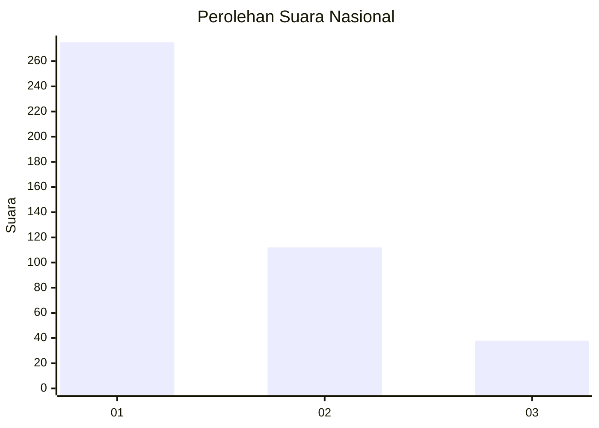
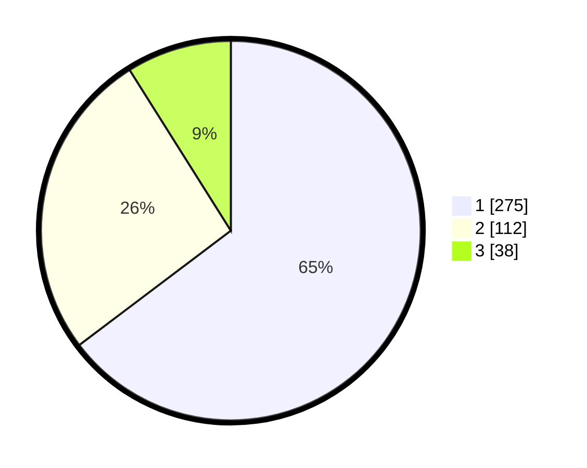

# Hasil

## Grafik

## Tabel

| No. | Nama Paslon    | Suara | Suara (raw) | Persentase |
|:--- |:-------------- | -----:| -----------:| ----------:|
| 1   | ANIES MUHAIMIN | 275   | [275][p-1]  | 64,71      |
| 2   | PRABOWO GIBRAN | 112   | [112][p-2]  | 26,35      |
| 3   | GANJAR MAHFUD  | 38    | [38][p-3]   | 8,94       |

[p-1]: https://github.com/gigit-pemilu/pemilu-2024/blob/main/pilpres/hitung-suara/sub/99-luar-negeri/sub/06-ankara-turki/sub/01-ankara-turki/sub/0001-ankara-turki/sub/002-tps-001/sub/paslon-1.txt
[p-2]: https://github.com/gigit-pemilu/pemilu-2024/blob/main/pilpres/hitung-suara/sub/99-luar-negeri/sub/06-ankara-turki/sub/01-ankara-turki/sub/0001-ankara-turki/sub/002-tps-001/sub/paslon-2.txt
[p-3]: https://github.com/gigit-pemilu/pemilu-2024/blob/main/pilpres/hitung-suara/sub/99-luar-negeri/sub/06-ankara-turki/sub/01-ankara-turki/sub/0001-ankara-turki/sub/002-tps-001/sub/paslon-3.txt

## Foto C Plano

https://sirekap-obj-formc.kpu.go.id/8887/pemilu/ppwp/99/06/01/00/01/9906010001002-20240214-232434--aabd7af0-b610-4548-8cf5-1f5f15c2ba3d.jpg

https://sirekap-obj-formc.kpu.go.id/8887/pemilu/ppwp/99/06/01/00/01/9906010001002-20240214-232548--0f59dd3e-03aa-4ec8-88d9-f209d903aae0.jpg

https://sirekap-obj-formc.kpu.go.id/8887/pemilu/ppwp/99/06/01/00/01/9906010001002-20240214-232656--509a1e26-c4ef-4680-885e-1eff40f43626.jpg

## Metadata

| Key        | Value               |
| ---------- | ------------------- |
| Time Stamp | 2024-02-15 20:00:44 |

## DATA PEMILIH TETAP

Jumlah pemilih dalam DPT: **638**.
 * L: **215**.
 * P: **423**.

## DATA PENGGUNA HAK PILIH

Jumlah pengguna hak pilih dalam DPT: **279**.
 * L: **94**.
 * P: **185**.

Jumlah pengguna hak pilih dalam DPTb: **130**.
 * L: **73**.
 * P: **57**.

Jumlah pengguna hak pilih dalam DPK: **16**.
 * L: **7**.
 * P: **9**.

Jumlah pengguna hak pilih: **425**.
 * L: **174**.
 * P: **251**.

## JUMLAH SUARA SAH DAN TIDAK SAH

JUMLAH SELURUH SUARA SAH: **425**.

JUMLAH SUARA TIDAK SAH: **0**.

JUMLAH SELURUH SUARA SAH DAN SUARA TIDAK SAH: **425**.

