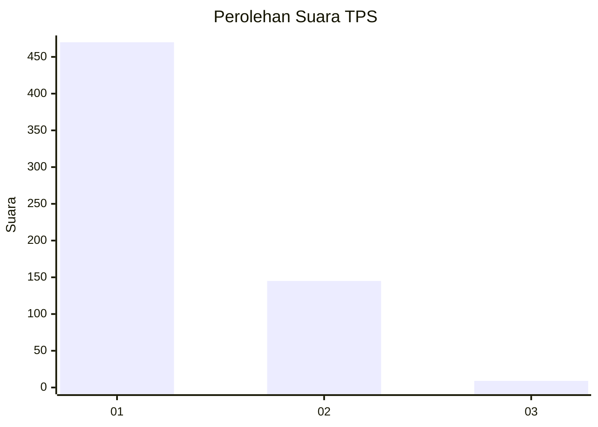
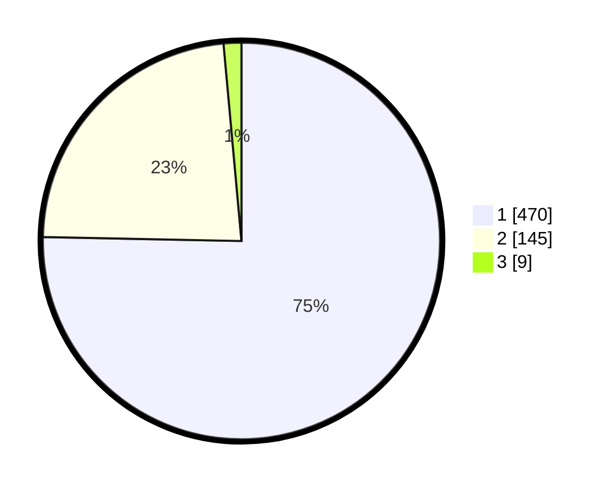

# Hasil

## Grafik

## Tabel

| No. | Nama Paslon    | Suara | Suara (raw) | Persentase |
|:--- |:-------------- | -----:| -----------:| ----------:|
| 1   | ANIES MUHAIMIN | 470   | [470][p-1]  | 75,32      |
| 2   | PRABOWO GIBRAN | 145   | [145][p-2]  | 23,24      |
| 3   | GANJAR MAHFUD  | 9     | [9][p-3]    | 1,44       |

[p-1]: https://github.com/gigit-pemilu/pemilu-2024-99-luar-negeri/blob/main/pilpres/hitung-suara/sub/99-luar-negeri/sub/06-ankara-turki/sub/01-ankara-turki/sub/0001-ankara-turki/sub/003-tps-002/sub/paslon-1.txt
[p-2]: https://github.com/gigit-pemilu/pemilu-2024-99-luar-negeri/blob/main/pilpres/hitung-suara/sub/99-luar-negeri/sub/06-ankara-turki/sub/01-ankara-turki/sub/0001-ankara-turki/sub/003-tps-002/sub/paslon-2.txt
[p-3]: https://github.com/gigit-pemilu/pemilu-2024-99-luar-negeri/blob/main/pilpres/hitung-suara/sub/99-luar-negeri/sub/06-ankara-turki/sub/01-ankara-turki/sub/0001-ankara-turki/sub/003-tps-002/sub/paslon-3.txt

## Foto C Plano

https://sirekap-obj-formc.kpu.go.id/2d4b/pemilu/ppwp/99/06/01/00/01/9906010001003-20240214-201252--174158d1-1bcd-4204-ae03-50aed7ddb171.jpg

https://sirekap-obj-formc.kpu.go.id/2d4b/pemilu/ppwp/99/06/01/00/01/9906010001003-20240214-190423--277b0b2e-637c-4dcb-8707-2e731e2e701a.jpg

https://sirekap-obj-formc.kpu.go.id/2d4b/pemilu/ppwp/99/06/01/00/01/9906010001003-20240214-190518--94b4956a-d4b5-4343-aeff-85694c78521c.jpg

## Metadata

| Key        | Value               |
| ---------- | ------------------- |
| Time Stamp | 2024-02-14 21:46:01 |

## DATA PEMILIH TETAP

Jumlah pemilih dalam DPT: **678**.
 * L: **309**.
 * P: **369**.

## DATA PENGGUNA HAK PILIH

Jumlah pengguna hak pilih dalam DPT: **457**.
 * L: **197**.
 * P: **260**.

Jumlah pengguna hak pilih dalam DPTb: **124**.
 * L: **79**.
 * P: **45**.

Jumlah pengguna hak pilih dalam DPK: **45**.
 * L: **19**.
 * P: **26**.

Jumlah pengguna hak pilih: **626**.
 * L: **295**.
 * P: **331**.

## JUMLAH SUARA SAH DAN TIDAK SAH

JUMLAH SELURUH SUARA SAH: **624**.

JUMLAH SUARA TIDAK SAH: **2**.

JUMLAH SELURUH SUARA SAH DAN SUARA TIDAK SAH: **626**.

