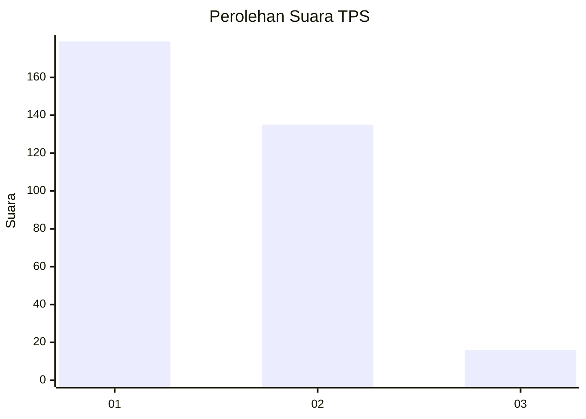
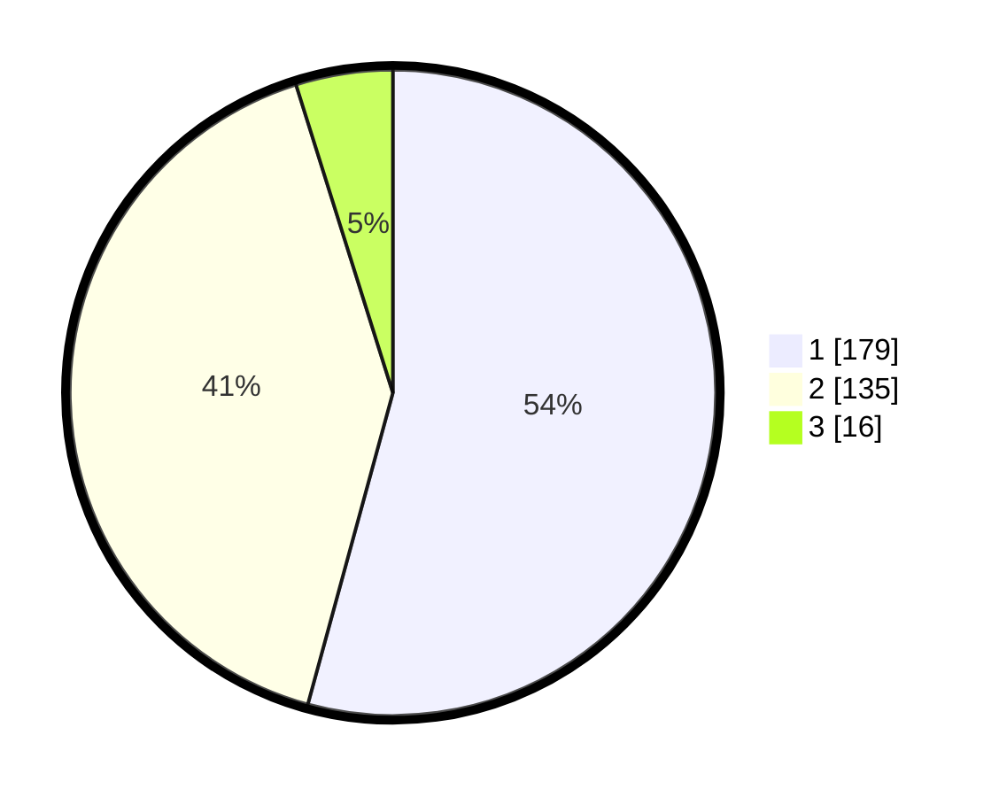

# Hasil

## Grafik

## Tabel

| No. | Nama Paslon    | Suara | Suara (raw) | Persentase |
|:--- |:-------------- | -----:| -----------:| ----------:|
| 1   | ANIES MUHAIMIN | 179   | [179][p-1]  | 54,24      |
| 2   | PRABOWO GIBRAN | 135   | [135][p-2]  | 40,91      |
| 3   | GANJAR MAHFUD  | 16    | [16][p-3]   | 4,85       |

[p-1]: https://github.com/gigit-pemilu/pemilu-2024-99-luar-negeri/blob/main/pilpres/hitung-suara/sub/99-luar-negeri/sub/06-ankara-turki/sub/01-ankara-turki/sub/0001-ankara-turki/sub/004-ksk-001/sub/paslon-1.txt
[p-2]: https://github.com/gigit-pemilu/pemilu-2024-99-luar-negeri/blob/main/pilpres/hitung-suara/sub/99-luar-negeri/sub/06-ankara-turki/sub/01-ankara-turki/sub/0001-ankara-turki/sub/004-ksk-001/sub/paslon-2.txt
[p-3]: https://github.com/gigit-pemilu/pemilu-2024-99-luar-negeri/blob/main/pilpres/hitung-suara/sub/99-luar-negeri/sub/06-ankara-turki/sub/01-ankara-turki/sub/0001-ankara-turki/sub/004-ksk-001/sub/paslon-3.txt

## Foto C Plano

https://sirekap-obj-formc.kpu.go.id/3e61/pemilu/ppwp/99/06/01/00/01/9906010001004-20240215-090520--a48859d3-88b2-4910-a86f-3fbaec22e2de.jpg

https://sirekap-obj-formc.kpu.go.id/3e61/pemilu/ppwp/99/06/01/00/01/9906010001004-20240215-090641--04f73a9b-df3a-4c9a-a2ad-9979b5b462a7.jpg

https://sirekap-obj-formc.kpu.go.id/3e61/pemilu/ppwp/99/06/01/00/01/9906010001004-20240215-090803--6e94b9b5-02be-4f74-b0c7-1197c89ffa10.jpg

## Metadata

| Key        | Value               |
| ---------- | ------------------- |
| Time Stamp | 2024-02-15 22:00:27 |

## DATA PEMILIH TETAP

Jumlah pemilih dalam DPT: **467**.
 * L: **155**.
 * P: **312**.

## DATA PENGGUNA HAK PILIH

Jumlah pengguna hak pilih dalam DPT: **239**.
 * L: **104**.
 * P: **135**.

Jumlah pengguna hak pilih dalam DPTb: **75**.
 * L: **37**.
 * P: **38**.

Jumlah pengguna hak pilih dalam DPK: **18**.
 * L: **9**.
 * P: **9**.

Jumlah pengguna hak pilih: **332**.
 * L: **150**.
 * P: **182**.

## JUMLAH SUARA SAH DAN TIDAK SAH

JUMLAH SELURUH SUARA SAH: **330**.

JUMLAH SUARA TIDAK SAH: **2**.

JUMLAH SELURUH SUARA SAH DAN SUARA TIDAK SAH: **332**.

