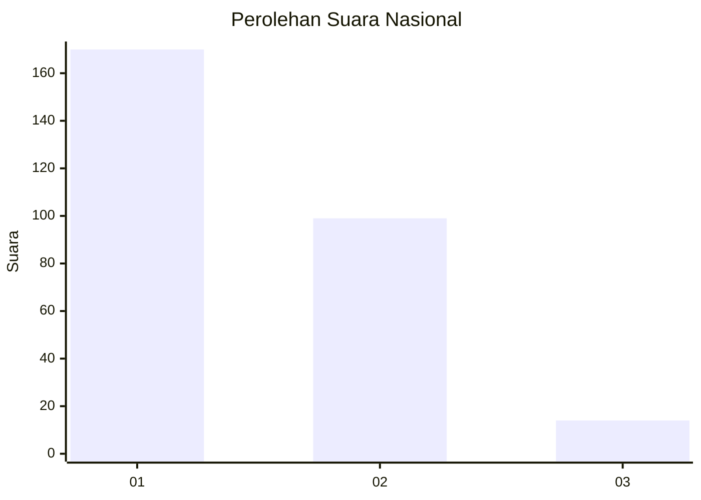
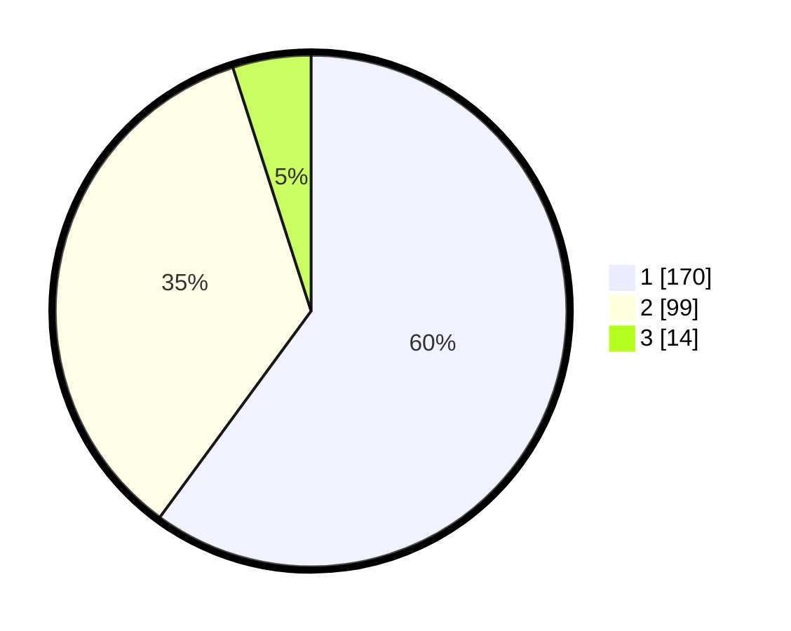

# Hasil

## Grafik

## Tabel

| No. | Nama Paslon    | Suara | Suara (raw) | Persentase |
|:--- |:-------------- | -----:| -----------:| ----------:|
| 1   | ANIES MUHAIMIN | 170   | [170][p-1]  | 60,07      |
| 2   | PRABOWO GIBRAN | 99    | [99][p-2]   | 34,98      |
| 3   | GANJAR MAHFUD  | 14    | [14][p-3]   | 4,95       |

[p-1]: https://github.com/gigit-pemilu/pemilu-2024/blob/main/pilpres/hitung-suara/sub/99-luar-negeri/sub/06-ankara-turki/sub/01-ankara-turki/sub/0001-ankara-turki/sub/005-ksk-002/sub/paslon-1.txt
[p-2]: https://github.com/gigit-pemilu/pemilu-2024/blob/main/pilpres/hitung-suara/sub/99-luar-negeri/sub/06-ankara-turki/sub/01-ankara-turki/sub/0001-ankara-turki/sub/005-ksk-002/sub/paslon-2.txt
[p-3]: https://github.com/gigit-pemilu/pemilu-2024/blob/main/pilpres/hitung-suara/sub/99-luar-negeri/sub/06-ankara-turki/sub/01-ankara-turki/sub/0001-ankara-turki/sub/005-ksk-002/sub/paslon-3.txt

## Foto C Plano

https://sirekap-obj-formc.kpu.go.id/c5c2/pemilu/ppwp/99/06/01/00/01/9906010001005-20240216-220712--8f68f707-6825-46f3-ba5d-3a6c15df52bf.jpg

https://sirekap-obj-formc.kpu.go.id/c5c2/pemilu/ppwp/99/06/01/00/01/9906010001005-20240215-032505--adae872c-a179-4bea-9f6f-5f2a0aafedba.jpg

https://sirekap-obj-formc.kpu.go.id/c5c2/pemilu/ppwp/99/06/01/00/01/9906010001005-20240215-032545--f197f570-e17e-40b0-8b17-c5bc122387b0.jpg

## Metadata

| Key        | Value               |
| ---------- | ------------------- |
| Time Stamp | 2024-02-16 22:30:00 |

## DATA PEMILIH TETAP

Jumlah pemilih dalam DPT: **279**.
 * L: **109**.
 * P: **170**.

## DATA PENGGUNA HAK PILIH

Jumlah pengguna hak pilih dalam DPT: **208**.
 * L: **89**.
 * P: **119**.

Jumlah pengguna hak pilih dalam DPTb: **74**.
 * L: **32**.
 * P: **42**.

Jumlah pengguna hak pilih dalam DPK: **1**.
 * L: **0**.
 * P: **1**.

Jumlah pengguna hak pilih: **283**.
 * L: **121**.
 * P: **162**.

## JUMLAH SUARA SAH DAN TIDAK SAH

JUMLAH SELURUH SUARA SAH: **283**.

JUMLAH SUARA TIDAK SAH: **2**.

JUMLAH SELURUH SUARA SAH DAN SUARA TIDAK SAH: **285**.

