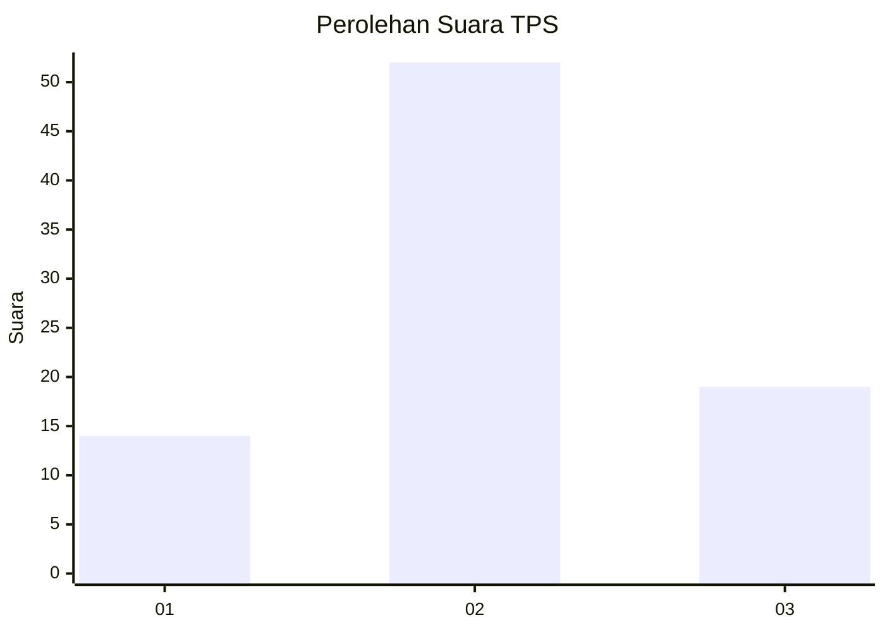
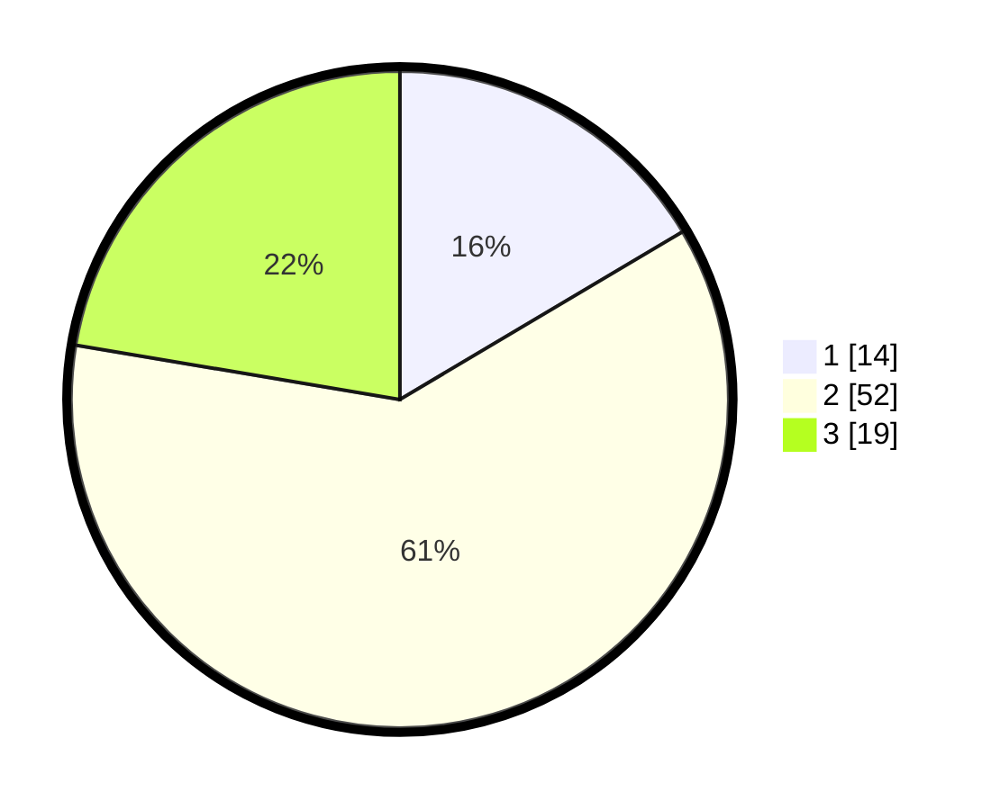

# Hasil

## Grafik

## Tabel

| No. | Nama Paslon    | Suara | Suara (raw) | Persentase |
|:--- |:-------------- | -----:| -----------:| ----------:|
| 1   | ANIES MUHAIMIN | 14    | [14][p-1]   | 16,47      |
| 2   | PRABOWO GIBRAN | 52    | [52][p-2]   | 61,18      |
| 3   | GANJAR MAHFUD  | 19    | [19][p-3]   | 22,35      |

[p-1]: https://github.com/gigit-pemilu/pemilu-2024-99-luar-negeri/blob/main/pilpres/hitung-suara/sub/99-luar-negeri/sub/07-antananarivo-madagaskar/sub/01-antananarivo-madagaskar/sub/0001-antananarivo-madagaskar/sub/001-tps/sub/paslon-1.txt
[p-2]: https://github.com/gigit-pemilu/pemilu-2024-99-luar-negeri/blob/main/pilpres/hitung-suara/sub/99-luar-negeri/sub/07-antananarivo-madagaskar/sub/01-antananarivo-madagaskar/sub/0001-antananarivo-madagaskar/sub/001-tps/sub/paslon-2.txt
[p-3]: https://github.com/gigit-pemilu/pemilu-2024-99-luar-negeri/blob/main/pilpres/hitung-suara/sub/99-luar-negeri/sub/07-antananarivo-madagaskar/sub/01-antananarivo-madagaskar/sub/0001-antananarivo-madagaskar/sub/001-tps/sub/paslon-3.txt

## Foto C Plano

https://sirekap-obj-formc.kpu.go.id/e471/pemilu/ppwp/99/07/01/00/01/9907010001001-20240217-182602--187ea116-ad19-4a3f-9c68-1098f60ffd0e.jpg

https://sirekap-obj-formc.kpu.go.id/e471/pemilu/ppwp/99/07/01/00/01/9907010001001-20240217-184202--1d48f370-222a-426f-a9e8-a44db82798ce.jpg

https://sirekap-obj-formc.kpu.go.id/e471/pemilu/ppwp/99/07/01/00/01/9907010001001-20240215-144524--d461ad09-0063-4323-9296-7b167b657035.jpg

## Metadata

| Key        | Value               |
| ---------- | ------------------- |
| Time Stamp | 2024-02-17 19:00:04 |

## DATA PEMILIH TETAP

Jumlah pemilih dalam DPT: **88**.
 * L: **67**.
 * P: **21**.

## DATA PENGGUNA HAK PILIH

Jumlah pengguna hak pilih dalam DPT: **52**.
 * L: **42**.
 * P: **10**.

Jumlah pengguna hak pilih dalam DPTb: **10**.
 * L: **6**.
 * P: **4**.

Jumlah pengguna hak pilih dalam DPK: **23**.
 * L: **21**.
 * P: **2**.

Jumlah pengguna hak pilih: **85**.
 * L: **69**.
 * P: **16**.

## JUMLAH SUARA SAH DAN TIDAK SAH

JUMLAH SELURUH SUARA SAH: **85**.

JUMLAH SUARA TIDAK SAH: **5**.

JUMLAH SELURUH SUARA SAH DAN SUARA TIDAK SAH: **90**.

