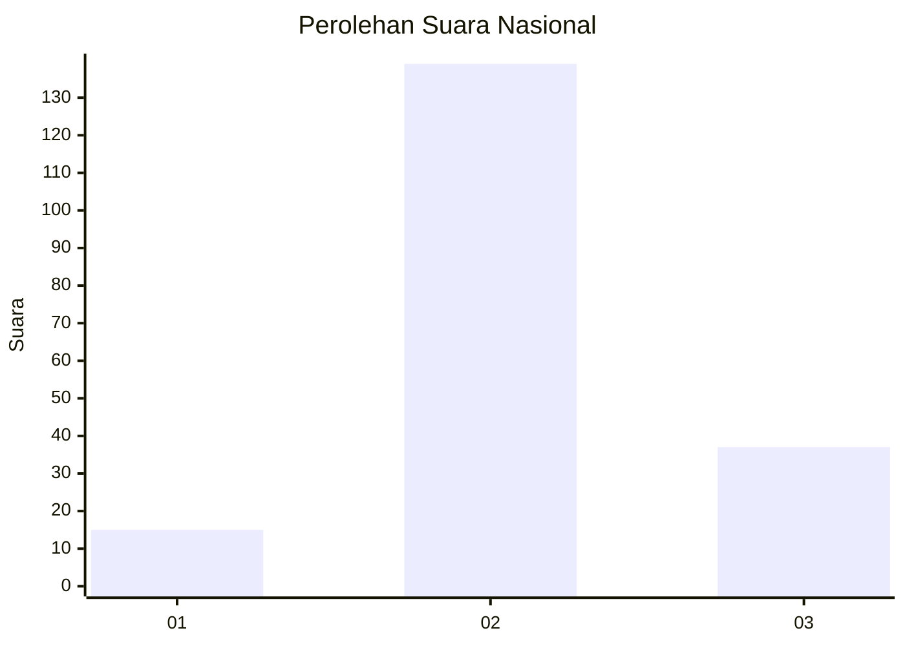
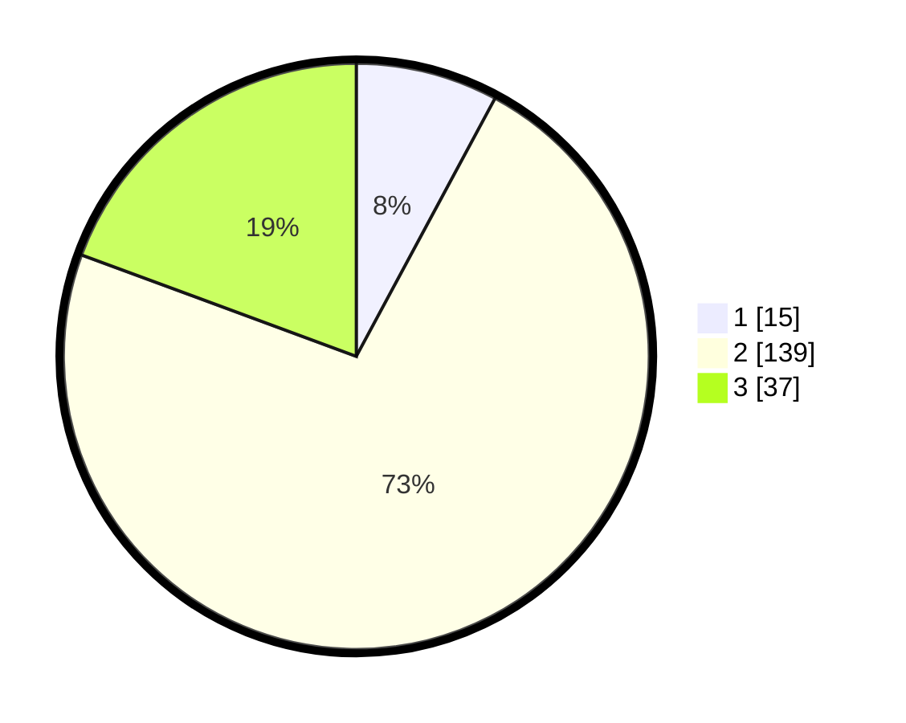

# Hasil

## Grafik

## Tabel

| No. | Nama Paslon    | Suara | Suara (raw) | Persentase |
|:--- |:-------------- | -----:| -----------:| ----------:|
| 1   | ANIES MUHAIMIN | 15    | [15][p-1]   | 7,85       |
| 2   | PRABOWO GIBRAN | 139   | [139][p-2]  | 72,77      |
| 3   | GANJAR MAHFUD  | 37    | [37][p-3]   | 19,37      |

[p-1]: https://github.com/gigit-pemilu/pemilu-2024/blob/main/pilpres/hitung-suara/sub/99-luar-negeri/sub/07-antananarivo-madagaskar/sub/01-antananarivo-madagaskar/sub/0001-antananarivo-madagaskar/sub/002-tps/sub/paslon-1.txt
[p-2]: https://github.com/gigit-pemilu/pemilu-2024/blob/main/pilpres/hitung-suara/sub/99-luar-negeri/sub/07-antananarivo-madagaskar/sub/01-antananarivo-madagaskar/sub/0001-antananarivo-madagaskar/sub/002-tps/sub/paslon-2.txt
[p-3]: https://github.com/gigit-pemilu/pemilu-2024/blob/main/pilpres/hitung-suara/sub/99-luar-negeri/sub/07-antananarivo-madagaskar/sub/01-antananarivo-madagaskar/sub/0001-antananarivo-madagaskar/sub/002-tps/sub/paslon-3.txt

## Foto C Plano

https://sirekap-obj-formc.kpu.go.id/2362/pemilu/ppwp/99/07/01/00/01/9907010001002-20240217-221208--7ea6020c-3ef6-4829-a9b3-c6af5fb74b2c.jpg

https://sirekap-obj-formc.kpu.go.id/2362/pemilu/ppwp/99/07/01/00/01/9907010001002-20240217-221417--12f252b1-ee53-4b29-8b4d-a678e6f8dbb8.jpg

https://sirekap-obj-formc.kpu.go.id/2362/pemilu/ppwp/99/07/01/00/01/9907010001002-20240217-221621--cd1ccc45-7899-444a-85f0-e6d3c18cf874.jpg

## Metadata

| Key        | Value               |
| ---------- | ------------------- |
| Time Stamp | 2024-02-19 06:16:00 |

## DATA PEMILIH TETAP

Jumlah pemilih dalam DPT: **189**.
 * L: **148**.
 * P: **41**.

## DATA PENGGUNA HAK PILIH

Jumlah pengguna hak pilih dalam DPT: **124**.
 * L: **95**.
 * P: **29**.

Jumlah pengguna hak pilih dalam DPTb: **26**.
 * L: **17**.
 * P: **9**.

Jumlah pengguna hak pilih dalam DPK: **43**.
 * L: **34**.
 * P: **9**.

Jumlah pengguna hak pilih: **193**.
 * L: **146**.
 * P: **47**.

## JUMLAH SUARA SAH DAN TIDAK SAH

JUMLAH SELURUH SUARA SAH: **191**.

JUMLAH SUARA TIDAK SAH: **2**.

JUMLAH SELURUH SUARA SAH DAN SUARA TIDAK SAH: **193**.

