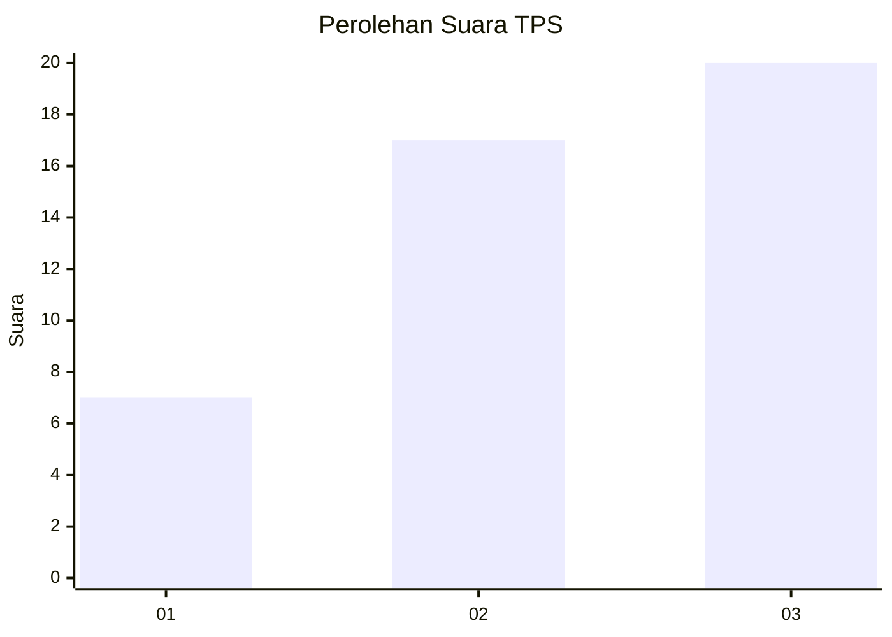
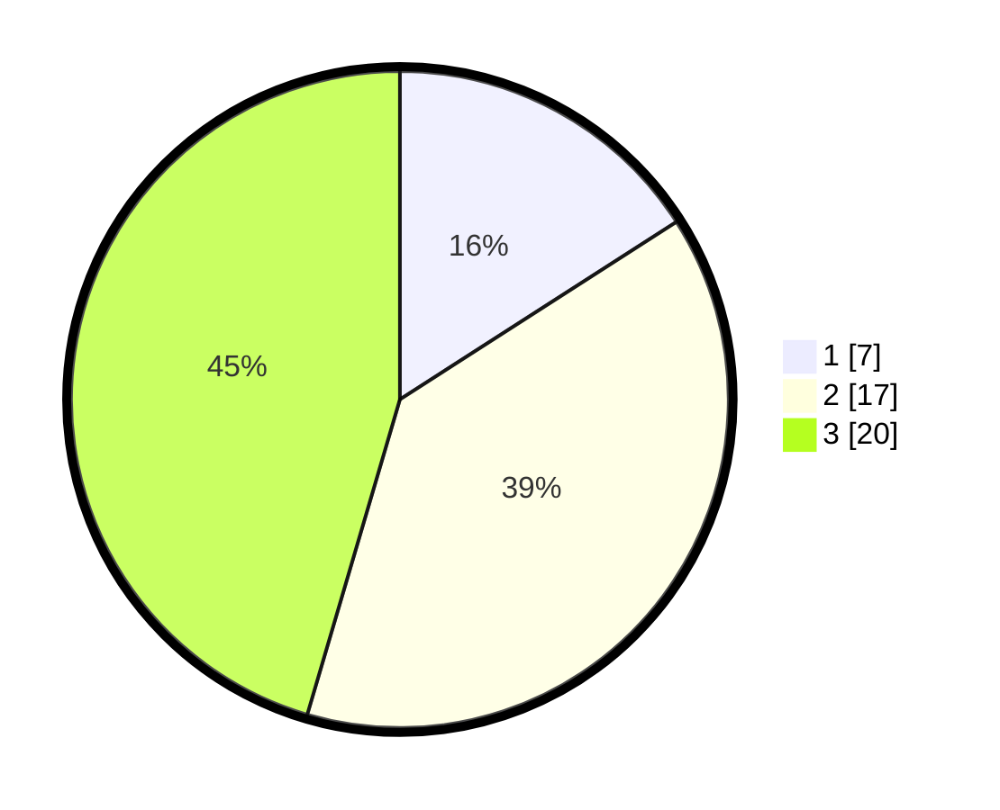

# Hasil

## Grafik

## Tabel

| No. | Nama Paslon    | Suara | Suara (raw) | Persentase |
|:--- |:-------------- | -----:| -----------:| ----------:|
| 1   | ANIES MUHAIMIN | 7     | [7][p-1]    | 15,91      |
| 2   | PRABOWO GIBRAN | 17    | [17][p-2]   | 38,64      |
| 3   | GANJAR MAHFUD  | 20    | [20][p-3]   | 45,45      |

[p-1]: https://github.com/gigit-pemilu/pemilu-2024-99-luar-negeri/blob/main/pilpres/hitung-suara/sub/99-luar-negeri/sub/07-antananarivo-madagaskar/sub/01-antananarivo-madagaskar/sub/0001-antananarivo-madagaskar/sub/003-ksk-001/sub/paslon-1.txt
[p-2]: https://github.com/gigit-pemilu/pemilu-2024-99-luar-negeri/blob/main/pilpres/hitung-suara/sub/99-luar-negeri/sub/07-antananarivo-madagaskar/sub/01-antananarivo-madagaskar/sub/0001-antananarivo-madagaskar/sub/003-ksk-001/sub/paslon-2.txt
[p-3]: https://github.com/gigit-pemilu/pemilu-2024-99-luar-negeri/blob/main/pilpres/hitung-suara/sub/99-luar-negeri/sub/07-antananarivo-madagaskar/sub/01-antananarivo-madagaskar/sub/0001-antananarivo-madagaskar/sub/003-ksk-001/sub/paslon-3.txt

## Foto C Plano

https://sirekap-obj-formc.kpu.go.id/fa98/pemilu/ppwp/99/07/01/00/01/9907010001003-20240215-224856--012a1583-9633-4648-9407-d05211c402b0.jpg

https://sirekap-obj-formc.kpu.go.id/fa98/pemilu/ppwp/99/07/01/00/01/9907010001003-20240215-225205--12e24b00-7389-4110-b419-ac875639bec6.jpg

https://sirekap-obj-formc.kpu.go.id/fa98/pemilu/ppwp/99/07/01/00/01/9907010001003-20240215-224659--dc489d09-22a3-4028-a35c-2df4d0aa2c45.jpg

## Metadata

| Key        | Value               |
| ---------- | ------------------- |
| Time Stamp | 2024-02-15 23:29:50 |

## DATA PEMILIH TETAP

Jumlah pemilih dalam DPT: **43**.
 * L: **10**.
 * P: **33**.

## DATA PENGGUNA HAK PILIH

Jumlah pengguna hak pilih dalam DPT: **32**.
 * L: **6**.
 * P: **26**.

Jumlah pengguna hak pilih dalam DPTb: **1**.
 * L: **0**.
 * P: **1**.

Jumlah pengguna hak pilih dalam DPK: **11**.
 * L: **6**.
 * P: **5**.

Jumlah pengguna hak pilih: **44**.
 * L: **12**.
 * P: **32**.

## JUMLAH SUARA SAH DAN TIDAK SAH

JUMLAH SELURUH SUARA SAH: **44**.

JUMLAH SUARA TIDAK SAH: **0**.

JUMLAH SELURUH SUARA SAH DAN SUARA TIDAK SAH: **44**.

