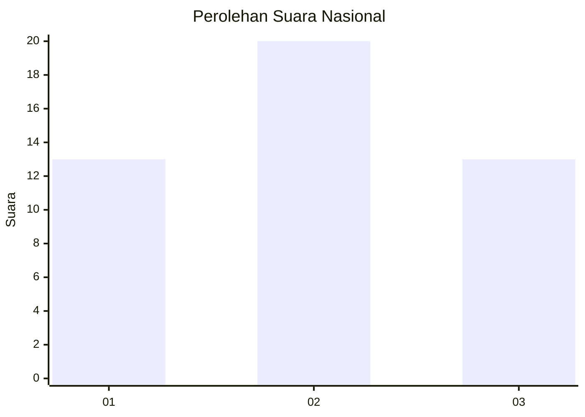
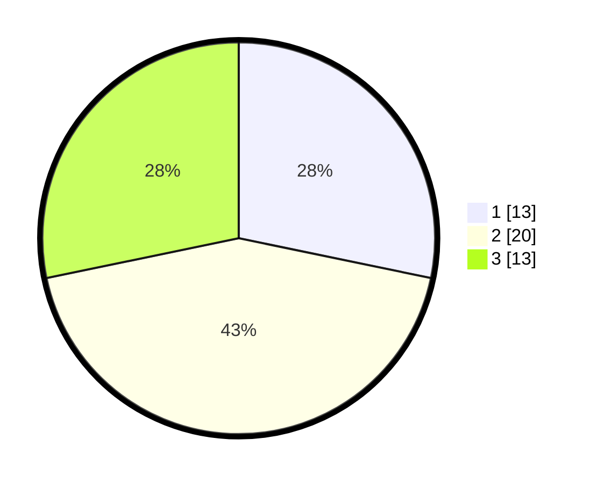

# Hasil

## Grafik

## Tabel

| No. | Nama Paslon    | Suara | Suara (raw) | Persentase |
|:--- |:-------------- | -----:| -----------:| ----------:|
| 1   | ANIES MUHAIMIN | 13    | [13][p-1]   | 28,26      |
| 2   | PRABOWO GIBRAN | 20    | [20][p-2]   | 43,48      |
| 3   | GANJAR MAHFUD  | 13    | [13][p-3]   | 28,26      |

[p-1]: https://github.com/gigit-pemilu/pemilu-2024/blob/main/pilpres/hitung-suara/sub/99-luar-negeri/sub/08-astana-kazakhstan/sub/01-astana-kazakhstan/sub/0001-astana-kazakhstan/sub/001-pos-001/sub/paslon-1.txt
[p-2]: https://github.com/gigit-pemilu/pemilu-2024/blob/main/pilpres/hitung-suara/sub/99-luar-negeri/sub/08-astana-kazakhstan/sub/01-astana-kazakhstan/sub/0001-astana-kazakhstan/sub/001-pos-001/sub/paslon-2.txt
[p-3]: https://github.com/gigit-pemilu/pemilu-2024/blob/main/pilpres/hitung-suara/sub/99-luar-negeri/sub/08-astana-kazakhstan/sub/01-astana-kazakhstan/sub/0001-astana-kazakhstan/sub/001-pos-001/sub/paslon-3.txt

## Foto C Plano

https://sirekap-obj-formc.kpu.go.id/74cf/pemilu/ppwp/99/08/01/00/01/9908010001001-20240216-151615--266d1f06-daef-475c-b4c6-37570236e7e9.jpg

https://sirekap-obj-formc.kpu.go.id/74cf/pemilu/ppwp/99/08/01/00/01/9908010001001-20240216-151617--93fe2a98-d814-4898-8155-f7626fe91053.jpg

https://sirekap-obj-formc.kpu.go.id/74cf/pemilu/ppwp/99/08/01/00/01/9908010001001-20240216-151616--2b61b04e-ab14-45a3-acf3-2a8e0be47e4e.jpg

## Metadata

| Key        | Value               |
| ---------- | ------------------- |
| Time Stamp | 2024-02-17 01:00:00 |

## DATA PEMILIH TETAP

Jumlah pemilih dalam DPT: **63**.
 * L: **27**.
 * P: **36**.

## DATA PENGGUNA HAK PILIH

Jumlah pengguna hak pilih dalam DPT: **45**.
 * L: **20**.
 * P: **25**.

Jumlah pengguna hak pilih dalam DPTb: **0**.
 * L: **0**.
 * P: **0**.

Jumlah pengguna hak pilih dalam DPK: **1**.
 * L: **0**.
 * P: **1**.

Jumlah pengguna hak pilih: **46**.
 * L: **20**.
 * P: **26**.

## JUMLAH SUARA SAH DAN TIDAK SAH

JUMLAH SELURUH SUARA SAH: **46**.

JUMLAH SUARA TIDAK SAH: **0**.

JUMLAH SELURUH SUARA SAH DAN SUARA TIDAK SAH: **46**.

