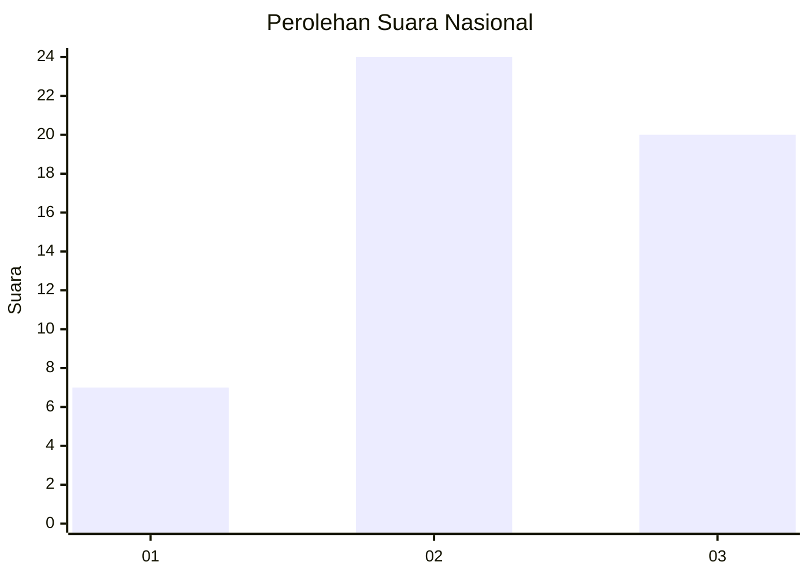
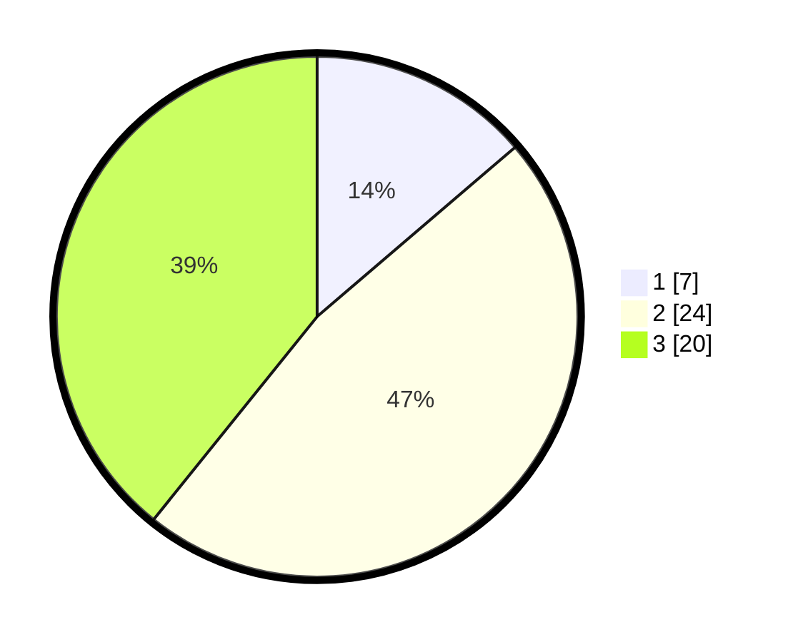

# Hasil

## Grafik

## Tabel

| No. | Nama Paslon    | Suara | Suara (raw) | Persentase |
|:--- |:-------------- | -----:| -----------:| ----------:|
| 1   | ANIES MUHAIMIN | 7     | [7][p-1]    | 13,73      |
| 2   | PRABOWO GIBRAN | 24    | [24][p-2]   | 47,06      |
| 3   | GANJAR MAHFUD  | 20    | [20][p-3]   | 39,22      |

[p-1]: https://github.com/gigit-pemilu/pemilu-2024/blob/main/pilpres/hitung-suara/sub/99-luar-negeri/sub/08-astana-kazakhstan/sub/01-astana-kazakhstan/sub/0001-astana-kazakhstan/sub/002-tps-001/sub/paslon-1.txt
[p-2]: https://github.com/gigit-pemilu/pemilu-2024/blob/main/pilpres/hitung-suara/sub/99-luar-negeri/sub/08-astana-kazakhstan/sub/01-astana-kazakhstan/sub/0001-astana-kazakhstan/sub/002-tps-001/sub/paslon-2.txt
[p-3]: https://github.com/gigit-pemilu/pemilu-2024/blob/main/pilpres/hitung-suara/sub/99-luar-negeri/sub/08-astana-kazakhstan/sub/01-astana-kazakhstan/sub/0001-astana-kazakhstan/sub/002-tps-001/sub/paslon-3.txt

## Foto C Plano

https://sirekap-obj-formc.kpu.go.id/3174/pemilu/ppwp/99/08/01/00/01/9908010001002-20240214-212505--2fde04a9-c81d-49d7-84b4-01ea716f82de.jpg

https://sirekap-obj-formc.kpu.go.id/3174/pemilu/ppwp/99/08/01/00/01/9908010001002-20240214-210628--8b0714a0-4d0e-417d-a3cb-aaff296edbc8.jpg

https://sirekap-obj-formc.kpu.go.id/3174/pemilu/ppwp/99/08/01/00/01/9908010001002-20240216-131154--82d72dfd-b58c-4186-b0c9-e075c06adabc.jpg

## Metadata

| Key        | Value               |
| ---------- | ------------------- |
| Time Stamp | 2024-02-17 01:00:00 |

## DATA PEMILIH TETAP

Jumlah pemilih dalam DPT: **63**.
 * L: **20**.
 * P: **43**.

## DATA PENGGUNA HAK PILIH

Jumlah pengguna hak pilih dalam DPT: **43**.
 * L: **14**.
 * P: **29**.

Jumlah pengguna hak pilih dalam DPTb: **7**.
 * L: **4**.
 * P: **3**.

Jumlah pengguna hak pilih dalam DPK: **2**.
 * L: **0**.
 * P: **2**.

Jumlah pengguna hak pilih: **52**.
 * L: **18**.
 * P: **34**.

## JUMLAH SUARA SAH DAN TIDAK SAH

JUMLAH SELURUH SUARA SAH: **51**.

JUMLAH SUARA TIDAK SAH: **1**.

JUMLAH SELURUH SUARA SAH DAN SUARA TIDAK SAH: **52**.

