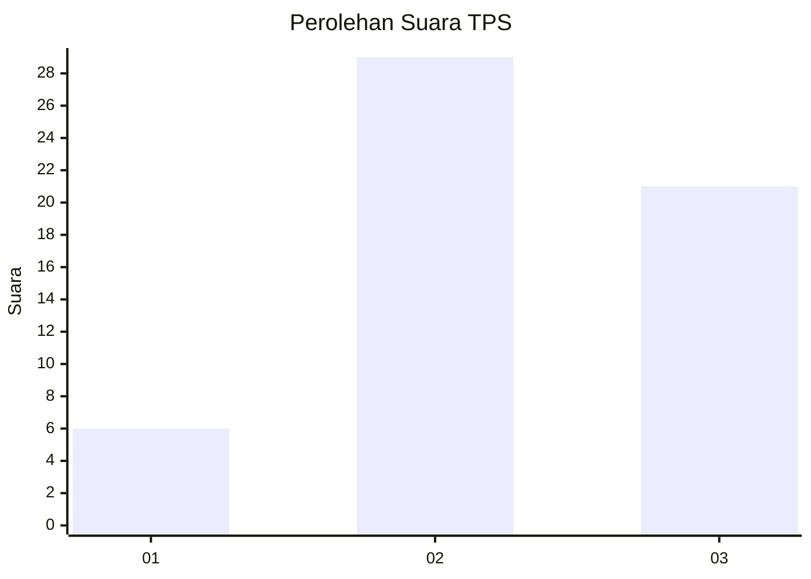
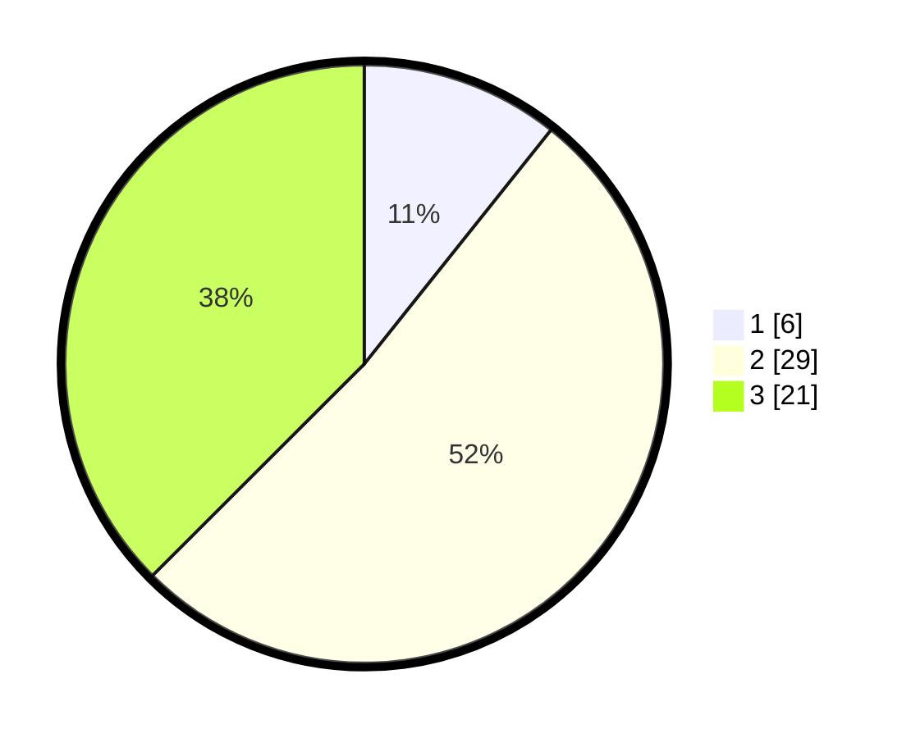

# Hasil

## Grafik

## Tabel

| No. | Nama Paslon    | Suara | Suara (raw) | Persentase |
|:--- |:-------------- | -----:| -----------:| ----------:|
| 1   | ANIES MUHAIMIN | 6     | [6][p-1]    | 10,71      |
| 2   | PRABOWO GIBRAN | 29    | [29][p-2]   | 51,79      |
| 3   | GANJAR MAHFUD  | 21    | [21][p-3]   | 37,50      |

[p-1]: https://github.com/gigit-pemilu/pemilu-2024-99-luar-negeri/blob/main/pilpres/hitung-suara/sub/99-luar-negeri/sub/09-athena-yunani/sub/01-athena-yunani/sub/0001-athena-yunani/sub/001-pos-001/sub/paslon-1.txt
[p-2]: https://github.com/gigit-pemilu/pemilu-2024-99-luar-negeri/blob/main/pilpres/hitung-suara/sub/99-luar-negeri/sub/09-athena-yunani/sub/01-athena-yunani/sub/0001-athena-yunani/sub/001-pos-001/sub/paslon-2.txt
[p-3]: https://github.com/gigit-pemilu/pemilu-2024-99-luar-negeri/blob/main/pilpres/hitung-suara/sub/99-luar-negeri/sub/09-athena-yunani/sub/01-athena-yunani/sub/0001-athena-yunani/sub/001-pos-001/sub/paslon-3.txt

## Foto C Plano

https://sirekap-obj-formc.kpu.go.id/3729/pemilu/ppwp/99/09/01/00/01/9909010001001-20240218-165257--a0fbab22-c44c-470d-a1bb-f3e49970d788.jpg

https://sirekap-obj-formc.kpu.go.id/3729/pemilu/ppwp/99/09/01/00/01/9909010001001-20240218-164822--4f49dd36-585e-4e94-a16f-bbe64af93ed8.jpg

https://sirekap-obj-formc.kpu.go.id/3729/pemilu/ppwp/99/09/01/00/01/9909010001001-20240218-165138--5d744344-9287-4edb-bbf8-5603d84946f3.jpg

## Metadata

| Key        | Value               |
| ---------- | ------------------- |
| Time Stamp | 2024-02-19 06:16:00 |

## DATA PEMILIH TETAP

Jumlah pemilih dalam DPT: **62**.
 * L: **12**.
 * P: **50**.

## DATA PENGGUNA HAK PILIH

Jumlah pengguna hak pilih dalam DPT: **47**.
 * L: **8**.
 * P: **39**.

Jumlah pengguna hak pilih dalam DPTb: **15**.
 * L: **5**.
 * P: **10**.

Jumlah pengguna hak pilih dalam DPK: **0**.
 * L: **0**.
 * P: **0**.

Jumlah pengguna hak pilih: **62**.
 * L: **13**.
 * P: **49**.

## JUMLAH SUARA SAH DAN TIDAK SAH

JUMLAH SELURUH SUARA SAH: **56**.

JUMLAH SUARA TIDAK SAH: **6**.

JUMLAH SELURUH SUARA SAH DAN SUARA TIDAK SAH: **62**.

