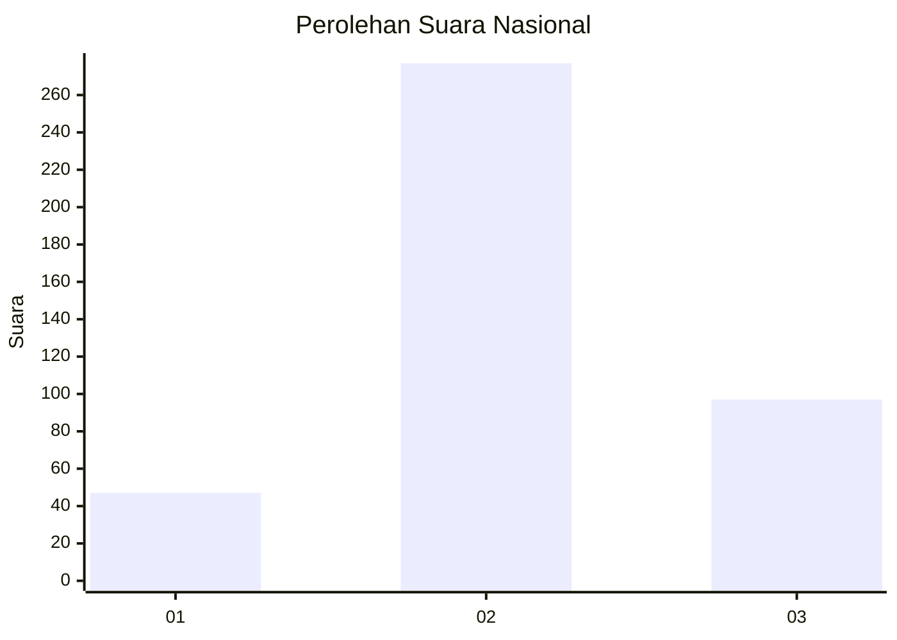
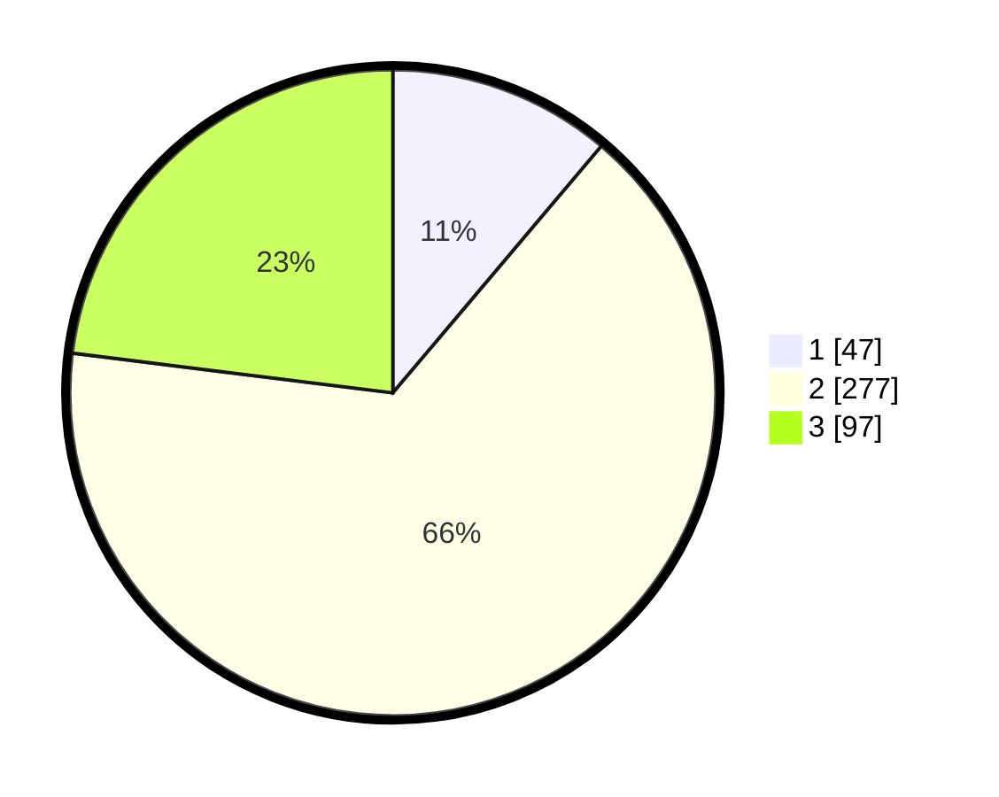

# Hasil

## Grafik

## Tabel

| No. | Nama Paslon    | Suara | Suara (raw) | Persentase |
|:--- |:-------------- | -----:| -----------:| ----------:|
| 1   | ANIES MUHAIMIN | 47    | [47][p-1]   | 11,16      |
| 2   | PRABOWO GIBRAN | 277   | [277][p-2]  | 65,80      |
| 3   | GANJAR MAHFUD  | 97    | [97][p-3]   | 23,04      |

[p-1]: https://github.com/gigit-pemilu/pemilu-2024/blob/main/pilpres/hitung-suara/sub/99-luar-negeri/sub/09-athena-yunani/sub/01-athena-yunani/sub/0001-athena-yunani/sub/002-tps-001/sub/paslon-1.txt
[p-2]: https://github.com/gigit-pemilu/pemilu-2024/blob/main/pilpres/hitung-suara/sub/99-luar-negeri/sub/09-athena-yunani/sub/01-athena-yunani/sub/0001-athena-yunani/sub/002-tps-001/sub/paslon-2.txt
[p-3]: https://github.com/gigit-pemilu/pemilu-2024/blob/main/pilpres/hitung-suara/sub/99-luar-negeri/sub/09-athena-yunani/sub/01-athena-yunani/sub/0001-athena-yunani/sub/002-tps-001/sub/paslon-3.txt

## Foto C Plano

https://sirekap-obj-formc.kpu.go.id/4e5e/pemilu/ppwp/99/09/01/00/01/9909010001002-20240218-132036--380fa3d7-6e37-4985-83f0-5718dde8234a.jpg

https://sirekap-obj-formc.kpu.go.id/4e5e/pemilu/ppwp/99/09/01/00/01/9909010001002-20240218-132038--e2f16b63-d2fe-448d-8799-79c7eb0fc79a.jpg

https://sirekap-obj-formc.kpu.go.id/4e5e/pemilu/ppwp/99/09/01/00/01/9909010001002-20240218-132037--e381b4f0-c0cb-4a73-88ec-81094f7996cd.jpg

## Metadata

| Key        | Value               |
| ---------- | ------------------- |
| Time Stamp | 2024-02-19 06:16:00 |

## DATA PEMILIH TETAP

Jumlah pemilih dalam DPT: **544**.
 * L: **124**.
 * P: **420**.

## DATA PENGGUNA HAK PILIH

Jumlah pengguna hak pilih dalam DPT: **365**.
 * L: **78**.
 * P: **287**.

Jumlah pengguna hak pilih dalam DPTb: **21**.
 * L: **9**.
 * P: **12**.

Jumlah pengguna hak pilih dalam DPK: **39**.
 * L: **8**.
 * P: **31**.

Jumlah pengguna hak pilih: **425**.
 * L: **95**.
 * P: **330**.

## JUMLAH SUARA SAH DAN TIDAK SAH

JUMLAH SELURUH SUARA SAH: **421**.

JUMLAH SUARA TIDAK SAH: **4**.

JUMLAH SELURUH SUARA SAH DAN SUARA TIDAK SAH: **425**.

