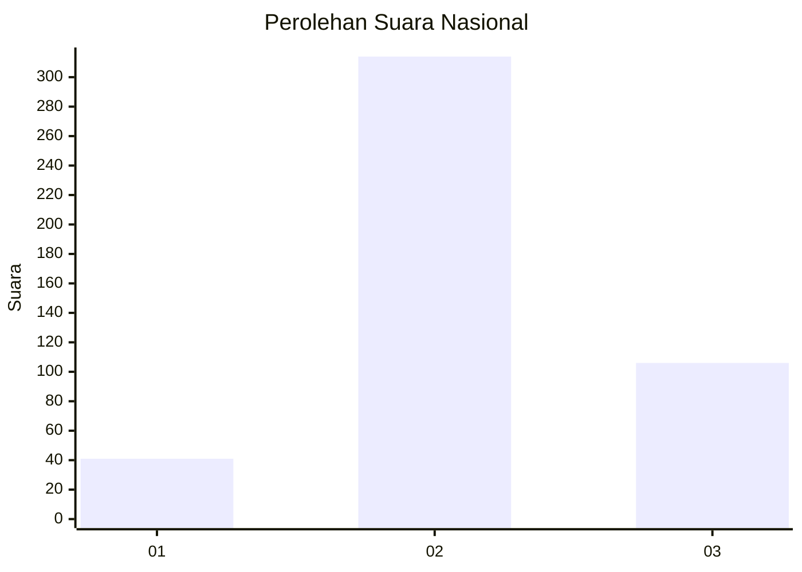
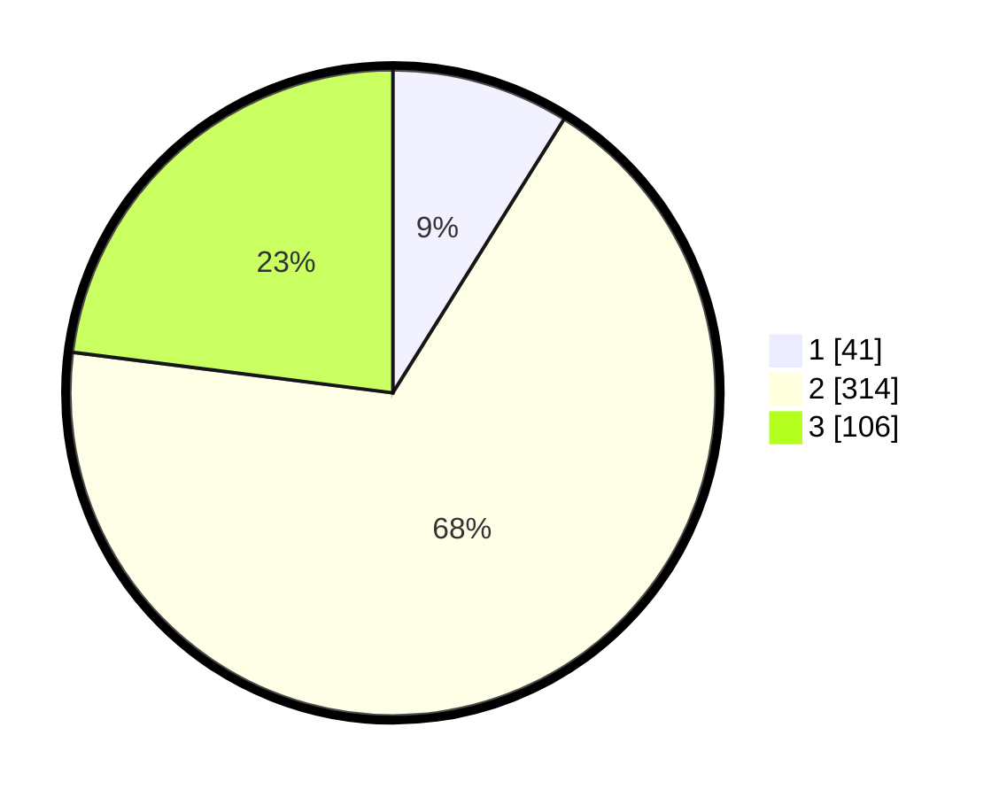

# Hasil

## Grafik

## Tabel

| No. | Nama Paslon    | Suara | Suara (raw) | Persentase |
|:--- |:-------------- | -----:| -----------:| ----------:|
| 1   | ANIES MUHAIMIN | 41    | [41][p-1]   | 8,89       |
| 2   | PRABOWO GIBRAN | 314   | [314][p-2]  | 68,11      |
| 3   | GANJAR MAHFUD  | 106   | [106][p-3]  | 22,99      |

[p-1]: https://github.com/gigit-pemilu/pemilu-2024/blob/main/pilpres/hitung-suara/sub/99-luar-negeri/sub/09-athena-yunani/sub/01-athena-yunani/sub/0001-athena-yunani/sub/003-tps-002/sub/paslon-1.txt
[p-2]: https://github.com/gigit-pemilu/pemilu-2024/blob/main/pilpres/hitung-suara/sub/99-luar-negeri/sub/09-athena-yunani/sub/01-athena-yunani/sub/0001-athena-yunani/sub/003-tps-002/sub/paslon-2.txt
[p-3]: https://github.com/gigit-pemilu/pemilu-2024/blob/main/pilpres/hitung-suara/sub/99-luar-negeri/sub/09-athena-yunani/sub/01-athena-yunani/sub/0001-athena-yunani/sub/003-tps-002/sub/paslon-3.txt

## Foto C Plano

https://sirekap-obj-formc.kpu.go.id/4da4/pemilu/ppwp/99/09/01/00/01/9909010001003-20240217-225002--0cd878ba-140e-487d-8bdc-43bd47d3bc42.jpg

https://sirekap-obj-formc.kpu.go.id/4da4/pemilu/ppwp/99/09/01/00/01/9909010001003-20240217-225004--68ae282b-574b-4723-bfb6-ae2a70824c2b.jpg

https://sirekap-obj-formc.kpu.go.id/4da4/pemilu/ppwp/99/09/01/00/01/9909010001003-20240217-225003--9b32177e-7bb2-4281-a3cf-090db8c121b4.jpg

## Metadata

| Key        | Value               |
| ---------- | ------------------- |
| Time Stamp | 2024-02-19 06:16:00 |

## DATA PEMILIH TETAP

Jumlah pemilih dalam DPT: **626**.
 * L: **83**.
 * P: **543**.

## DATA PENGGUNA HAK PILIH

Jumlah pengguna hak pilih dalam DPT: **442**.
 * L: **58**.
 * P: **384**.

Jumlah pengguna hak pilih dalam DPTb: **8**.
 * L: **1**.
 * P: **7**.

Jumlah pengguna hak pilih dalam DPK: **20**.
 * L: **3**.
 * P: **17**.

Jumlah pengguna hak pilih: **470**.
 * L: **62**.
 * P: **408**.

## JUMLAH SUARA SAH DAN TIDAK SAH

JUMLAH SELURUH SUARA SAH: **461**.

JUMLAH SUARA TIDAK SAH: **9**.

JUMLAH SELURUH SUARA SAH DAN SUARA TIDAK SAH: **470**.

