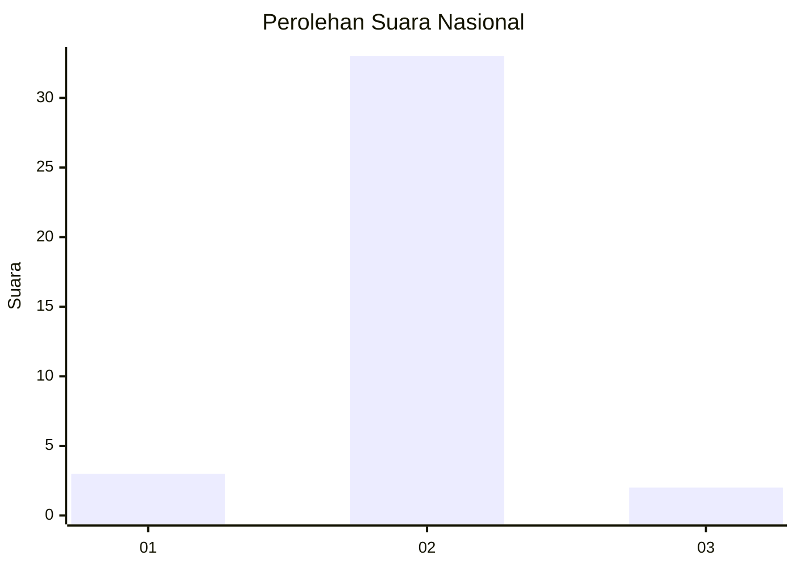
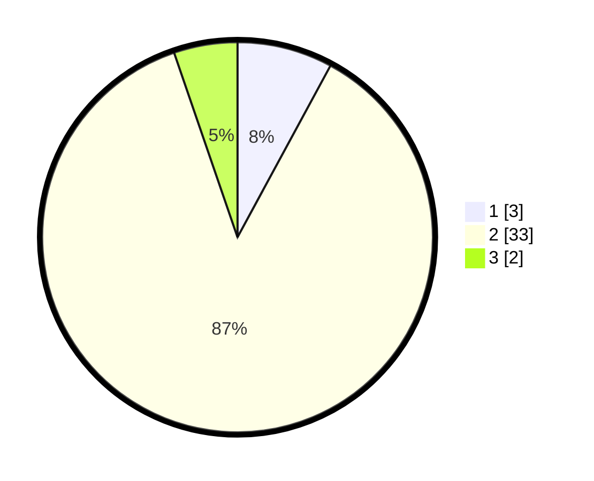

# Hasil

## Grafik

## Tabel

| No. | Nama Paslon    | Suara | Suara (raw) | Persentase |
|:--- |:-------------- | -----:| -----------:| ----------:|
| 1   | ANIES MUHAIMIN | 3     | [3][p-1]    | 7,89       |
| 2   | PRABOWO GIBRAN | 33    | [33][p-2]   | 86,84      |
| 3   | GANJAR MAHFUD  | 2     | [2][p-3]    | 5,26       |

[p-1]: https://github.com/gigit-pemilu/pemilu-2024/blob/main/pilpres/hitung-suara/sub/99-luar-negeri/sub/09-athena-yunani/sub/01-athena-yunani/sub/0001-athena-yunani/sub/004-ksk-001/sub/paslon-1.txt
[p-2]: https://github.com/gigit-pemilu/pemilu-2024/blob/main/pilpres/hitung-suara/sub/99-luar-negeri/sub/09-athena-yunani/sub/01-athena-yunani/sub/0001-athena-yunani/sub/004-ksk-001/sub/paslon-2.txt
[p-3]: https://github.com/gigit-pemilu/pemilu-2024/blob/main/pilpres/hitung-suara/sub/99-luar-negeri/sub/09-athena-yunani/sub/01-athena-yunani/sub/0001-athena-yunani/sub/004-ksk-001/sub/paslon-3.txt

## Foto C Plano

https://sirekap-obj-formc.kpu.go.id/9cdd/pemilu/ppwp/99/09/01/00/01/9909010001004-20240214-202436--d63905bd-1b66-4de0-83cb-838d86fdec2c.jpg

https://sirekap-obj-formc.kpu.go.id/9cdd/pemilu/ppwp/99/09/01/00/01/9909010001004-20240214-202534--33beb25f-bbe2-47a8-bc79-014bbb754e40.jpg

https://sirekap-obj-formc.kpu.go.id/9cdd/pemilu/ppwp/99/09/01/00/01/9909010001004-20240214-214630--0d91c48e-7316-43d8-aff1-33b9a0e57fd4.jpg

## Metadata

| Key        | Value               |
| ---------- | ------------------- |
| Time Stamp | 2024-02-17 14:45:18 |

## DATA PEMILIH TETAP

Jumlah pemilih dalam DPT: **52**.
 * L: **5**.
 * P: **47**.

## DATA PENGGUNA HAK PILIH

Jumlah pengguna hak pilih dalam DPT: **37**.
 * L: **3**.
 * P: **34**.

Jumlah pengguna hak pilih dalam DPTb: **4**.
 * L: **1**.
 * P: **3**.

Jumlah pengguna hak pilih dalam DPK: **0**.
 * L: **0**.
 * P: **0**.

Jumlah pengguna hak pilih: **41**.
 * L: **4**.
 * P: **37**.

## JUMLAH SUARA SAH DAN TIDAK SAH

JUMLAH SELURUH SUARA SAH: **38**.

JUMLAH SUARA TIDAK SAH: **3**.

JUMLAH SELURUH SUARA SAH DAN SUARA TIDAK SAH: **41**.

