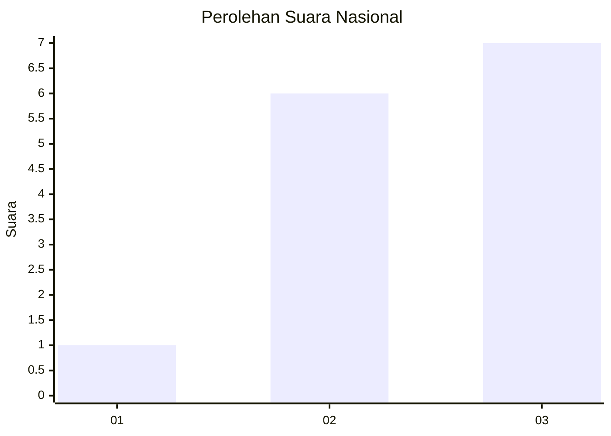
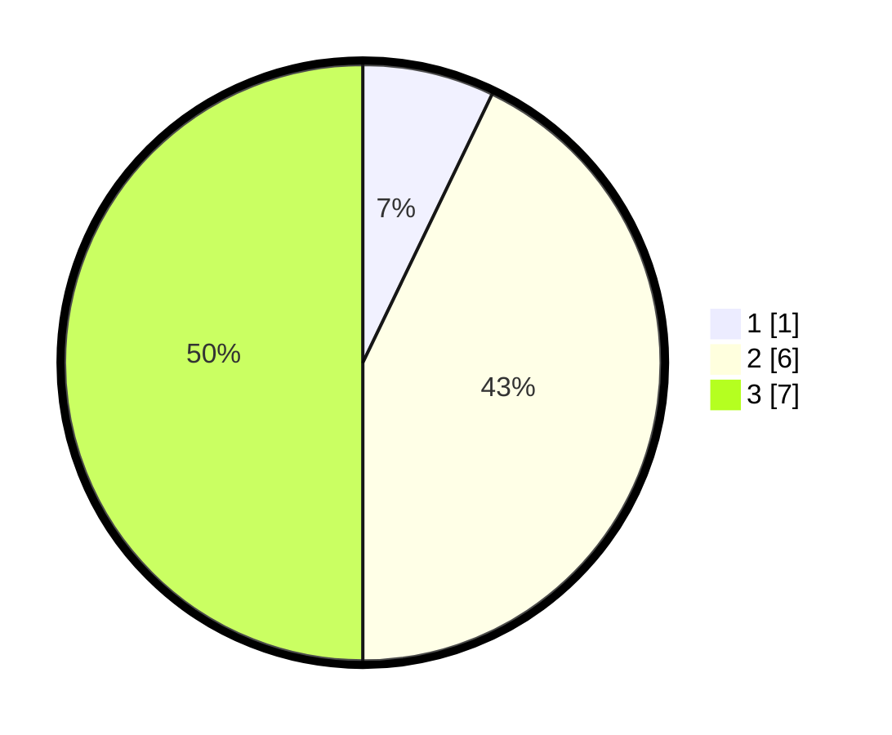

# Hasil

## Grafik

## Tabel

| No. | Nama Paslon    | Suara | Suara (raw) | Persentase |
|:--- |:-------------- | -----:| -----------:| ----------:|
| 1   | ANIES MUHAIMIN | 1     | [1][p-1]    | 7,14       |
| 2   | PRABOWO GIBRAN | 6     | [6][p-2]    | 42,86      |
| 3   | GANJAR MAHFUD  | 7     | [7][p-3]    | 50,00      |

[p-1]: https://github.com/gigit-pemilu/pemilu-2024/blob/main/pilpres/hitung-suara/sub/99-luar-negeri/sub/09-athena-yunani/sub/01-athena-yunani/sub/0001-athena-yunani/sub/005-ksk-002/sub/paslon-1.txt
[p-2]: https://github.com/gigit-pemilu/pemilu-2024/blob/main/pilpres/hitung-suara/sub/99-luar-negeri/sub/09-athena-yunani/sub/01-athena-yunani/sub/0001-athena-yunani/sub/005-ksk-002/sub/paslon-2.txt
[p-3]: https://github.com/gigit-pemilu/pemilu-2024/blob/main/pilpres/hitung-suara/sub/99-luar-negeri/sub/09-athena-yunani/sub/01-athena-yunani/sub/0001-athena-yunani/sub/005-ksk-002/sub/paslon-3.txt

## Foto C Plano

https://sirekap-obj-formc.kpu.go.id/907b/pemilu/ppwp/99/09/01/00/01/9909010001005-20240214-203704--abb94d5c-116b-40e7-bf6b-f8f3a1bab6b9.jpg

https://sirekap-obj-formc.kpu.go.id/907b/pemilu/ppwp/99/09/01/00/01/9909010001005-20240214-212703--bfa98443-87e1-4ad3-b485-5e886b58f38b.jpg

https://sirekap-obj-formc.kpu.go.id/907b/pemilu/ppwp/99/09/01/00/01/9909010001005-20240214-204102--4ea3eb43-a182-4f09-b345-eb09019765fe.jpg

## Metadata

| Key        | Value               |
| ---------- | ------------------- |
| Time Stamp | 2024-02-15 12:00:28 |

## DATA PEMILIH TETAP

Jumlah pemilih dalam DPT: **16**.
 * L: **3**.
 * P: **13**.

## DATA PENGGUNA HAK PILIH

Jumlah pengguna hak pilih dalam DPT: **11**.
 * L: **2**.
 * P: **9**.

Jumlah pengguna hak pilih dalam DPTb: **3**.
 * L: **0**.
 * P: **3**.

Jumlah pengguna hak pilih dalam DPK: **0**.
 * L: **0**.
 * P: **0**.

Jumlah pengguna hak pilih: **14**.
 * L: **2**.
 * P: **12**.

## JUMLAH SUARA SAH DAN TIDAK SAH

JUMLAH SELURUH SUARA SAH: **14**.

JUMLAH SUARA TIDAK SAH: **0**.

JUMLAH SELURUH SUARA SAH DAN SUARA TIDAK SAH: **14**.

