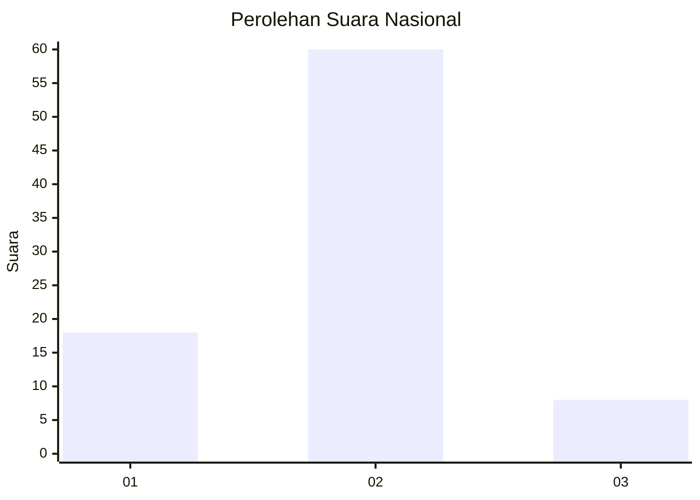

# Hasil

## Grafik

## Tabel

| No. | Nama Paslon    | Suara | Suara (raw) | Persentase |
|:--- |:-------------- | -----:| -----------:| ----------:|
| 1   | ANIES MUHAIMIN | 18    | [18][p-1]   | 20,93      |
| 2   | PRABOWO GIBRAN | 60    | [60][p-2]   | 69,77      |
| 3   | GANJAR MAHFUD  | 8     | [8][p-3]    | 9,30       |

[p-1]: https://github.com/gigit-pemilu/pemilu-2024/blob/main/pilpres/hitung-suara/sub/99-luar-negeri/sub/10-baghdad-irak/sub/01-baghdad-irak/sub/0001-baghdad-irak/sub/001-tps/sub/paslon-1.txt
[p-2]: https://github.com/gigit-pemilu/pemilu-2024/blob/main/pilpres/hitung-suara/sub/99-luar-negeri/sub/10-baghdad-irak/sub/01-baghdad-irak/sub/0001-baghdad-irak/sub/001-tps/sub/paslon-2.txt
[p-3]: https://github.com/gigit-pemilu/pemilu-2024/blob/main/pilpres/hitung-suara/sub/99-luar-negeri/sub/10-baghdad-irak/sub/01-baghdad-irak/sub/0001-baghdad-irak/sub/001-tps/sub/paslon-3.txt

## Foto C Plano

https://sirekap-obj-formc.kpu.go.id/4510/pemilu/ppwp/99/10/01/00/01/9910010001001-20240217-023832--f7e346ed-bc63-4d2b-8dc7-5911c82c39e8.jpg

https://sirekap-obj-formc.kpu.go.id/4510/pemilu/ppwp/99/10/01/00/01/9910010001001-20240217-040223--6759e0bd-d57c-4137-8591-e15a43e54549.jpg

https://sirekap-obj-formc.kpu.go.id/4510/pemilu/ppwp/99/10/01/00/01/9910010001001-20240217-040344--54bb0909-c936-4756-8de5-dbac08af58e5.jpg

## Metadata

| Key        | Value               |
| ---------- | ------------------- |
| Time Stamp | 2024-02-17 14:45:18 |

## DATA PEMILIH TETAP

Jumlah pemilih dalam DPT: **270**.
 * L: **99**.
 * P: **171**.

## DATA PENGGUNA HAK PILIH

Jumlah pengguna hak pilih dalam DPT: **23**.
 * L: **2**.
 * P: **21**.

Jumlah pengguna hak pilih dalam DPTb: **1**.
 * L: **0**.
 * P: **1**.

Jumlah pengguna hak pilih dalam DPK: **62**.
 * L: **5**.
 * P: **57**.

Jumlah pengguna hak pilih: **86**.
 * L: **7**.
 * P: **79**.

## JUMLAH SUARA SAH DAN TIDAK SAH

JUMLAH SELURUH SUARA SAH: **86**.

JUMLAH SUARA TIDAK SAH: **0**.

JUMLAH SELURUH SUARA SAH DAN SUARA TIDAK SAH: **86**.

