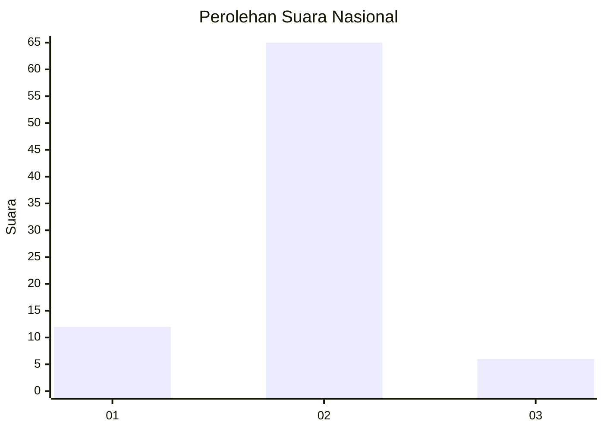
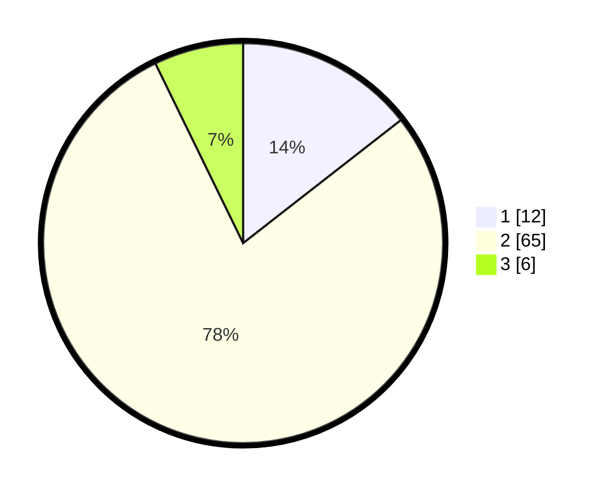

# Hasil

## Grafik

## Tabel

| No. | Nama Paslon    | Suara | Suara (raw) | Persentase |
|:--- |:-------------- | -----:| -----------:| ----------:|
| 1   | ANIES MUHAIMIN | 12    | [12][p-1]   | 14,46      |
| 2   | PRABOWO GIBRAN | 65    | [65][p-2]   | 78,31      |
| 3   | GANJAR MAHFUD  | 6     | [6][p-3]    | 7,23       |

[p-1]: https://github.com/gigit-pemilu/pemilu-2024/blob/main/pilpres/hitung-suara/sub/99-luar-negeri/sub/10-baghdad-irak/sub/01-baghdad-irak/sub/0001-baghdad-irak/sub/002-ksk-001/sub/paslon-1.txt
[p-2]: https://github.com/gigit-pemilu/pemilu-2024/blob/main/pilpres/hitung-suara/sub/99-luar-negeri/sub/10-baghdad-irak/sub/01-baghdad-irak/sub/0001-baghdad-irak/sub/002-ksk-001/sub/paslon-2.txt
[p-3]: https://github.com/gigit-pemilu/pemilu-2024/blob/main/pilpres/hitung-suara/sub/99-luar-negeri/sub/10-baghdad-irak/sub/01-baghdad-irak/sub/0001-baghdad-irak/sub/002-ksk-001/sub/paslon-3.txt

## Foto C Plano

https://sirekap-obj-formc.kpu.go.id/e3bd/pemilu/ppwp/99/10/01/00/01/9910010001002-20240219-021111--9e76ea0b-0038-442b-ab6c-1856f408c5dd.jpg

https://sirekap-obj-formc.kpu.go.id/e3bd/pemilu/ppwp/99/10/01/00/01/9910010001002-20240219-021149--f61e21be-4f08-459f-bdb2-65fb30e1815d.jpg

https://sirekap-obj-formc.kpu.go.id/e3bd/pemilu/ppwp/99/10/01/00/01/9910010001002-20240219-021404--163ac77b-a402-4770-8a5f-fd6d29ac0961.jpg

## Metadata

| Key        | Value               |
| ---------- | ------------------- |
| Time Stamp | 2024-02-19 06:16:00 |

## DATA PEMILIH TETAP

Jumlah pemilih dalam DPT: **270**.
 * L: **99**.
 * P: **171**.

## DATA PENGGUNA HAK PILIH

Jumlah pengguna hak pilih dalam DPT: **42**.
 * L: **35**.
 * P: **7**.

Jumlah pengguna hak pilih dalam DPTb: **1**.
 * L: **1**.
 * P: **0**.

Jumlah pengguna hak pilih dalam DPK: **43**.
 * L: **18**.
 * P: **25**.

Jumlah pengguna hak pilih: **86**.
 * L: **54**.
 * P: **32**.

## JUMLAH SUARA SAH DAN TIDAK SAH

JUMLAH SELURUH SUARA SAH: **83**.

JUMLAH SUARA TIDAK SAH: **3**.

JUMLAH SELURUH SUARA SAH DAN SUARA TIDAK SAH: **86**.

