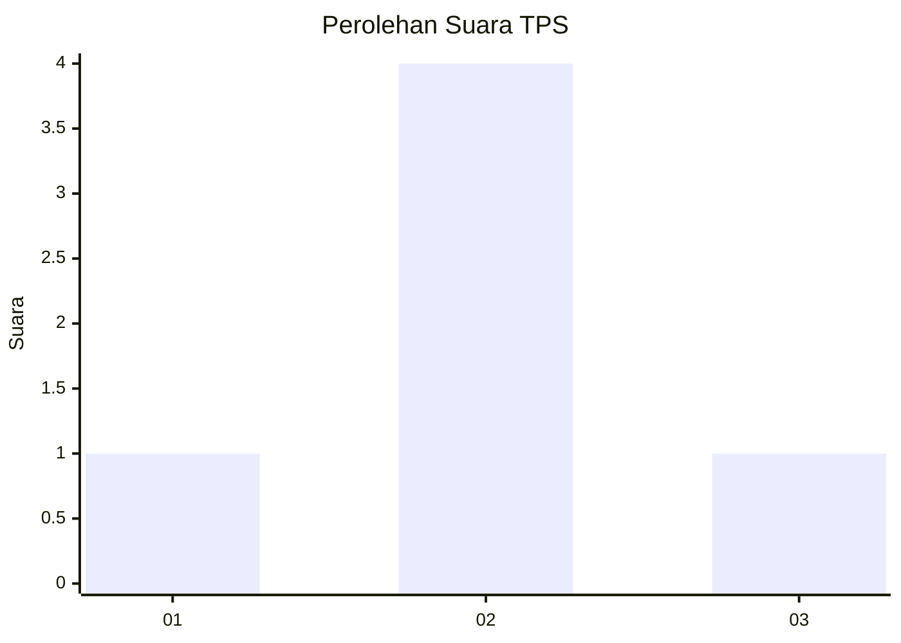
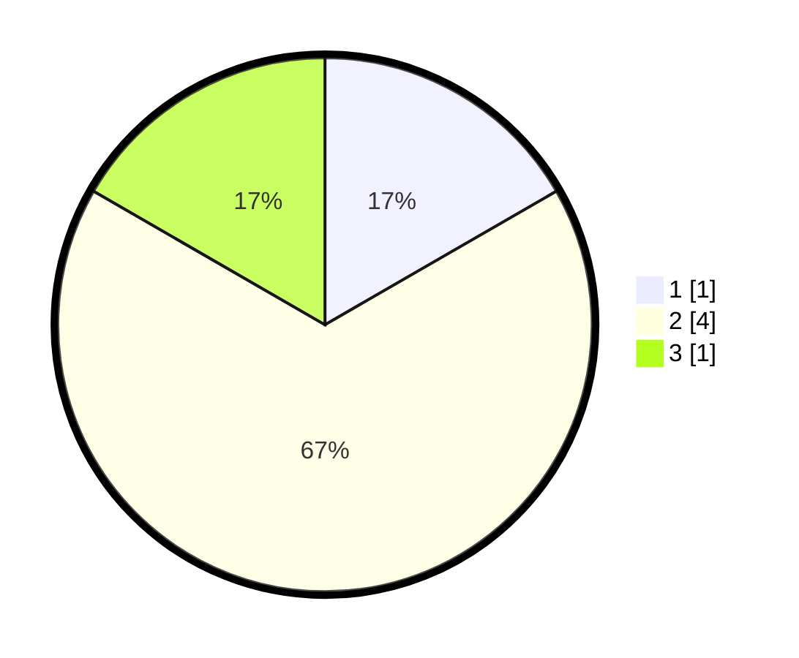

# Hasil

## Grafik

## Tabel

| No. | Nama Paslon    | Suara | Suara (raw) | Persentase |
|:--- |:-------------- | -----:| -----------:| ----------:|
| 1   | ANIES MUHAIMIN | 1     | [1][p-1]    | 16,67      |
| 2   | PRABOWO GIBRAN | 4     | [4][p-2]    | 66,67      |
| 3   | GANJAR MAHFUD  | 1     | [1][p-3]    | 16,67      |

[p-1]: https://github.com/gigit-pemilu/pemilu-2024-99-luar-negeri/blob/main/pilpres/hitung-suara/sub/99-luar-negeri/sub/11-baku-azerbaijan/sub/01-baku-azerbaijan/sub/0001-baku-azerbaijan/sub/001-pos-001/sub/paslon-1.txt
[p-2]: https://github.com/gigit-pemilu/pemilu-2024-99-luar-negeri/blob/main/pilpres/hitung-suara/sub/99-luar-negeri/sub/11-baku-azerbaijan/sub/01-baku-azerbaijan/sub/0001-baku-azerbaijan/sub/001-pos-001/sub/paslon-2.txt
[p-3]: https://github.com/gigit-pemilu/pemilu-2024-99-luar-negeri/blob/main/pilpres/hitung-suara/sub/99-luar-negeri/sub/11-baku-azerbaijan/sub/01-baku-azerbaijan/sub/0001-baku-azerbaijan/sub/001-pos-001/sub/paslon-3.txt

## Foto C Plano

https://sirekap-obj-formc.kpu.go.id/7a96/pemilu/ppwp/99/11/01/00/01/9911010001001-20240216-145923--1c5407e3-7cc4-490b-9167-d19fa3bf7ab3.jpg

https://sirekap-obj-formc.kpu.go.id/7a96/pemilu/ppwp/99/11/01/00/01/9911010001001-20240216-145924--8a737381-9884-4fc9-a253-99d06029329e.jpg

https://sirekap-obj-formc.kpu.go.id/7a96/pemilu/ppwp/99/11/01/00/01/9911010001001-20240216-145923--b5e30635-d3e5-41d0-843f-c50f4a46e683.jpg

## Metadata

| Key        | Value               |
| ---------- | ------------------- |
| Time Stamp | 2024-02-17 01:00:00 |

## DATA PEMILIH TETAP

Jumlah pemilih dalam DPT: **7**.
 * L: **0**.
 * P: **7**.

## DATA PENGGUNA HAK PILIH

Jumlah pengguna hak pilih dalam DPT: **5**.
 * L: **0**.
 * P: **5**.

Jumlah pengguna hak pilih dalam DPTb: **1**.
 * L: **0**.
 * P: **1**.

Jumlah pengguna hak pilih dalam DPK: **0**.
 * L: **0**.
 * P: **0**.

Jumlah pengguna hak pilih: **6**.
 * L: **0**.
 * P: **6**.

## JUMLAH SUARA SAH DAN TIDAK SAH

JUMLAH SELURUH SUARA SAH: **6**.

JUMLAH SUARA TIDAK SAH: **0**.

JUMLAH SELURUH SUARA SAH DAN SUARA TIDAK SAH: **6**.

