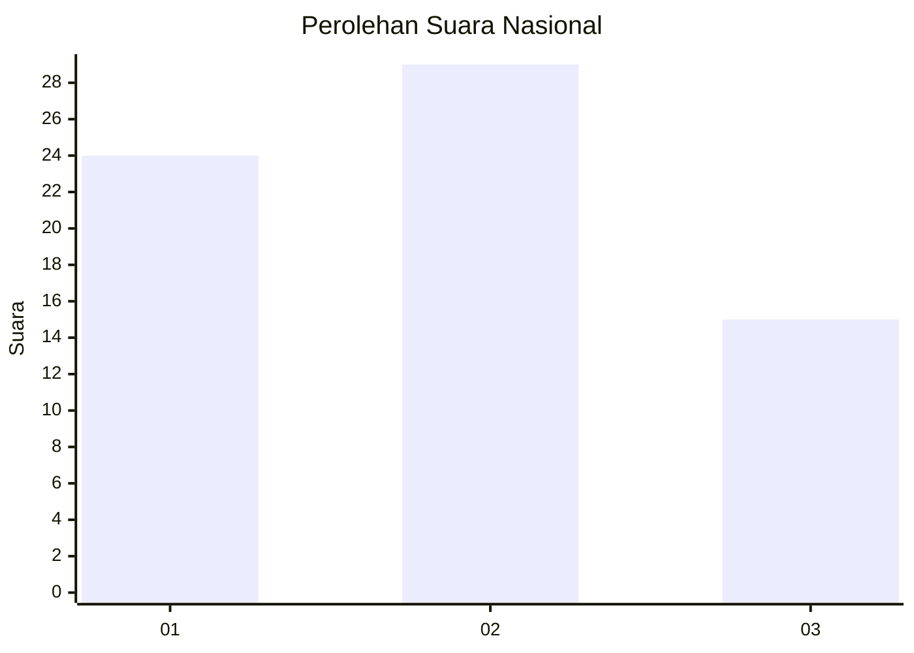
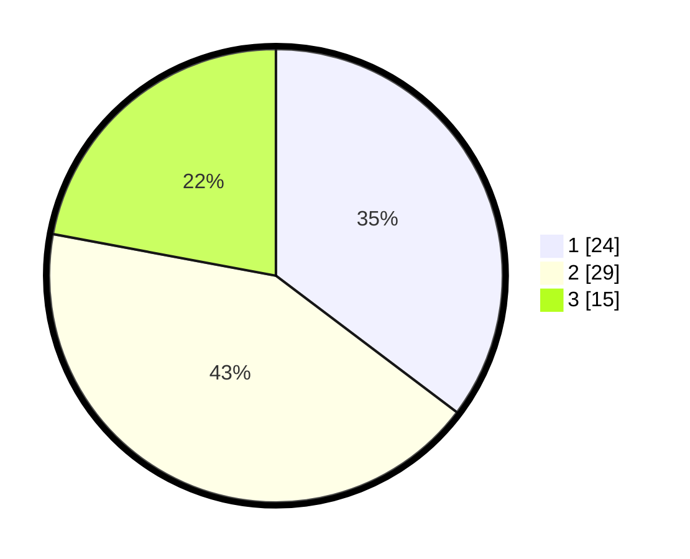

# Hasil

## Grafik

## Tabel

| No. | Nama Paslon    | Suara | Suara (raw) | Persentase |
|:--- |:-------------- | -----:| -----------:| ----------:|
| 1   | ANIES MUHAIMIN | 24    | [24][p-1]   | 35,29      |
| 2   | PRABOWO GIBRAN | 29    | [29][p-2]   | 42,65      |
| 3   | GANJAR MAHFUD  | 15    | [15][p-3]   | 22,06      |

[p-1]: https://github.com/gigit-pemilu/pemilu-2024/blob/main/pilpres/hitung-suara/sub/99-luar-negeri/sub/11-baku-azerbaijan/sub/01-baku-azerbaijan/sub/0001-baku-azerbaijan/sub/002-tps-001/sub/paslon-1.txt
[p-2]: https://github.com/gigit-pemilu/pemilu-2024/blob/main/pilpres/hitung-suara/sub/99-luar-negeri/sub/11-baku-azerbaijan/sub/01-baku-azerbaijan/sub/0001-baku-azerbaijan/sub/002-tps-001/sub/paslon-2.txt
[p-3]: https://github.com/gigit-pemilu/pemilu-2024/blob/main/pilpres/hitung-suara/sub/99-luar-negeri/sub/11-baku-azerbaijan/sub/01-baku-azerbaijan/sub/0001-baku-azerbaijan/sub/002-tps-001/sub/paslon-3.txt

## Foto C Plano

https://sirekap-obj-formc.kpu.go.id/5ef6/pemilu/ppwp/99/11/01/00/01/9911010001002-20240215-232502--f09898f2-ccca-4a5a-8b97-66698f337f1a.jpg

https://sirekap-obj-formc.kpu.go.id/5ef6/pemilu/ppwp/99/11/01/00/01/9911010001002-20240215-232504--c6aded4e-6b03-4dad-8392-e019ef9949a0.jpg

https://sirekap-obj-formc.kpu.go.id/5ef6/pemilu/ppwp/99/11/01/00/01/9911010001002-20240215-232503--ab962ae1-0c50-4cec-a963-5bc610616e0f.jpg

## Metadata

| Key        | Value               |
| ---------- | ------------------- |
| Time Stamp | 2024-02-16 12:51:22 |

## DATA PEMILIH TETAP

Jumlah pemilih dalam DPT: **66**.
 * L: **21**.
 * P: **45**.

## DATA PENGGUNA HAK PILIH

Jumlah pengguna hak pilih dalam DPT: **53**.
 * L: **17**.
 * P: **36**.

Jumlah pengguna hak pilih dalam DPTb: **13**.
 * L: **5**.
 * P: **8**.

Jumlah pengguna hak pilih dalam DPK: **2**.
 * L: **1**.
 * P: **1**.

Jumlah pengguna hak pilih: **68**.
 * L: **23**.
 * P: **45**.

## JUMLAH SUARA SAH DAN TIDAK SAH

JUMLAH SELURUH SUARA SAH: **68**.

JUMLAH SUARA TIDAK SAH: **0**.

JUMLAH SELURUH SUARA SAH DAN SUARA TIDAK SAH: **68**.

