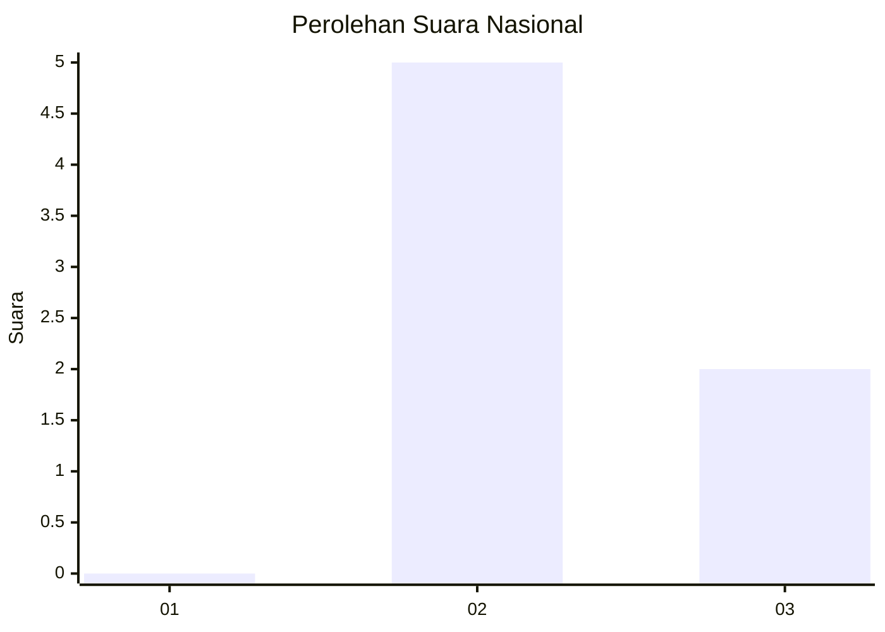
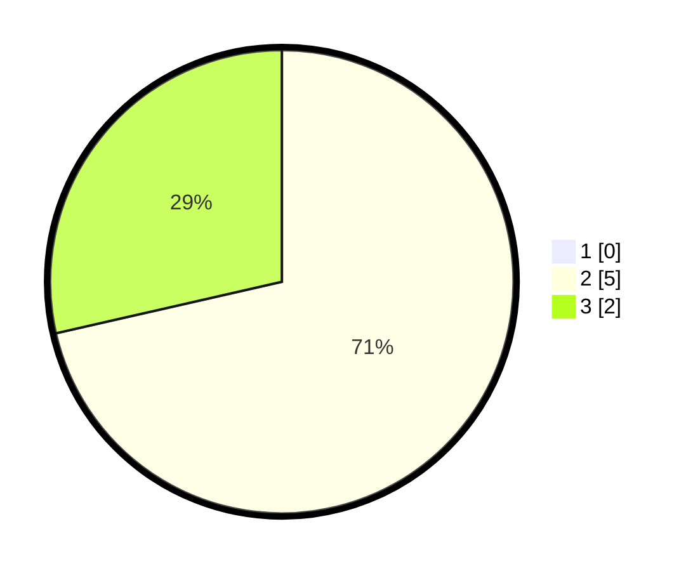

# Hasil

## Grafik

## Tabel

| No. | Nama Paslon    | Suara | Suara (raw) | Persentase |
|:--- |:-------------- | -----:| -----------:| ----------:|
| 1   | ANIES MUHAIMIN | 0     | [0][p-1]    | 0,00       |
| 2   | PRABOWO GIBRAN | 5     | [5][p-2]    | 71,43      |
| 3   | GANJAR MAHFUD  | 2     | [2][p-3]    | 28,57      |

[p-1]: https://github.com/gigit-pemilu/pemilu-2024/blob/main/pilpres/hitung-suara/sub/99-luar-negeri/sub/11-baku-azerbaijan/sub/01-baku-azerbaijan/sub/0001-baku-azerbaijan/sub/003-ksk-001/sub/paslon-1.txt
[p-2]: https://github.com/gigit-pemilu/pemilu-2024/blob/main/pilpres/hitung-suara/sub/99-luar-negeri/sub/11-baku-azerbaijan/sub/01-baku-azerbaijan/sub/0001-baku-azerbaijan/sub/003-ksk-001/sub/paslon-2.txt
[p-3]: https://github.com/gigit-pemilu/pemilu-2024/blob/main/pilpres/hitung-suara/sub/99-luar-negeri/sub/11-baku-azerbaijan/sub/01-baku-azerbaijan/sub/0001-baku-azerbaijan/sub/003-ksk-001/sub/paslon-3.txt

## Foto C Plano

https://sirekap-obj-formc.kpu.go.id/b7d9/pemilu/ppwp/99/11/01/00/01/9911010001003-20240216-134026--ff676557-2acf-4fdd-abd5-05197dc42f55.jpg

https://sirekap-obj-formc.kpu.go.id/b7d9/pemilu/ppwp/99/11/01/00/01/9911010001003-20240216-134028--e3dfb292-958c-4856-bc18-676c0a40efd3.jpg

https://sirekap-obj-formc.kpu.go.id/b7d9/pemilu/ppwp/99/11/01/00/01/9911010001003-20240216-134027--e1332928-6819-4648-8b29-7886593862dd.jpg

## Metadata

| Key        | Value               |
| ---------- | ------------------- |
| Time Stamp | 2024-02-17 01:00:00 |

## DATA PEMILIH TETAP

Jumlah pemilih dalam DPT: **8**.
 * L: **1**.
 * P: **7**.

## DATA PENGGUNA HAK PILIH

Jumlah pengguna hak pilih dalam DPT: **3**.
 * L: **0**.
 * P: **3**.

Jumlah pengguna hak pilih dalam DPTb: **2**.
 * L: **0**.
 * P: **2**.

Jumlah pengguna hak pilih dalam DPK: **2**.
 * L: **0**.
 * P: **2**.

Jumlah pengguna hak pilih: **7**.
 * L: **0**.
 * P: **7**.

## JUMLAH SUARA SAH DAN TIDAK SAH

JUMLAH SELURUH SUARA SAH: **7**.

JUMLAH SUARA TIDAK SAH: **0**.

JUMLAH SELURUH SUARA SAH DAN SUARA TIDAK SAH: **7**.

