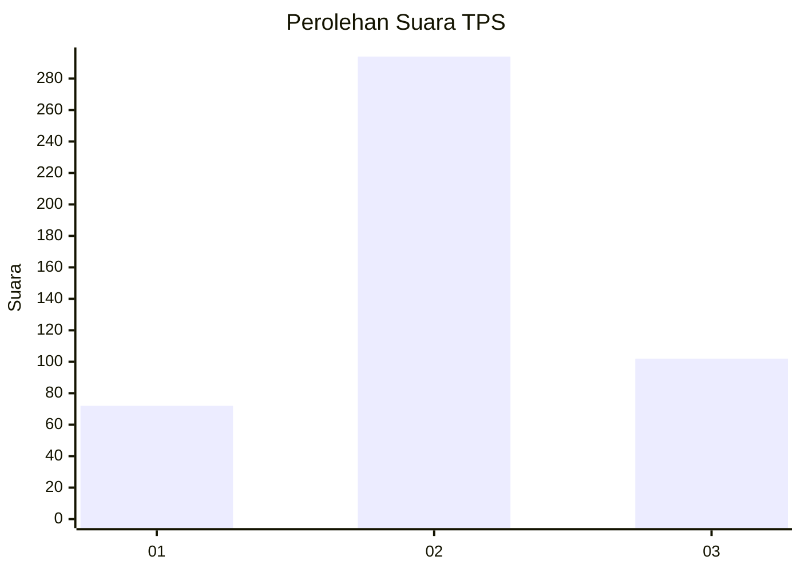
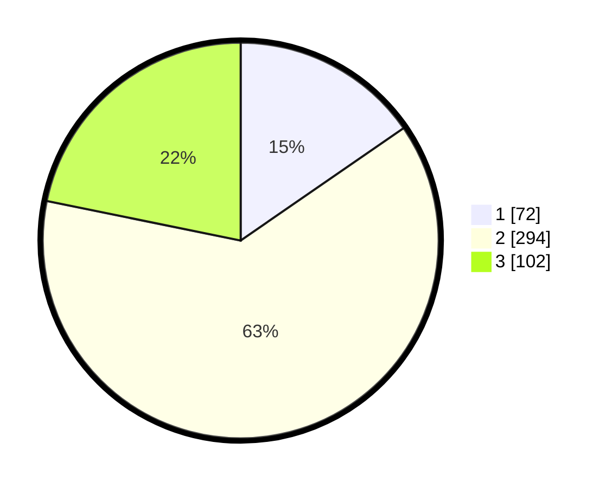

# Hasil

## Grafik

## Tabel

| No. | Nama Paslon    | Suara | Suara (raw) | Persentase |
|:--- |:-------------- | -----:| -----------:| ----------:|
| 1   | ANIES MUHAIMIN | 72    | [72][p-1]   | 15,38      |
| 2   | PRABOWO GIBRAN | 294   | [294][p-2]  | 62,82      |
| 3   | GANJAR MAHFUD  | 102   | [102][p-3]  | 21,79      |

[p-1]: https://github.com/gigit-pemilu/pemilu-2024-99-luar-negeri/blob/main/pilpres/hitung-suara/sub/99-luar-negeri/sub/12-bandar-seri-begawan-brunei-darussalam/sub/01-bandar-seri-begawan-brunei-darussalam/sub/0001-bandar-seri-begawan-brunei-darussalam/sub/001-pos-026/sub/paslon-1.txt
[p-2]: https://github.com/gigit-pemilu/pemilu-2024-99-luar-negeri/blob/main/pilpres/hitung-suara/sub/99-luar-negeri/sub/12-bandar-seri-begawan-brunei-darussalam/sub/01-bandar-seri-begawan-brunei-darussalam/sub/0001-bandar-seri-begawan-brunei-darussalam/sub/001-pos-026/sub/paslon-2.txt
[p-3]: https://github.com/gigit-pemilu/pemilu-2024-99-luar-negeri/blob/main/pilpres/hitung-suara/sub/99-luar-negeri/sub/12-bandar-seri-begawan-brunei-darussalam/sub/01-bandar-seri-begawan-brunei-darussalam/sub/0001-bandar-seri-begawan-brunei-darussalam/sub/001-pos-026/sub/paslon-3.txt

## Foto C Plano

https://sirekap-obj-formc.kpu.go.id/2fc5/pemilu/ppwp/99/12/01/00/01/9912010001001-20240218-001245--3ec39b7d-6a71-4027-b6ef-99f2c0eaca29.jpg

https://sirekap-obj-formc.kpu.go.id/2fc5/pemilu/ppwp/99/12/01/00/01/9912010001001-20240218-001324--48830af6-1f50-4269-934c-eaf6786fad79.jpg

https://sirekap-obj-formc.kpu.go.id/2fc5/pemilu/ppwp/99/12/01/00/01/9912010001001-20240218-001358--a900409a-f109-4342-a3d3-93858d2a9866.jpg

## Metadata

| Key        | Value               |
| ---------- | ------------------- |
| Time Stamp | 2024-02-19 06:16:00 |

## DATA PEMILIH TETAP

Jumlah pemilih dalam DPT: **1115**.
 * L: **741**.
 * P: **374**.

## DATA PENGGUNA HAK PILIH

Jumlah pengguna hak pilih dalam DPT: **484**.
 * L: **276**.
 * P: **208**.

Jumlah pengguna hak pilih dalam DPTb: **0**.
 * L: **0**.
 * P: **0**.

Jumlah pengguna hak pilih dalam DPK: **0**.
 * L: **0**.
 * P: **0**.

Jumlah pengguna hak pilih: **484**.
 * L: **276**.
 * P: **208**.

## JUMLAH SUARA SAH DAN TIDAK SAH

JUMLAH SELURUH SUARA SAH: **468**.

JUMLAH SUARA TIDAK SAH: **16**.

JUMLAH SELURUH SUARA SAH DAN SUARA TIDAK SAH: **484**.

