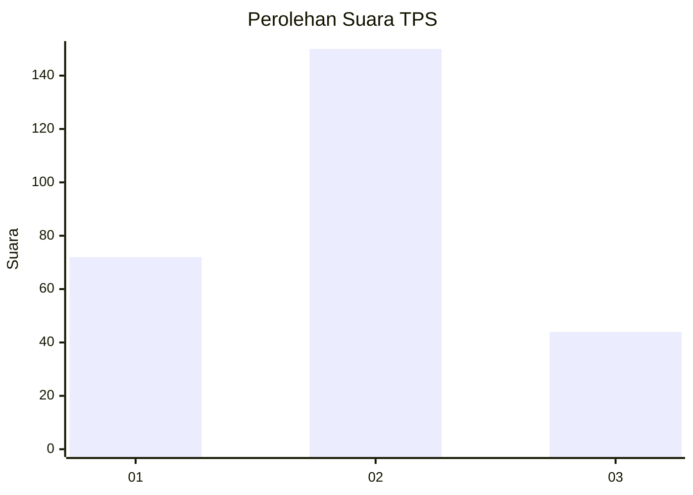
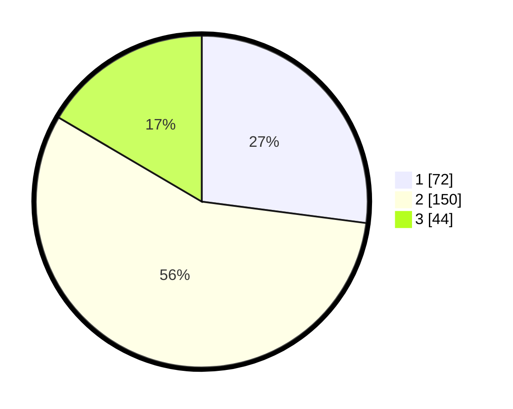

# Hasil

## Grafik

## Tabel

| No. | Nama Paslon    | Suara | Suara (raw) | Persentase |
|:--- |:-------------- | -----:| -----------:| ----------:|
| 1   | ANIES MUHAIMIN | 72    | [72][p-1]   | 27,07      |
| 2   | PRABOWO GIBRAN | 150   | [150][p-2]  | 56,39      |
| 3   | GANJAR MAHFUD  | 44    | [44][p-3]   | 16,54      |

[p-1]: https://github.com/gigit-pemilu/pemilu-2024-99-luar-negeri/blob/main/pilpres/hitung-suara/sub/99-luar-negeri/sub/12-bandar-seri-begawan-brunei-darussalam/sub/01-bandar-seri-begawan-brunei-darussalam/sub/0001-bandar-seri-begawan-brunei-darussalam/sub/002-tps-001/sub/paslon-1.txt
[p-2]: https://github.com/gigit-pemilu/pemilu-2024-99-luar-negeri/blob/main/pilpres/hitung-suara/sub/99-luar-negeri/sub/12-bandar-seri-begawan-brunei-darussalam/sub/01-bandar-seri-begawan-brunei-darussalam/sub/0001-bandar-seri-begawan-brunei-darussalam/sub/002-tps-001/sub/paslon-2.txt
[p-3]: https://github.com/gigit-pemilu/pemilu-2024-99-luar-negeri/blob/main/pilpres/hitung-suara/sub/99-luar-negeri/sub/12-bandar-seri-begawan-brunei-darussalam/sub/01-bandar-seri-begawan-brunei-darussalam/sub/0001-bandar-seri-begawan-brunei-darussalam/sub/002-tps-001/sub/paslon-3.txt

## Foto C Plano

https://sirekap-obj-formc.kpu.go.id/fa91/pemilu/ppwp/99/12/01/00/01/9912010001002-20240214-191612--d5cf6de5-3917-4e21-a758-9c589d01da20.jpg

https://sirekap-obj-formc.kpu.go.id/fa91/pemilu/ppwp/99/12/01/00/01/9912010001002-20240214-190313--d96aa2b2-8695-44dd-b327-8fc4ffd8dc6e.jpg

https://sirekap-obj-formc.kpu.go.id/fa91/pemilu/ppwp/99/12/01/00/01/9912010001002-20240214-190352--63c99689-0e33-4e73-89b7-6e7270b412b8.jpg

## Metadata

| Key        | Value               |
| ---------- | ------------------- |
| Time Stamp | 2024-02-14 21:46:01 |

## DATA PEMILIH TETAP

Jumlah pemilih dalam DPT: **799**.
 * L: **576**.
 * P: **223**.

## DATA PENGGUNA HAK PILIH

Jumlah pengguna hak pilih dalam DPT: **150**.
 * L: **106**.
 * P: **44**.

Jumlah pengguna hak pilih dalam DPTb: **56**.
 * L: **38**.
 * P: **18**.

Jumlah pengguna hak pilih dalam DPK: **64**.
 * L: **41**.
 * P: **23**.

Jumlah pengguna hak pilih: **270**.
 * L: **185**.
 * P: **85**.

## JUMLAH SUARA SAH DAN TIDAK SAH

JUMLAH SELURUH SUARA SAH: **266**.

JUMLAH SUARA TIDAK SAH: **4**.

JUMLAH SELURUH SUARA SAH DAN SUARA TIDAK SAH: **270**.

