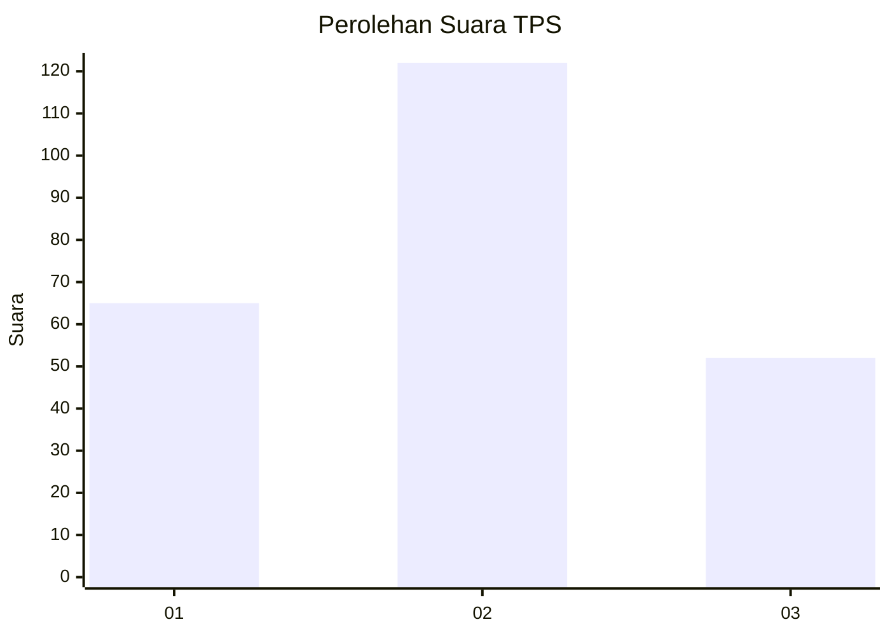
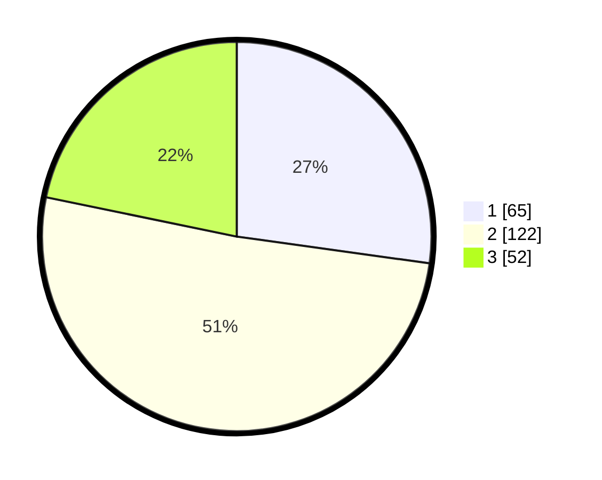

# Hasil

## Grafik

## Tabel

| No. | Nama Paslon    | Suara | Suara (raw) | Persentase |
|:--- |:-------------- | -----:| -----------:| ----------:|
| 1   | ANIES MUHAIMIN | 65    | [65][p-1]   | 27,20      |
| 2   | PRABOWO GIBRAN | 122   | [122][p-2]  | 51,05      |
| 3   | GANJAR MAHFUD  | 52    | [52][p-3]   | 21,76      |

[p-1]: https://github.com/gigit-pemilu/pemilu-2024-99-luar-negeri/blob/main/pilpres/hitung-suara/sub/99-luar-negeri/sub/12-bandar-seri-begawan-brunei-darussalam/sub/01-bandar-seri-begawan-brunei-darussalam/sub/0001-bandar-seri-begawan-brunei-darussalam/sub/003-tps-002/sub/paslon-1.txt
[p-2]: https://github.com/gigit-pemilu/pemilu-2024-99-luar-negeri/blob/main/pilpres/hitung-suara/sub/99-luar-negeri/sub/12-bandar-seri-begawan-brunei-darussalam/sub/01-bandar-seri-begawan-brunei-darussalam/sub/0001-bandar-seri-begawan-brunei-darussalam/sub/003-tps-002/sub/paslon-2.txt
[p-3]: https://github.com/gigit-pemilu/pemilu-2024-99-luar-negeri/blob/main/pilpres/hitung-suara/sub/99-luar-negeri/sub/12-bandar-seri-begawan-brunei-darussalam/sub/01-bandar-seri-begawan-brunei-darussalam/sub/0001-bandar-seri-begawan-brunei-darussalam/sub/003-tps-002/sub/paslon-3.txt

## Foto C Plano

https://sirekap-obj-formc.kpu.go.id/7467/pemilu/ppwp/99/12/01/00/01/9912010001003-20240218-100732--5e0fee46-521e-4a97-867c-f7b77bbf63df.jpg

https://sirekap-obj-formc.kpu.go.id/7467/pemilu/ppwp/99/12/01/00/01/9912010001003-20240218-105604--faaa079f-55ca-4218-b06e-9028965555b7.jpg

https://sirekap-obj-formc.kpu.go.id/7467/pemilu/ppwp/99/12/01/00/01/9912010001003-20240218-101126--7b5e8164-4843-4cdb-a75c-458409d20dfb.jpg

## Metadata

| Key        | Value               |
| ---------- | ------------------- |
| Time Stamp | 2024-02-19 06:16:00 |

## DATA PEMILIH TETAP

Jumlah pemilih dalam DPT: **527**.
 * L: **363**.
 * P: **164**.

## DATA PENGGUNA HAK PILIH

Jumlah pengguna hak pilih dalam DPT: **79**.
 * L: **56**.
 * P: **23**.

Jumlah pengguna hak pilih dalam DPTb: **80**.
 * L: **53**.
 * P: **27**.

Jumlah pengguna hak pilih dalam DPK: **83**.
 * L: **63**.
 * P: **20**.

Jumlah pengguna hak pilih: **242**.
 * L: **172**.
 * P: **70**.

## JUMLAH SUARA SAH DAN TIDAK SAH

JUMLAH SELURUH SUARA SAH: **239**.

JUMLAH SUARA TIDAK SAH: **3**.

JUMLAH SELURUH SUARA SAH DAN SUARA TIDAK SAH: **242**.

