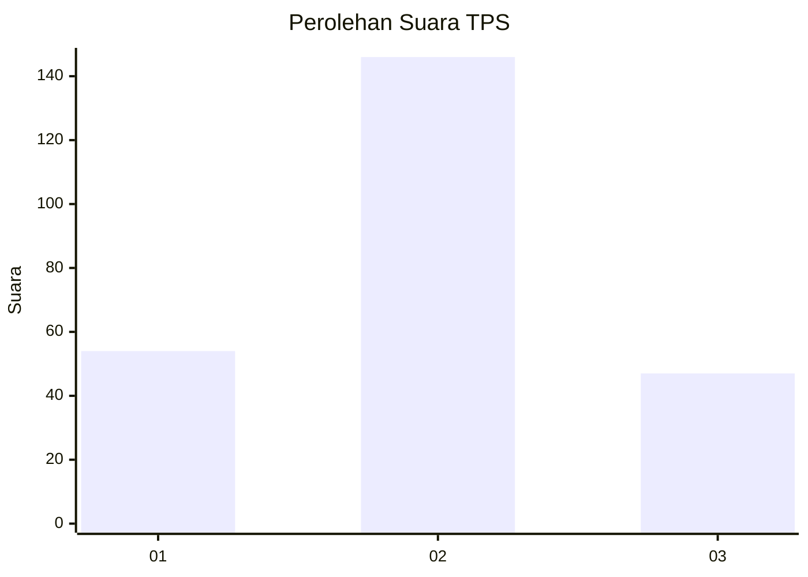
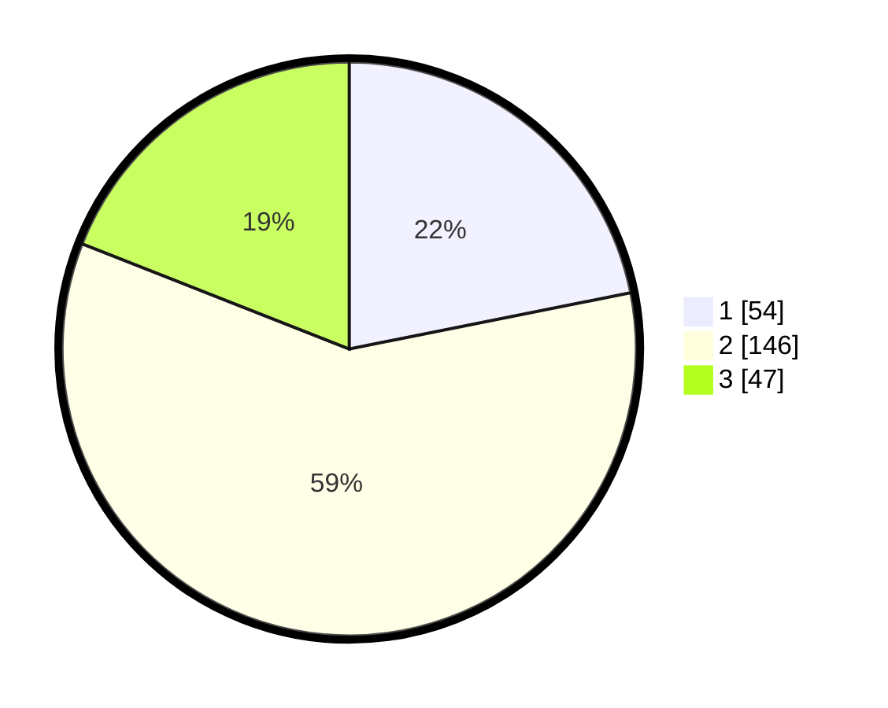

# Hasil

## Grafik

## Tabel

| No. | Nama Paslon    | Suara | Suara (raw) | Persentase |
|:--- |:-------------- | -----:| -----------:| ----------:|
| 1   | ANIES MUHAIMIN | 54    | [54][p-1]   | 21,86      |
| 2   | PRABOWO GIBRAN | 146   | [146][p-2]  | 59,11      |
| 3   | GANJAR MAHFUD  | 47    | [47][p-3]   | 19,03      |

[p-1]: https://github.com/gigit-pemilu/pemilu-2024-99-luar-negeri/blob/main/pilpres/hitung-suara/sub/99-luar-negeri/sub/12-bandar-seri-begawan-brunei-darussalam/sub/01-bandar-seri-begawan-brunei-darussalam/sub/0001-bandar-seri-begawan-brunei-darussalam/sub/004-tps-003/sub/paslon-1.txt
[p-2]: https://github.com/gigit-pemilu/pemilu-2024-99-luar-negeri/blob/main/pilpres/hitung-suara/sub/99-luar-negeri/sub/12-bandar-seri-begawan-brunei-darussalam/sub/01-bandar-seri-begawan-brunei-darussalam/sub/0001-bandar-seri-begawan-brunei-darussalam/sub/004-tps-003/sub/paslon-2.txt
[p-3]: https://github.com/gigit-pemilu/pemilu-2024-99-luar-negeri/blob/main/pilpres/hitung-suara/sub/99-luar-negeri/sub/12-bandar-seri-begawan-brunei-darussalam/sub/01-bandar-seri-begawan-brunei-darussalam/sub/0001-bandar-seri-begawan-brunei-darussalam/sub/004-tps-003/sub/paslon-3.txt

## Foto C Plano

https://sirekap-obj-formc.kpu.go.id/110a/pemilu/ppwp/99/12/01/00/01/9912010001004-20240214-185505--8caa1346-33ed-4418-9b33-2532a9edc438.jpg

https://sirekap-obj-formc.kpu.go.id/110a/pemilu/ppwp/99/12/01/00/01/9912010001004-20240214-185128--392481b6-00d8-4403-adac-73b64bdf8a88.jpg

https://sirekap-obj-formc.kpu.go.id/110a/pemilu/ppwp/99/12/01/00/01/9912010001004-20240214-185907--d3b17b7e-5156-4889-b0ff-346389bb556c.jpg

## Metadata

| Key        | Value               |
| ---------- | ------------------- |
| Time Stamp | 2024-02-16 12:51:22 |

## DATA PEMILIH TETAP

Jumlah pemilih dalam DPT: **548**.
 * L: **389**.
 * P: **159**.

## DATA PENGGUNA HAK PILIH

Jumlah pengguna hak pilih dalam DPT: **119**.
 * L: **87**.
 * P: **32**.

Jumlah pengguna hak pilih dalam DPTb: **47**.
 * L: **30**.
 * P: **17**.

Jumlah pengguna hak pilih dalam DPK: **82**.
 * L: **64**.
 * P: **18**.

Jumlah pengguna hak pilih: **248**.
 * L: **181**.
 * P: **67**.

## JUMLAH SUARA SAH DAN TIDAK SAH

JUMLAH SELURUH SUARA SAH: **247**.

JUMLAH SUARA TIDAK SAH: **1**.

JUMLAH SELURUH SUARA SAH DAN SUARA TIDAK SAH: **248**.

