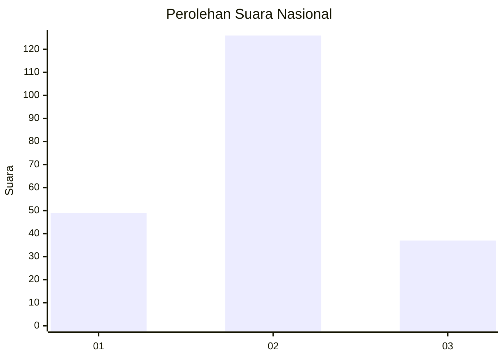

# Hasil

## Grafik

## Tabel

| No. | Nama Paslon    | Suara | Suara (raw) | Persentase |
|:--- |:-------------- | -----:| -----------:| ----------:|
| 1   | ANIES MUHAIMIN | 49    | [49][p-1]   | 23,11      |
| 2   | PRABOWO GIBRAN | 126   | [126][p-2]  | 59,43      |
| 3   | GANJAR MAHFUD  | 37    | [37][p-3]   | 17,45      |

[p-1]: https://github.com/gigit-pemilu/pemilu-2024/blob/main/pilpres/hitung-suara/sub/99-luar-negeri/sub/12-bandar-seri-begawan-brunei-darussalam/sub/01-bandar-seri-begawan-brunei-darussalam/sub/0001-bandar-seri-begawan-brunei-darussalam/sub/005-tps-004/sub/paslon-1.txt
[p-2]: https://github.com/gigit-pemilu/pemilu-2024/blob/main/pilpres/hitung-suara/sub/99-luar-negeri/sub/12-bandar-seri-begawan-brunei-darussalam/sub/01-bandar-seri-begawan-brunei-darussalam/sub/0001-bandar-seri-begawan-brunei-darussalam/sub/005-tps-004/sub/paslon-2.txt
[p-3]: https://github.com/gigit-pemilu/pemilu-2024/blob/main/pilpres/hitung-suara/sub/99-luar-negeri/sub/12-bandar-seri-begawan-brunei-darussalam/sub/01-bandar-seri-begawan-brunei-darussalam/sub/0001-bandar-seri-begawan-brunei-darussalam/sub/005-tps-004/sub/paslon-3.txt

## Foto C Plano

https://sirekap-obj-formc.kpu.go.id/6ee2/pemilu/ppwp/99/12/01/00/01/9912010001005-20240214-204013--693c1c3a-1973-4706-aff7-0a262460c5bd.jpg

https://sirekap-obj-formc.kpu.go.id/6ee2/pemilu/ppwp/99/12/01/00/01/9912010001005-20240214-204053--1aacd7c5-0163-4535-b19e-6282e5b5126d.jpg

https://sirekap-obj-formc.kpu.go.id/6ee2/pemilu/ppwp/99/12/01/00/01/9912010001005-20240214-204130--892b3ae1-ff94-4f6e-b8b0-60d1f012e6cd.jpg

## Metadata

| Key        | Value               |
| ---------- | ------------------- |
| Time Stamp | 2024-02-15 17:30:25 |

## DATA PEMILIH TETAP

Jumlah pemilih dalam DPT: **626**.
 * L: **435**.
 * P: **191**.

## DATA PENGGUNA HAK PILIH

Jumlah pengguna hak pilih dalam DPT: **111**.
 * L: **89**.
 * P: **22**.

Jumlah pengguna hak pilih dalam DPTb: **46**.
 * L: **30**.
 * P: **16**.

Jumlah pengguna hak pilih dalam DPK: **55**.
 * L: **45**.
 * P: **10**.

Jumlah pengguna hak pilih: **212**.
 * L: **164**.
 * P: **48**.

## JUMLAH SUARA SAH DAN TIDAK SAH

JUMLAH SELURUH SUARA SAH: **212**.

JUMLAH SUARA TIDAK SAH: **0**.

JUMLAH SELURUH SUARA SAH DAN SUARA TIDAK SAH: **212**.

