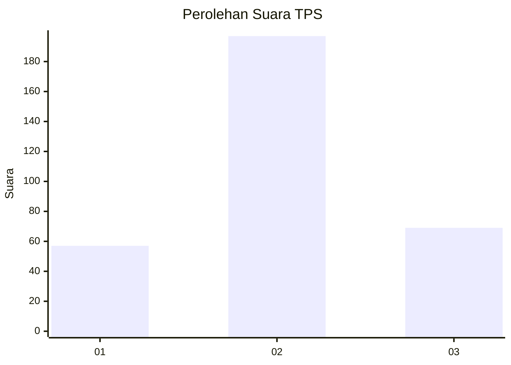
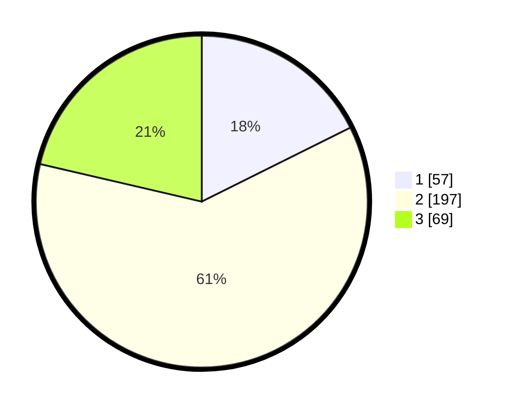

# Hasil

## Grafik

## Tabel

| No. | Nama Paslon    | Suara | Suara (raw) | Persentase |
|:--- |:-------------- | -----:| -----------:| ----------:|
| 1   | ANIES MUHAIMIN | 57    | [57][p-1]   | 17,65      |
| 2   | PRABOWO GIBRAN | 197   | [197][p-2]  | 60,99      |
| 3   | GANJAR MAHFUD  | 69    | [69][p-3]   | 21,36      |

[p-1]: https://github.com/gigit-pemilu/pemilu-2024-99-luar-negeri/blob/main/pilpres/hitung-suara/sub/99-luar-negeri/sub/12-bandar-seri-begawan-brunei-darussalam/sub/01-bandar-seri-begawan-brunei-darussalam/sub/0001-bandar-seri-begawan-brunei-darussalam/sub/006-tps-005/sub/paslon-1.txt
[p-2]: https://github.com/gigit-pemilu/pemilu-2024-99-luar-negeri/blob/main/pilpres/hitung-suara/sub/99-luar-negeri/sub/12-bandar-seri-begawan-brunei-darussalam/sub/01-bandar-seri-begawan-brunei-darussalam/sub/0001-bandar-seri-begawan-brunei-darussalam/sub/006-tps-005/sub/paslon-2.txt
[p-3]: https://github.com/gigit-pemilu/pemilu-2024-99-luar-negeri/blob/main/pilpres/hitung-suara/sub/99-luar-negeri/sub/12-bandar-seri-begawan-brunei-darussalam/sub/01-bandar-seri-begawan-brunei-darussalam/sub/0001-bandar-seri-begawan-brunei-darussalam/sub/006-tps-005/sub/paslon-3.txt

## Foto C Plano

https://sirekap-obj-formc.kpu.go.id/38c9/pemilu/ppwp/99/12/01/00/01/9912010001006-20240215-202718--41c54458-c0d6-4228-a4f6-efabc284811b.jpg

https://sirekap-obj-formc.kpu.go.id/38c9/pemilu/ppwp/99/12/01/00/01/9912010001006-20240215-202732--3b01f44c-98bd-4432-b31a-e8bdebd9ee87.jpg

https://sirekap-obj-formc.kpu.go.id/38c9/pemilu/ppwp/99/12/01/00/01/9912010001006-20240215-202727--b7bc7b25-0664-473e-80d3-1afad5b5a0e9.jpg

## Metadata

| Key        | Value               |
| ---------- | ------------------- |
| Time Stamp | 2024-02-16 12:51:22 |

## DATA PEMILIH TETAP

Jumlah pemilih dalam DPT: **544**.
 * L: **275**.
 * P: **269**.

## DATA PENGGUNA HAK PILIH

Jumlah pengguna hak pilih dalam DPT: **208**.
 * L: **92**.
 * P: **116**.

Jumlah pengguna hak pilih dalam DPTb: **41**.
 * L: **25**.
 * P: **16**.

Jumlah pengguna hak pilih dalam DPK: **77**.
 * L: **60**.
 * P: **17**.

Jumlah pengguna hak pilih: **326**.
 * L: **177**.
 * P: **149**.

## JUMLAH SUARA SAH DAN TIDAK SAH

JUMLAH SELURUH SUARA SAH: **323**.

JUMLAH SUARA TIDAK SAH: **3**.

JUMLAH SELURUH SUARA SAH DAN SUARA TIDAK SAH: **326**.

