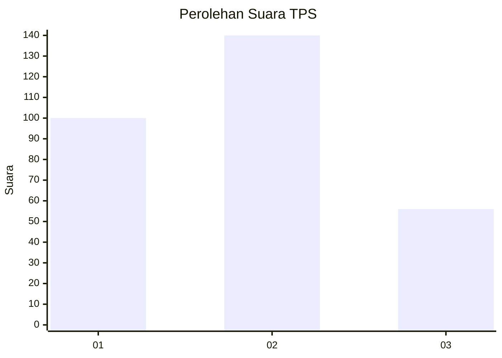
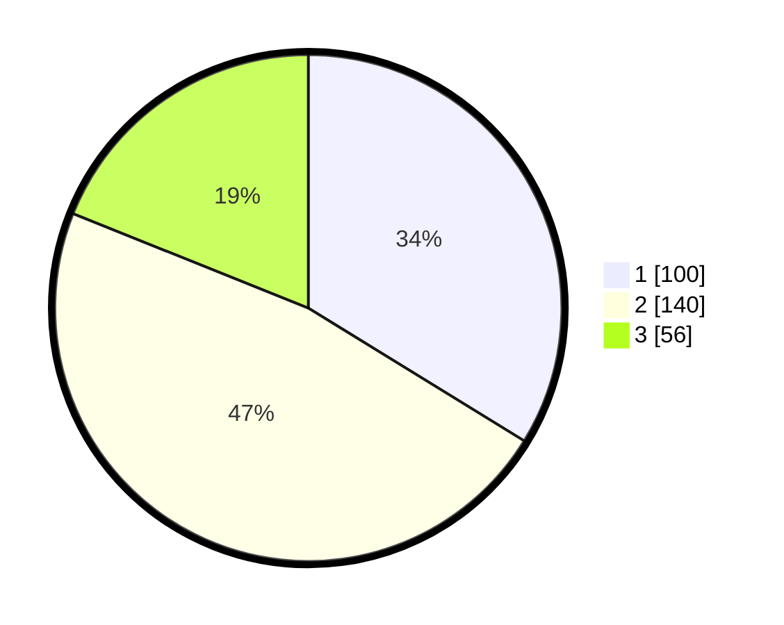

# Hasil

## Grafik

## Tabel

| No. | Nama Paslon    | Suara | Suara (raw) | Persentase |
|:--- |:-------------- | -----:| -----------:| ----------:|
| 1   | ANIES MUHAIMIN | 100   | [100][p-1]  | 33,78      |
| 2   | PRABOWO GIBRAN | 140   | [140][p-2]  | 47,30      |
| 3   | GANJAR MAHFUD  | 56    | [56][p-3]   | 18,92      |

[p-1]: https://github.com/gigit-pemilu/pemilu-2024-99-luar-negeri/blob/main/pilpres/hitung-suara/sub/99-luar-negeri/sub/12-bandar-seri-begawan-brunei-darussalam/sub/01-bandar-seri-begawan-brunei-darussalam/sub/0001-bandar-seri-begawan-brunei-darussalam/sub/009-tps-008/sub/paslon-1.txt
[p-2]: https://github.com/gigit-pemilu/pemilu-2024-99-luar-negeri/blob/main/pilpres/hitung-suara/sub/99-luar-negeri/sub/12-bandar-seri-begawan-brunei-darussalam/sub/01-bandar-seri-begawan-brunei-darussalam/sub/0001-bandar-seri-begawan-brunei-darussalam/sub/009-tps-008/sub/paslon-2.txt
[p-3]: https://github.com/gigit-pemilu/pemilu-2024-99-luar-negeri/blob/main/pilpres/hitung-suara/sub/99-luar-negeri/sub/12-bandar-seri-begawan-brunei-darussalam/sub/01-bandar-seri-begawan-brunei-darussalam/sub/0001-bandar-seri-begawan-brunei-darussalam/sub/009-tps-008/sub/paslon-3.txt

## Foto C Plano

https://sirekap-obj-formc.kpu.go.id/8b90/pemilu/ppwp/99/12/01/00/01/9912010001009-20240218-115933--5e057560-ccd8-49ff-b46c-32d1378028ee.jpg

https://sirekap-obj-formc.kpu.go.id/8b90/pemilu/ppwp/99/12/01/00/01/9912010001009-20240218-120110--7749a4fa-aa07-4106-b546-d86b0f3ac253.jpg

https://sirekap-obj-formc.kpu.go.id/8b90/pemilu/ppwp/99/12/01/00/01/9912010001009-20240218-120420--00065241-d5d5-42cd-9443-ad76432a4fce.jpg

## Metadata

| Key        | Value               |
| ---------- | ------------------- |
| Time Stamp | 2024-02-19 06:16:00 |

## DATA PEMILIH TETAP

Jumlah pemilih dalam DPT: **799**.
 * L: **512**.
 * P: **287**.

## DATA PENGGUNA HAK PILIH

Jumlah pengguna hak pilih dalam DPT: **209**.
 * L: **124**.
 * P: **85**.

Jumlah pengguna hak pilih dalam DPTb: **43**.
 * L: **29**.
 * P: **14**.

Jumlah pengguna hak pilih dalam DPK: **45**.
 * L: **34**.
 * P: **11**.

Jumlah pengguna hak pilih: **297**.
 * L: **187**.
 * P: **110**.

## JUMLAH SUARA SAH DAN TIDAK SAH

JUMLAH SELURUH SUARA SAH: **296**.

JUMLAH SUARA TIDAK SAH: **1**.

JUMLAH SELURUH SUARA SAH DAN SUARA TIDAK SAH: **297**.

