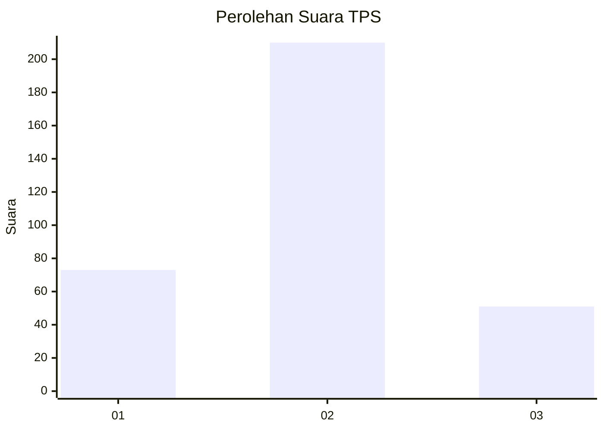
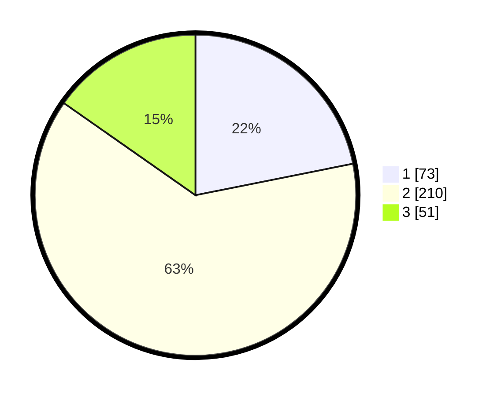

# Hasil

## Grafik

## Tabel

| No. | Nama Paslon    | Suara | Suara (raw) | Persentase |
|:--- |:-------------- | -----:| -----------:| ----------:|
| 1   | ANIES MUHAIMIN | 73    | [73][p-1]   | 21,86      |
| 2   | PRABOWO GIBRAN | 210   | [210][p-2]  | 62,87      |
| 3   | GANJAR MAHFUD  | 51    | [51][p-3]   | 15,27      |

[p-1]: https://github.com/gigit-pemilu/pemilu-2024-99-luar-negeri/blob/main/pilpres/hitung-suara/sub/99-luar-negeri/sub/12-bandar-seri-begawan-brunei-darussalam/sub/01-bandar-seri-begawan-brunei-darussalam/sub/0001-bandar-seri-begawan-brunei-darussalam/sub/011-tps-010/sub/paslon-1.txt
[p-2]: https://github.com/gigit-pemilu/pemilu-2024-99-luar-negeri/blob/main/pilpres/hitung-suara/sub/99-luar-negeri/sub/12-bandar-seri-begawan-brunei-darussalam/sub/01-bandar-seri-begawan-brunei-darussalam/sub/0001-bandar-seri-begawan-brunei-darussalam/sub/011-tps-010/sub/paslon-2.txt
[p-3]: https://github.com/gigit-pemilu/pemilu-2024-99-luar-negeri/blob/main/pilpres/hitung-suara/sub/99-luar-negeri/sub/12-bandar-seri-begawan-brunei-darussalam/sub/01-bandar-seri-begawan-brunei-darussalam/sub/0001-bandar-seri-begawan-brunei-darussalam/sub/011-tps-010/sub/paslon-3.txt

## Foto C Plano

https://sirekap-obj-formc.kpu.go.id/2111/pemilu/ppwp/99/12/01/00/01/9912010001011-20240214-193617--22793df0-a3f6-42be-b076-439e6f526360.jpg

https://sirekap-obj-formc.kpu.go.id/2111/pemilu/ppwp/99/12/01/00/01/9912010001011-20240214-191626--70e0a731-80fc-480e-beae-1a0a87bebc44.jpg

https://sirekap-obj-formc.kpu.go.id/2111/pemilu/ppwp/99/12/01/00/01/9912010001011-20240214-191716--87ac062a-3307-4327-a323-c588c36ff181.jpg

## Metadata

| Key        | Value               |
| ---------- | ------------------- |
| Time Stamp | 2024-02-14 21:46:01 |

## DATA PEMILIH TETAP

Jumlah pemilih dalam DPT: **831**.
 * L: **707**.
 * P: **124**.

## DATA PENGGUNA HAK PILIH

Jumlah pengguna hak pilih dalam DPT: **202**.
 * L: **135**.
 * P: **67**.

Jumlah pengguna hak pilih dalam DPTb: **48**.
 * L: **31**.
 * P: **17**.

Jumlah pengguna hak pilih dalam DPK: **86**.
 * L: **67**.
 * P: **19**.

Jumlah pengguna hak pilih: **336**.
 * L: **233**.
 * P: **103**.

## JUMLAH SUARA SAH DAN TIDAK SAH

JUMLAH SELURUH SUARA SAH: **334**.

JUMLAH SUARA TIDAK SAH: **2**.

JUMLAH SELURUH SUARA SAH DAN SUARA TIDAK SAH: **336**.

