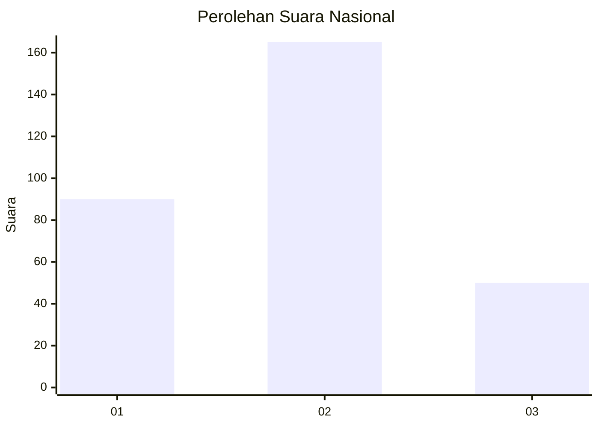
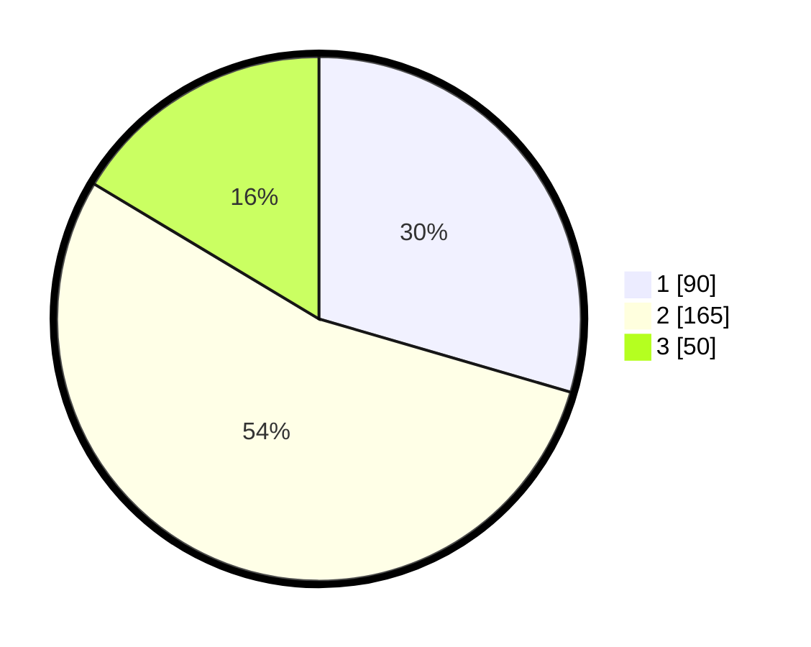

# Hasil

## Grafik

## Tabel

| No. | Nama Paslon    | Suara | Suara (raw) | Persentase |
|:--- |:-------------- | -----:| -----------:| ----------:|
| 1   | ANIES MUHAIMIN | 90    | [90][p-1]   | 29,51      |
| 2   | PRABOWO GIBRAN | 165   | [165][p-2]  | 54,10      |
| 3   | GANJAR MAHFUD  | 50    | [50][p-3]   | 16,39      |

[p-1]: https://github.com/gigit-pemilu/pemilu-2024/blob/main/pilpres/hitung-suara/sub/99-luar-negeri/sub/12-bandar-seri-begawan-brunei-darussalam/sub/01-bandar-seri-begawan-brunei-darussalam/sub/0001-bandar-seri-begawan-brunei-darussalam/sub/012-tps-011/sub/paslon-1.txt
[p-2]: https://github.com/gigit-pemilu/pemilu-2024/blob/main/pilpres/hitung-suara/sub/99-luar-negeri/sub/12-bandar-seri-begawan-brunei-darussalam/sub/01-bandar-seri-begawan-brunei-darussalam/sub/0001-bandar-seri-begawan-brunei-darussalam/sub/012-tps-011/sub/paslon-2.txt
[p-3]: https://github.com/gigit-pemilu/pemilu-2024/blob/main/pilpres/hitung-suara/sub/99-luar-negeri/sub/12-bandar-seri-begawan-brunei-darussalam/sub/01-bandar-seri-begawan-brunei-darussalam/sub/0001-bandar-seri-begawan-brunei-darussalam/sub/012-tps-011/sub/paslon-3.txt

## Foto C Plano

https://sirekap-obj-formc.kpu.go.id/6e09/pemilu/ppwp/99/12/01/00/01/9912010001012-20240214-190435--51698b13-7421-4165-8a92-032653e07b87.jpg

https://sirekap-obj-formc.kpu.go.id/6e09/pemilu/ppwp/99/12/01/00/01/9912010001012-20240214-190906--4d03ff78-006e-41ea-ace2-c514afa37209.jpg

https://sirekap-obj-formc.kpu.go.id/6e09/pemilu/ppwp/99/12/01/00/01/9912010001012-20240214-190615--992dbcf0-6f1b-4557-a997-03e36be28139.jpg

## Metadata

| Key        | Value               |
| ---------- | ------------------- |
| Time Stamp | 2024-02-14 21:46:01 |

## DATA PEMILIH TETAP

Jumlah pemilih dalam DPT: **812**.
 * L: **423**.
 * P: **389**.

## DATA PENGGUNA HAK PILIH

Jumlah pengguna hak pilih dalam DPT: **214**.
 * L: **128**.
 * P: **86**.

Jumlah pengguna hak pilih dalam DPTb: **42**.
 * L: **27**.
 * P: **15**.

Jumlah pengguna hak pilih dalam DPK: **50**.
 * L: **37**.
 * P: **13**.

Jumlah pengguna hak pilih: **306**.
 * L: **192**.
 * P: **114**.

## JUMLAH SUARA SAH DAN TIDAK SAH

JUMLAH SELURUH SUARA SAH: **305**.

JUMLAH SUARA TIDAK SAH: **1**.

JUMLAH SELURUH SUARA SAH DAN SUARA TIDAK SAH: **306**.

